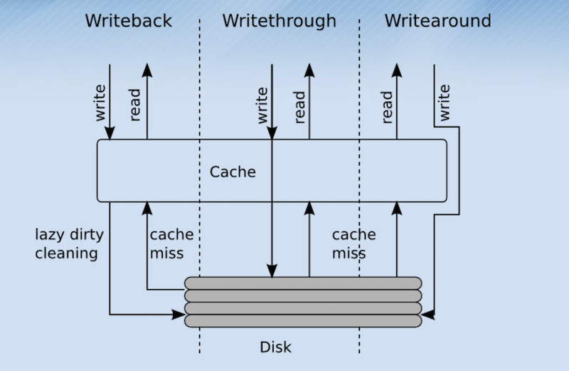

试过群晖、FreeNAS、OMV，都不太合心意：

- WEB UI虽然降低了使用门槛，但对于进阶用户而言引入了复杂性
- 现在大多服务都能在Docker中找到，这些系统也没为Docker的使用降低门槛

所以决定直接使用debian作为NAS系统

这篇文章不会step by step地教学，只适合有Linux使用经验的人。


大纲

1. 机器选择要点，组建思路（不推荐软路由、最小原则：围绕文件服务和一些开销小的服务），硬盘分配
2. debian安装，用户管理，docker环境、公网访问（防火墙、端口转发）
3. 缓存盘，联合文件系统，snapraid，文件服务（smb+webdav）
4. 自动维护：cron-apt
5. BT下载平台、PT玩法
6. 家庭影音：jellyfin，播放器nplayer
7. 家庭NVR服务器
8. 智能家居homeassisant


可能用到的额外参考：

计划任务crond：https://wiki.archlinux.org/index.php/Cron

设置磁盘配额：https://wiki.archlinux.org/index.php/Disk_quota


## 准备工作

### 想清楚自己的需求

在动手之前想清楚自己的需求，能避免折腾和多花钱：

- 我是否真的需要一台NAS？ NAS的用途是把资料单独抽出来放在一台机器上，方便自己在任意客户端上访问
- 我是否应该直接在Linux CLI上搭一台NAS？ 如果这台机器有可能交由其他人维护，这就是需要慎重考虑的问题了，这时群晖是个不错的选择
- 我需要的是一台all in one的机器吗？把软路由、HTPC、NAS放在同一台机器上听起来不错，但是，你可能需要额外付出更多的财力、学习更多的知识（如虚拟化平台的使用、显卡直通）、机器更难维护（比如增加软件故障时排除的难度）

### 家庭宽带

- 如果使用电信家庭宽带，建议拨打10000申请IPv4公网IP、将光猫设置为桥接模式
- 如果使用其他网络运营商，也可以尝试配置IPv6

### 透明代理

由于国内特殊的网络环境，强烈建议在路由器上配置透明代理，以避免网络问题。比如DockerHub非官方镜象的国内源很少，众多软件都需要配置代理也让操作变得繁琐。


### 硬件平台

关于CPU平台，只作储存时对CPU要求不高；需要转码推流时需要考虑硬编硬解，经验来说Intel核显是比较好折腾的。

关于硬盘选配，大体思路是尽量买大容量硬盘，减少硬盘数降低功耗、降低单位容量成本，硬盘数量根据阵列配置而定，放出笔者的配置供参考，4块HDD(6TB x 3) + 一块SSD（128GB x 1）：

- SSD0: EnhanceIO缓存方案的cache盘
- HDD0: EnhanceIO缓存方案，被加速的热数据盘
- HDD1, HDD2: 下载盘，冷数据
- HDD3: SnapRAID的校验数据盘

关于网卡，一般千兆网络对于一般场景已够用，最大吞吐量128MiB/s；如果不能满足需求，请考虑上光纤组万兆网（传送门：[牙医专栏](https://www.zhihu.com/people/karminski/posts)）；

关于平台功耗，电费0.6元计，每10w一年52.56 元，所以对功耗不必过分敏感，毕竟一个40w平台和20w平台，一年下来只有百元电费的区别。

## 系统基本配置

安装debian后，安装必要包：（todo：）

```
# apt install dnsutils
```

配置网络，这里只有一个网卡，静态IP，`/etc/network/interfaces`中加入：

```
auto enp4s0
iface enp4s0 inet static
    address 192.168.0.141
    netmask 255.255.255.0
    gateway 192.168.0.1
```

配置DNS服务器，安装`apt install resolvconf`，修改`/etc/systemd/resolv.conf`：

```
[Resolve]
DNS=192.168.0.1
FallbackDNS=114.114.114.114
```

重启网络服务：

```
# /etc/init.d/networking restart
# systemd-resolve --flush-caches
```


## 配置硬盘

这里硬盘的配置为：4块HDD + 一块SSD

查看分区UUID：`blkid`

### 新建分区、格式化

文件系统建议使用用得多的ext4，分区使用fdisk工具请[参考wiki](https://wiki.archlinux.org/index.php/Fdisk#Create_a_partition_table_and_partitions)，格式化使用工具mkfs.ext4请[参考wiki](https://wiki.archlinux.org/index.php/File_systems#Create_a_file_system)。

### 挂载分区

`/etc/fstab`中加入开机时要挂载的分区，例：

```
/dev/disk/by-uuid/33e1832c-fe82-47c0-85f5-d16f4fe91072          /srv/hdd0       ext4    defaults,nofail 0 1
/dev/disk/by-uuid/9cd4312c-caa0-4427-80b4-5117f4dc52e5          /srv/hdd1       ext4    defaults,nofail 0 1
/dev/disk/by-uuid/c01fbb40-87f6-4ff7-917f-84d6ebb5cbc7          /srv/hdd2       ext4    defaults,nofail 0 1
/dev/disk/by-uuid/d83c424f-6c93-40ad-8ac5-f570aa0fcdd5          /srv/hdd3       ext4    defaults,nofail 0 1
```

记得创建文件夹：

```
# mkdir /srv/hdd0
# mkdir /srv/hdd1
# mkdir /srv/hdd2
# mkdir /srv/hdd3
```

此时重启测试，命令`df -h`检查分区是否被挂载。


### 配置SnapRAID

SnapRAID方案介绍请参考这篇文章：[目录级别的冗余存储：SnapRAID](https://wzyboy.im/post/1186.html)。安装：

```
# wget https://github.com/amadvance/snapraid/releases/download/v11.5/snapraid-11.5.tar.gz
# tar -xzf snapraid-11.5.tar.gz
# cd snapraid-11.5/
# ./configure
# make -j8
# make install
```

修改配置文件`/etc/snapraid.conf`，这里共4块HDD，其中3块硬盘做数据盘（data），其中1块做校验盘（parity），并在每块硬盘上都存索引文件（content），不处理隐藏文件（nohidden），生成校验数据时每10GiB保存一次防中断（autosave）：

```
data d0 /srv/hdd0
data d1 /srv/hdd1
data d2 /srv/hdd2

content /srv/hdd0/snapraid.content
content /srv/hdd1/snapraid.content
content /srv/hdd2/snapraid.content
content /srv/hdd3/snapraid.content

parity /srv/hdd3/snapraid.parity

nohidden

exclude *.unrecoverable
exclude *.nobackup
exclude *.nobackup/
exclude /tmp/
exclude /lost+found/

autosave 10
```

SnapRAID需要定期执行sync、scrub：

- sync，从data盘的数据生成奇偶校验数据，存放到partiy盘；
- scrub，数据清洗，是提早发现硬盘问题的一种手段，默认每次检查8%的数据，看是否与奇偶校验数据匹配，如果不匹配则文件损坏，考虑可能是硬盘已经不可靠了。

现在可以手动运行一次`snapraid sync`生成校验，数据越多时间越久。

配置定时执行，新建配置文件`/etc/cron.d/snapraid`：

```
# .---------------- minute (0 - 59)
# |  .------------- hour (0 - 23)
# |  |  .---------- day of month (1 - 31)
# |  |  |  .------- month (1 - 12) OR jan,feb,mar,apr ...
# |  |  |  |  .---- day of week (0 - 6) (Sunday=0 or 7) OR sun,mon,tue,wed,thu,fri,sat
# |  |  |  |  |
# *  *  *  *  * user-name command to be executed
# 4:00 every day
0 4  *  *  *  root    snapraid sync
# 6:00 every day
0 4  *  *  *  root    snapraid scrub
```


### 配置mergerfs

虽然 snapraid 自己带有一个「Pooling」功能，能将阵列中的数据放在同一个目录树下，但毕竟原理只是创建符号链接，似乎只适合做只读的场景。所以这里使用mergerfs，它是一个fuse文件系统，能将几个盘并成一个。

>  参考：https://github.com/trapexit/mergerfs

安装mergefs：

```
# apt install mergerfs
```

合并HDD0，HDD1作为我的下载盘，在`/etc/fstab`中加入，记得创建文件夹`mkdir /srv/data_dl`：

```
/srv/hdd0:/srv/hdd1           /srv/data_dl       fuse.mergerfs   defaults,allow_other,use_ino,category.create=lfs,minfreespace=4G     0 0
```

这里将文件创建规则设为`lfs`(least free space)，使各盘剩余空间平衡。

命令`mount /srv/data_dl`，再用命令`df`检查是否挂载成功。

## 配置nfs

```
# apt install nfs-kernel-server
编辑配置
# vi /etc/exports
使配置生效
# exportfs -afv
```

配置参考：

```
/srv/data_dl/data_dl        *(fsid=0,rw,sync,no_subtree_check)
```


## 配置samba服务

参考：https://wiki.debian.org/zh_CN/SambaServerSimple

用于内网文件访问

开放samba

`/etc/samba/smb.conf`

```
global]
workgroup = WORKGROUP
server string = %h server
dns proxy = no
log level = 0
log file = /var/log/samba/log.%m
max log size = 1000
logging = syslog
panic action = /usr/share/samba/panic-action %d
encrypt passwords = true
passdb backend = tdbsam
obey pam restrictions = no
unix password sync = no
passwd program = /usr/bin/passwd %u
passwd chat = *Enter\snew\s*\spassword:* %n\n *Retype\snew\s*\spassword:* %n\n *password\supdated\ssuccessfully* .
pam password change = yes
socket options = TCP_NODELAY IPTOS_LOWDELAY
guest account = nobody
load printers = no
disable spoolss = yes
printing = bsd
printcap name = /dev/null
unix extensions = yes
wide links = no
create mask = 0777
directory mask = 0777
use sendfile = yes
aio read size = 16384
aio write size = 16384
time server = no
wins support = no
multicast dns register = no
# Special configuration for Apple's Time Machine
fruit:aapl = = yes
# Extra options
min receivefile size = 16384
write cache size = 524288
getwd cache = yes
socket options = TCP_NODELAY IPTOS_LOWDELAY
security = share
```

加入共享文件夹：

```
[data_dl]
path = /srv/data_dl/data_dl
writable = yes
browseable = yes
guest ok = no

[data]
path = /srv/hdd2/data/
writable = yes
browseable = yes
guest ok = no
```

重启服务`systemctl restart smbd`

>   beep btrfs-progs chrony collectd collectd-core cpufrequtils cron-apt dctrl-tools ethtool f2fs-tools fontconfig gdisk jfsutils jq libcpufreq0 libdatrie1 libdbi1 libf2fs-format4 libf2fs5 libfile-slurp-perl libgraphite2-3 libharfbuzz0b
>   libhiredis0.14 libjansson4 libjavascript-minifier-xs-perl libjq1 libjs-extjs6 libjs-jquery libjs-sphinxdoc libjs-underscore libjson-perl libldb1 liblocale-po-perl liblzo2-2 libmemcached11 libmemcachedutil2 libnginx-mod-http-auth-pam
>   libnginx-mod-http-dav-ext libnginx-mod-http-echo libnginx-mod-http-geoip libnginx-mod-http-image-filter libnginx-mod-http-subs-filter libnginx-mod-http-upstream-fair libnginx-mod-http-xslt-filter libnginx-mod-mail libnginx-mod-stream
>   libnl-3-200 libnl-genl-3-200 libnl-route-3-200 libnorm1 libnss-myhostname libntfs-3g883 libonig5 libossp-uuid16 libpango-1.0-0 libpangocairo-1.0-0 libpangoft2-1.0-0 libpcsclite1 libpgm-5.2-0 libpython2.7 librrd8 libsodium23 libtalloc2
>   libtdb1 libtevent0 libthai-data libthai0 libwbclient0 libxslt1.1 libzmq5 mergerfs netplan.io nfs-kernel-server nginx nginx-common nginx-full ntfs-3g php-bcmath php-cgi php-common php-fpm php-mbstring php-pam php-symfony-class-loader
>   php-xml php-yaml php7.3-bcmath php7.3-cgi php7.3-cli php7.3-common php7.3-fpm php7.3-json php7.3-mbstring php7.3-opcache php7.3-readline php7.3-xml proftpd-basic proftpd-mod-vroot python-crypto python-dnspython python-ldb python-samba
>   python-talloc python-tdb python3-click python3-colorama python3-dateutil python3-dialog python3-distro python3-jinja2 python3-lxml python3-markupsafe python3-msgpack python3-natsort python3-netifaces python3-psutil python3-pycryptodome
>   python3-pyudev python3-systemd python3-zmq quota quotatool rrdcached rrdtool salt-common salt-minion samba samba-common samba-common-bin samba-libs samba-vfs-modules sdparm smartmontools snapraid socat sshpass sudo tdb-tools uuid
>   wpasupplicant wsdd xfsprogs xmlstarlet


## 设置 UPS自动关机

我的UPS没有通讯口，但也能通过简单的方式实现实现停电自动关机：定时ping一台停电就会下线的机器，ping几次都不通，就判断为停电了，执行关机。

有网友已经实现了：https://github.com/ivanhao/fakeUpsShutdown


<details>
<summary>隐藏</summary>
```
### 配置EnhanceIO

用EnhanceIO加速HDD2，注意一块SSD只能加速一块HDD。

EnhanceIO是一种用高速存储设备当作缓存，为后端低速存储加速的的机制，有三种模式：

- Writeback： 写入时，首先会写入到Cache中，同时置元数据dirty bit，延迟写入后端设备，性能更好，但有丢数据的风险
- Writethrough（默认） : 写入时，写到Cache中，同时将数据写入后端设备直到写完
- Writearound : 写入时绕过Cache，直接写入后端设备，即SSD只当读缓存



固定内核版本，很笨但是管用的方法，把会不断更新的`linux-image-amd64`删除，内核的版本就固定下来了：

```
# dpkg -r linux-image-amd64
```

安装eio：

```
# apt install linux-headers-`uname -r`
# git clone https://github.com/lanconnected/EnhanceIO
# cd EnhanceIO
# ./Install-EIO
# modprobe enhanceio
# modprobe enhanceio_rand
# modprobe enhanceio_fifo
# modprobe enhanceio_lru
```

这里`/dev/sda`是我的SSD，`/dev/sdj`是HDD2，RO模式：

```
# eio_cli create -m ro -d /dev/sdj -s /dev/sda -c eio
```

重启后检查是否配置成功：

```
# eio_cli info
Cache Name       : eio
Source Device    : /dev/sdj
SSD Device       : /dev/sda
Policy           : lru
Mode             : Read Only
Block Size       : 4096
Associativity    : 256
State            : normal
```


> 参考：https://wiki.archlinux.jp/index.php/EnhanceIO
>
> ```
> # eio_cli edit -c eio -m ro
> # eio_cli delete -c eio
> ```
</details>
