date: 2024-05-03
tags: 

- 笔记
- 计算机网络

---

家中NAS使用固态硬盘后，千兆网络就显得不够用了，经过一些前期调研，决定升级10G光纤网络。

目标：尽可能地减少开销/替换原来预埋的网线/仅使用冷接工艺

<!-- more -->

## 关于光纤网络的一些前置知识

**光纤类型**

光纤分为单模光纤、多模光纤，不能混用。

**光纤接头**

- SC，常用在入户光纤接光猫：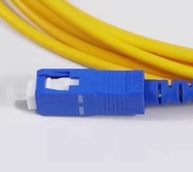
- LC，路由器交换机的光模块上最常见：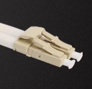
- 更多请参考[百度百科](https://baike.baidu.com/item/%E5%85%89%E7%BA%A4%E6%8E%A5%E5%A4%B4)、[维基百科](https://en.wikipedia.org/wiki/Optical_fiber_connector)

**光模块**

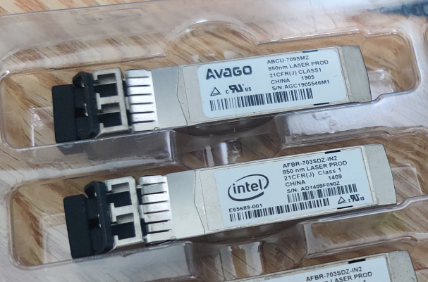

- 用于光电转换，最常见的封装是SFP+，最常见的接头是LC
- 由光纤的类型、光模块收发是否用同一根纤，分为几种类型
  - 单模单纤：最贵，但只用一根光纤
  - 单模双纤：便宜，量大
  - 多模双纤：最便宜，量最大，发热较低，条件允许的话是首选
- 更多概念和封装类型可以参考华为的这篇《[什么是光模块以及光模块的常见问题](https://support.huawei.com/enterprise/zh/doc/EDOC1100130745)》

**光缆的形态**

**皮线**——生活中最常见

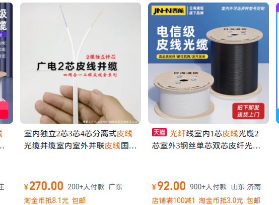

**跳线、尾纤**——跳线就是做好头的成品线，常用作设备间连接线；尾纤就是只做了一端成品头的线：

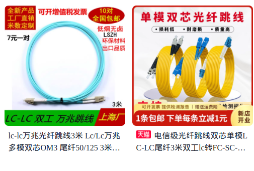

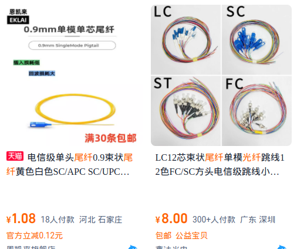

**集束光缆**——多芯，形态很多，有室内也有户外用的，一般都能抗大拉力

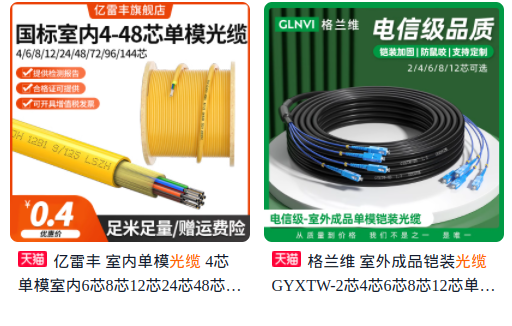

**总结一下**

|               | 单模                   | 多模                      |
| ------------- | ---------------------- | ------------------------- |
| 光源          | 激光器                 | LED                       |
| 距离          | 至少数公里             | 一般几百米                |
| 光纤标准      | G.652-G.657            | OM1-OM5                   |
| 包皮颜色      | 一般是黄色             | 橘、水蓝、紫、蓝、鲜绿... |
| 能否冷接      | 能                     | 不能                      |
| 10G单纤光模块 | 贵，80-                | -                         |
| 10G双纤光模块 | 便宜，海鲜市场15元一只 | 便宜，海鲜市场10元一只    |

### 冷接工艺

冷接工艺自己弄还是比较折腾的，要备齐百来块钱的工具，还要做好做坏、工作不稳定的心理准备，比较稳妥避免折腾的方案还是请师傅来熔接。

冷接子，用于把两根纤接在一起，实际操作还是比较考验技巧：

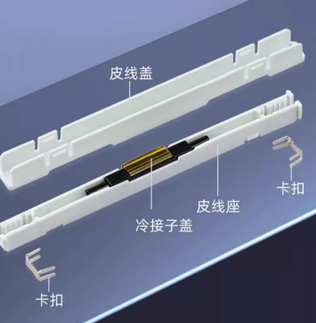

冷接头，SC头很便宜，两三块钱，下图这种LC头的就贵，某宝8元一个，接的成功率比较高，很友好：

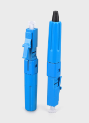

米勒钳，最大的孔用来剥外层的皮，中间的孔用来剥中层的皮，最小的孔用来刮除裸纤上的涂覆层：

光纤切割器，能切出好的端面减少损耗，自带配的定长工具是用于熔接的，冷接要用专门的定长器：

红光笔，能发出红色激光，方便观察光纤状态（光纤受伤了的位置会“红肿”）、损耗（接上光功率计测量），记得购买转接头，图里是FC公转LC母：

光功率计，用于验证光纤的传输效果，记得购买转接头，图里是SC公转LC母：

## 改造方案设计

家中原先的网络拓扑如图

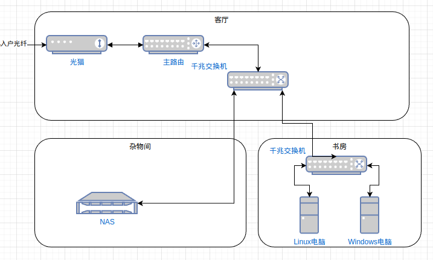

原本仅是打算在NAS上安装双光口网卡，走两根光纤，和书房的两台电脑直连，后面发现10G的光交换机价格已经低到几百块也能买到了，最终方案定为：

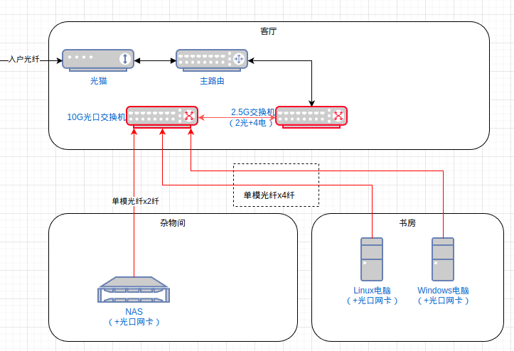

- 客厅的2.5G交换机作为光转电设备，同时替换原先的千兆交换机，将电口设备简单升级到2.5G
- 10G光口交换机到2.5G交换机间，选用多模双纤光模块+成品跳线
- 房间间互通的光纤需要穿管，而我需要自己冷接只能用单模，而单模单纤光模块太贵，所以选择了单模双纤方案
- 2.5G交换机（2光+4电）是个便宜好用的光电互转设备，后续需要

关键线材和设备是：

- JT-COM 全万兆8光口网管型交换机（JT-FG6700-8TFM），海鲜市场500收的全新
  - 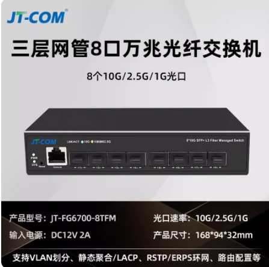
- 洪亚威视2.5G电口x4+10G光口x2 交换机（HYWS-SGT0204S），140元
  - 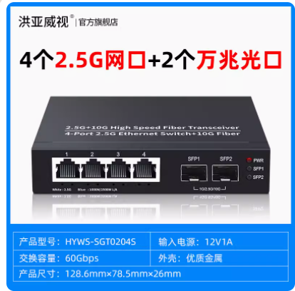
- 4芯光缆，20米的60多元，12米的40元
  - 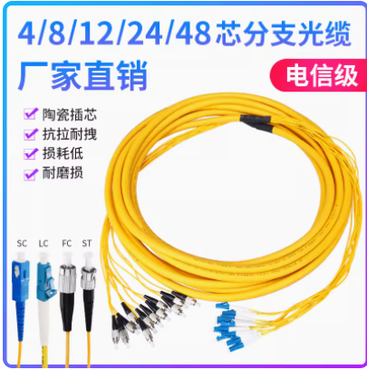
- 冷接工具，米勒钳+光纤切割器+红光笔，140+元
- LC冷接头8支，60+元（做废了两支，心疼）
- 10G单模双纤光模块x6，100元，用完了
- 10G单模双纤光模块x8，80元，用了两只；一些多模光纤跳线，十几块钱；用来做网络设备间的连接，便宜就多备点了

这次改造一共花了1200元左右

## 实操：拉线

