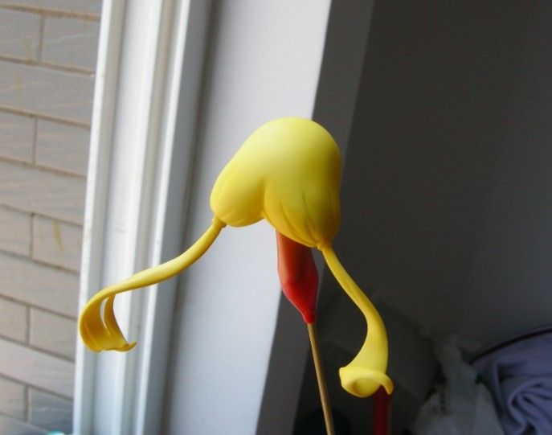
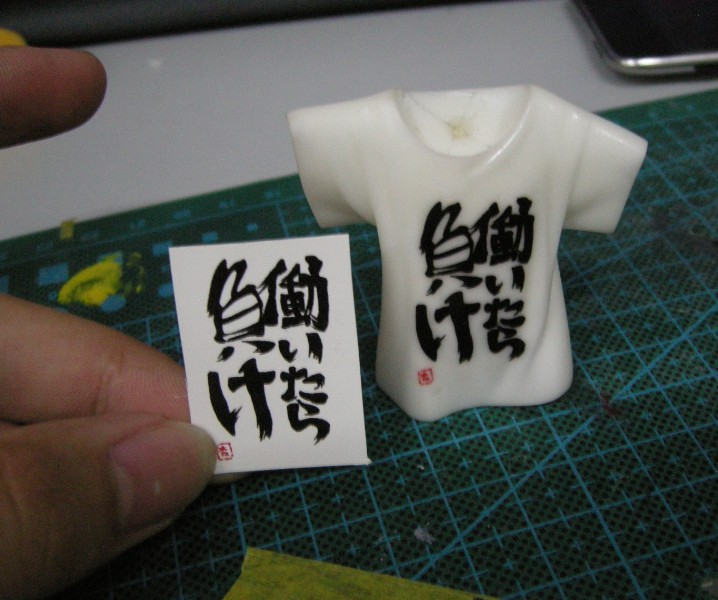
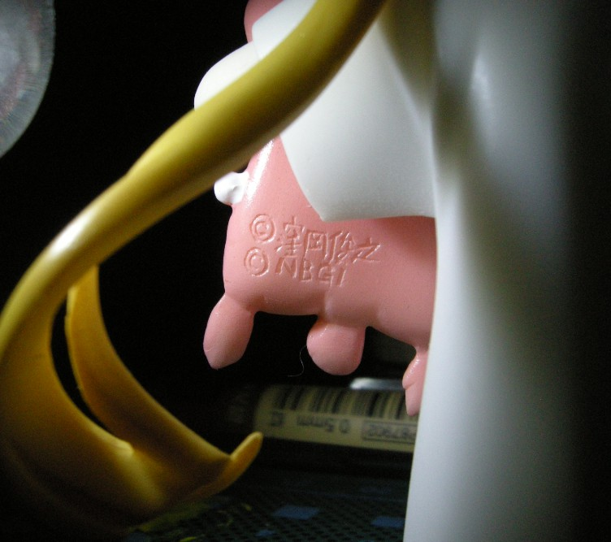

date: 2018-02-06
tags: 
- GK
---

2013年底完成涂装, 今天发现压箱底的相片顺手发出来..

原模情报: `WF2012夏 me her her 双葉杏`

<!--more-->

---

## 白模情况

质量很好二翻件 无气泡 细节也ok

## 底漆

## 涂装

## 水贴

大 气泡难搞

## 组装

---

## 和phat家的sd杏

