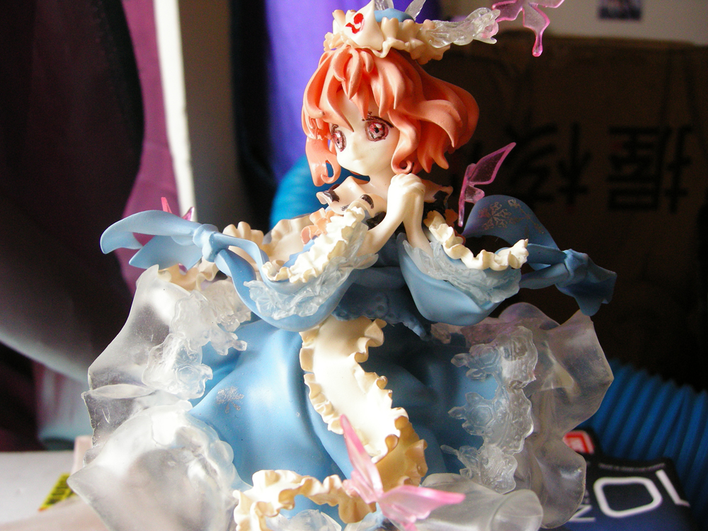
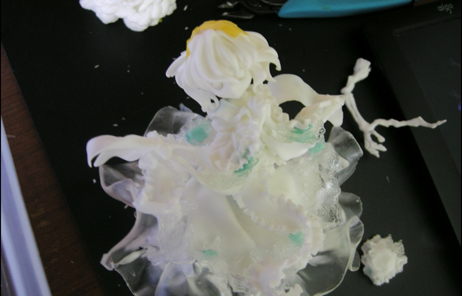
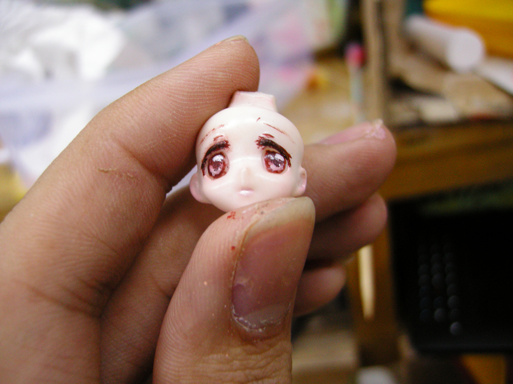
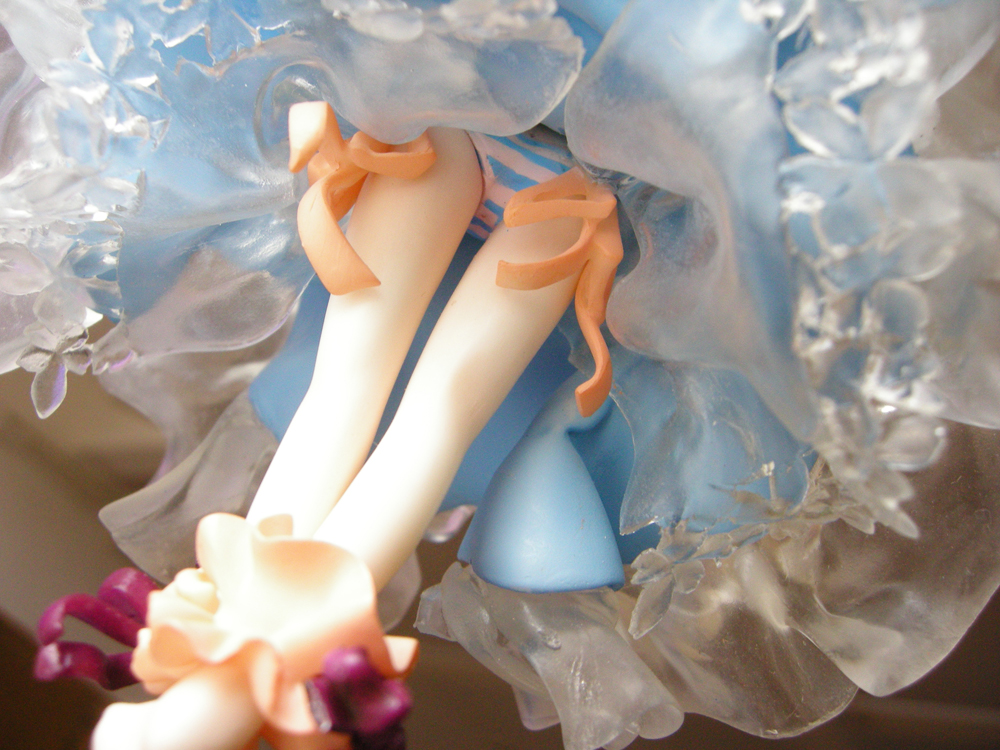

date: 2015-08-22
tags: 

- 模型
---

原型为[GLEMO](http://glemo.blog.fc2.com/)的「西行寺 幽々子」
12年底涂的一只uuz 第一只给真实比例人形涂装

<!--more-->

画眼睛是在是无力...
这东西太小了 一开始用水贴 但是水贴质量不行总是化开
后来尝试自己画 漆总是稀释不好..改了好多次 表面已经变粗糙了.于是..
现在这只模型由于漆面保护不到位 已经废了
当时拿到这个件时 实在是吓了一跳 1/12 85+的分件
硬着头皮就上了 走了很多弯路 也积累了不少经验
现在留着些过程的图片 趁着有空整理一下吧

---

## 涂装环境

大学里的一间教室里的一张桌子.
喷漆风箱, 是自己用纸箱搭的, 事实证明这玩意并不好用, 纤维到处是搞得漆面很不平整.

## 假组

基本可以用胶水解决 打桩较少

## 表面处理

件很多也很小 打磨大概花总时间的1/3
分件比较合理 用的是国内的二翻件 翻的质量还是比较好的
所以 做起来虽然麻烦 却还没到"无解"的程度

打磨 比起技巧 更考验耐心吧
笔刀把水口削个大概 之后就从400号砂纸开始慢慢磨
透明件 一磨就花了 处理好之后, 上一层光油情况能好转一些

## 皮肤上色

这里使用了透明肤色+水粉来上色, 感谢[驱魔娘娘的教程](http://blog.sina.com.cn/s/blog_533ff0b20100uwck.html)
总之就是先上一层半透明的底色, 再用碾碎的水粉涂色.
这个方法即使是新手, 也很容易掌握, 新手最怕喷出尸体色了(嘛..之前做了很多调色练习)
P.S.刚涂上去时效果是不错 但是由于保护漆没上够 水粉掉光了...后来..喜闻乐见尸体色.

## 其他部分的涂装

蓝白裤裤的涂装(别问我为什么是蓝白(σ´∀｀)σ)

这只uuz分件很合理 基本每分件不会超过2种颜色
所以遮盖就很省事了 颜色少的部分就直接珐琅漆手涂了

这个效果是 把漆调得很稀 喷上去挂滴就成了..

涂装

画眼睛....= = 无力..

组装咯

(￣∀￣)GOOD

## 完成
感谢社团里某大大 灯光和镜头都没合适的情况下 还是帮我拍了...

