date: 2026-07-24
tags:

- 工具

---

最近猫译员发布，唤起一些回忆，趁热打铁记录一下LabelPlus历史，会写得比较啰嗦且杂，请见谅见谅。

<!--more-->

不搞漫画翻译的圈外人可能不清楚LabelPlus这个项目，它的[主页](https://noodlefighter.com/label_plus/)有介绍，可以看看。

它在不知道什么时候，在GitHub Star数增长十分缓慢的情况下，后知后觉，成了漫画翻译圈子里的事实标准。

## 2010年 在做翻译之前的事

那时我高一，喜欢上自习课的时候看轻小说，而且还喜欢追新的看。

当时小说基本要等轻国之类的小说翻译，一卷新的轻小说出来，翻译过好久才更新。

当时就琢磨着自己学日语，想着迟早有一天能啃轻小说生肉。

实际上，当时学了才知道，啃掉《大家的日语》上、下册，学的那些三脚猫日语是没法流畅阅读小说的。

## 2015年 LabelPlus的诞生

> ~~LP公元**纪年**~~（划掉）
> 在那之前，虽然在动画字幕组里干过日听，但没坚持下来，原因是太累了，很多是晚上刚播出的动画，第二天就发布压好的带字幕视频...

那时大三，我的日语依旧不精，想着在本科毕业弄个能力考证书，一方面逼自己多多学习，一方面给自己一个交代，让多年的学习有个能看到的结果。

但是学习太枯燥了，爱好的学习就该用爱好的方式，所以在朋友介绍下，加了个漫画翻译组。

进漫画翻译组之后，在组里干着翻译，组织很松散，节奏很自由气氛很融洽，工作流大概就是：

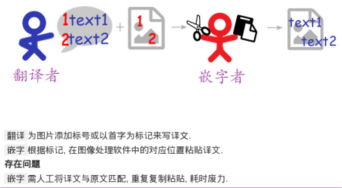

- **扫图**：图源当主催，拆本扫本，然后在组里找愿意接活的翻译员、嵌字员
- **修图**：刚扫出的图没法直接用，一般要重新修整比如适当去除纸制纹理、调整曝光和黑白场（很多时候嵌字和修图是同一人）
- **翻译**：扫好的图给到翻译员，**翻译员用一个组里自己写的标号工具，工具左边显示图片，右边是个记事本，图片上点一下就出一个标号，记事本上出现对应标号的文本，翻译员就在标号文本下方写翻译**
- **嵌字**：修好的图、译稿（打了标的图片+翻译文本）给到嵌字员，**在Photoshop里，根据标号的位置，将翻译文本一个个复制粘贴进来，调整格式，框内字涂白、框外字背景修补**

组里的翻译、嵌字的交接方式，就是LabelPlus工作流的原型，组里把它叫作「标号器」，作者是组里908大佬

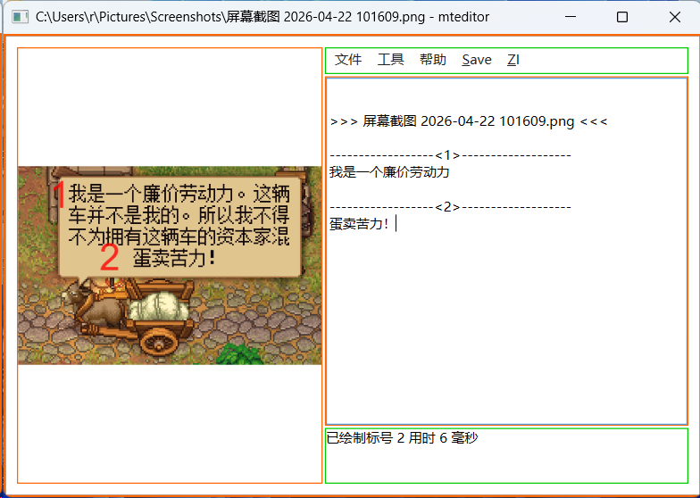

> 现在这个老古董还能在GitHub上看到 https://github.com/LabelPlus/mteditor
>
> 2013年创建，可见这工具在组里也用了两年，后面908大佬将它转移到LabelPlus组织下了 

完成了几个翻译任务之后我就觉得，这个交接环节太费事了... 嵌字要一个个文本复制到Photoshop里，有时还会弄错。

然后就开始研究Photoshop，得知它自带一个旧旧的JS引擎，暴露了一些API可以写脚本拿来实现文本导入，然后就有了LabelPlus...

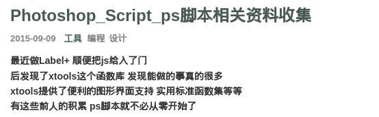

2015年年中开始做，7月底差不多定型了，当时写程序真菜，就是怎么快怎么来，磕磕碰碰。

还好908也给了一些帮助，给了些建议，教我用GitHub，还有一起找bug啥的。

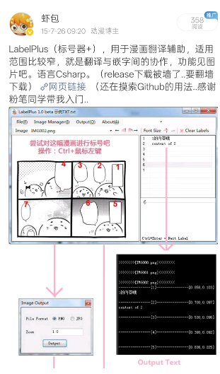

后面组里Leader觉得这工具是新生产力，虽然不稳定但是也让大家尽量用了，所以问题的反馈也很及时，这也是继续开发的动力，密集开发几个月就成了现在的这个样子：

- LabelPlus主程序，作为翻译工作台，定型之后基本没再怎么改（这奇怪的icon都是当时组的QQ群头像，一张水跃鱼的表情）
  - 翻译工作台功能很简单，几个视图：添加标签/写翻译/审校
  - 我本身是翻译，体验这方面自己爽了，当然是杠杠的，这点还是很自信的
  - 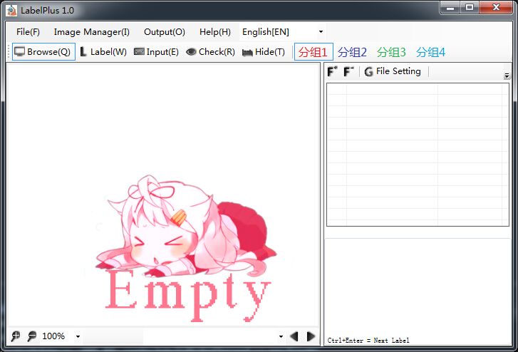
- LabelPlus PS导入脚本，作为嵌字的自动化工作台，有文本格式设置、实验性的框内字涂白功能，还能在导入时执行一些自动化动作
  - 后续的新需求主要来自嵌字，毕竟嵌字是麻烦事，追求工具的效率收益很大，后续的演进基本是在LabelPlus PS导入脚本上做文章
  - 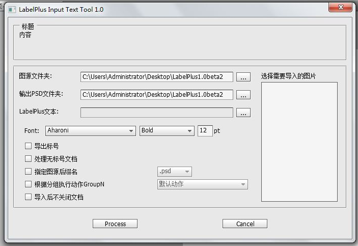

## 2017 萌翻上线

当时kozzzx觉得我的LabelPlus的idea不错，就做了WEB版本萌翻(moeflow.com)。

功能设计上，就是比LabelPlus更好的UX设计的翻译工作台+团队管理+远程协作，对比LabelPlus显然是进步的，解决的问题有：

- WEB天然跨平台，而响应式UI设计解决了电脑、手机协同，随时随地可以做翻译
- 数据在云端，解决了多端同步的问题
- 解决了组内协作，需要互发文件的问题，相当于翻译组内部OA

但有利就有弊，后文会说... 

## 2018 小爆发期

用户变多，问题的反馈也变多，可能就是这段时间从初期的少数我能联系到的几个翻译组，扩散到其他翻译组的。

甚至收到了国外用户的关于多语言问题的反馈，说他的搞翻译的朋友都在用.. 这些人倒是从GitHub找到这个工具的。

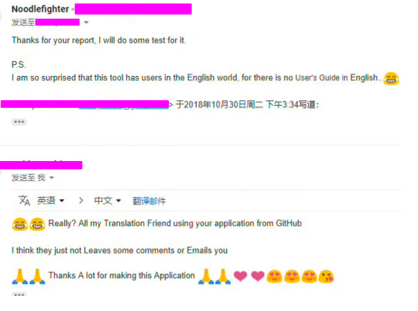

## 2020 没法维护的主程序和绝望的我

LabelPlus的用户量越来越多，虽然我不知道具体有多少，homepage一个月大概300访问量，对于一个漫画翻译小工具来说很多了，但是能感觉到收到的抱怨：

- 瞎糊的编辑页面渲染有偶发bug
- 跨平台需求满足不了
- 数据结构设计很烂，加功能困难

LabelPlus主程序烂在那了，当时能力实在有限，在很早之前就不打算改了... 只修bug，当时已经有了LabelPlus2构想——跨平台、插件化（能接自动化如在线翻译服务、简繁互转），但依旧还是精力和能力的问题，这个许愿没能实现

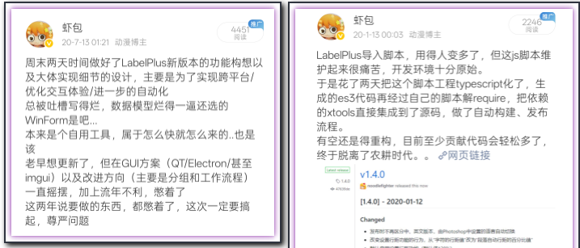

> 回头搜这些PO，看到就想笑，当时待在初创公司呢，你有时间搞吗.... 「一定要搞起」..

而PS脚本这边，维护越来越困难了，它原本是JS实现的，我将它做了重构TypeScript化，加上PSD模板、配置存取功能。

PS脚本 UI也变成了接近现在这样（之后UI没怎么变了，这其实是稍新版本的截图）：

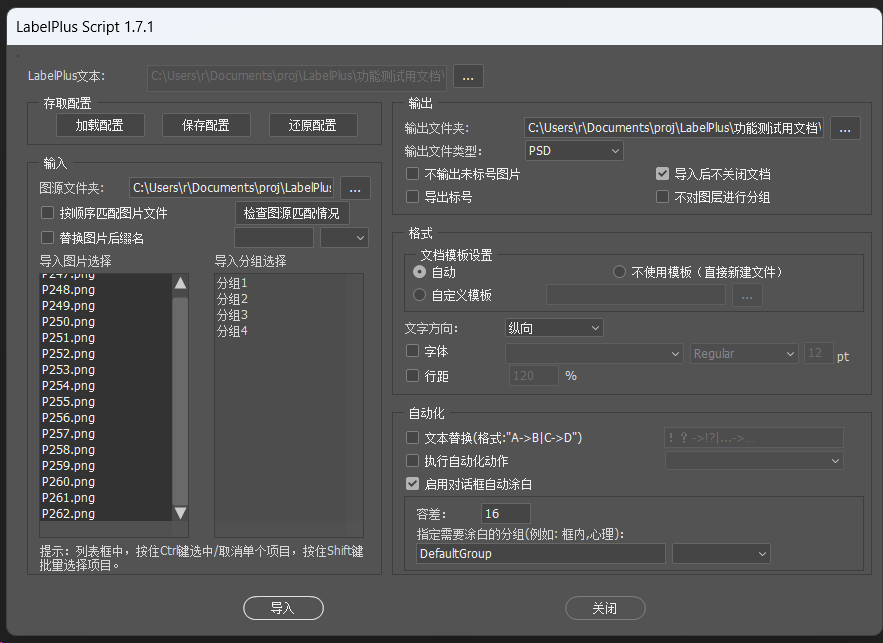

## 2021到2022——LabelPlus开发停滞、萌翻决定下线

PS脚本完善了涂白功能，之前的实现相当于只是跑了个魔法棒动作，在这个点把它代码化了，至此涂白功能才稳定下来，从实验性功能变成正式功能。

当时我还发现有了LabelPlus的其他实现.. JAVA写的LabelPlusFX（原仓库停止维护了，据说作者Meodinger已经去世，项目由社区的其他人fork接管了）

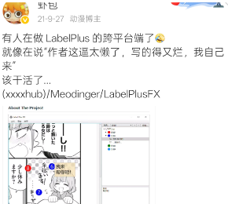

这一年萌翻也决定停止运营并将网站程序开源，它的问题是，线上协作的需求存在但没法自造血，也不经济：

- 用户上传文件之后，就占着服务器存储资源，产生着费用
- 而它有着小众工具属性，投放广告除了降低体验以外对于网站运营来说杯水车薪吧
- 很难有其他变现途径，企业应用吗，看不到这样的机会

> 这之后萌翻的用户主要以自托管形式使用，我只知道最大的实例是尨译(moetran.com)，因为以上原因，它的运营在没有外部资金的情况下必然是艰难的
> 站长dr490n像曾经的我们一样，纯用爱发电了... 似乎最近在募捐了

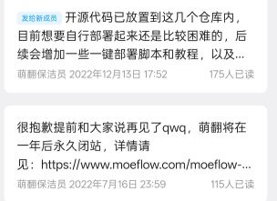

之后这个项目便陷入了沉寂，一个是项目的技术方向上的迷茫（GUI真是个让人讨厌的东西..），也有生活上也有原因吧。

时不时能听到人提到这个项目，才后知后觉这个工作流已经成为小圈子里的标准了。

## 2026年 猫译员 Neko Translators

都知道2023年，LLM的火烧起来之后，最先冲击的行业是语言相关——正好是翻译

而程序开发领域，是2025年年中开始的，以补全式（Cursor为代表）向agent式（Claude Code为代表）过渡，带来了生产力的爆发

LLM能联系上下文做翻译，漫画这种零碎语句的翻译质量有了飞跃式的进步

那时就想着，LabelPlus在这时应该迎来接替者了吧，N久之前期待的：

- 跨平台，跨电脑、手机端（类似萌翻）
- 支持远程协作（类似萌翻）
- LLM驱动的翻译（能接各种平台或者本地）
- 软件内完成部分修图工作
- 继续接LabelPlus工作流，需要后续进Photoshop、InDesign的可以继续沿用相同的翻译文本

毕竟有SickZil-Machine、BallonsTranslator等等这些前人的工作，把气泡识别、自动涂白用小模型实现了，只差一个平台做整合。

但是没等到... 等来的是社区的一些面向读者的翻译器，UX设计面向读者而不是译者、本地部署优先、需要显卡，和我们想要的有偏差...

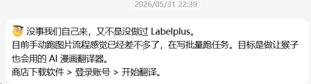

这次还是kozzzx当主催... 打磨两个月，Neko Translators (nekonekone.com/translator) 2026年7月21日发布，吸取之前的教训，这次的项目：

- AI驱动，CPU也能跑的本地小模型+API接入模型（线上模型为主，硬件够强的用户也能接本地部署模型）
- 跨平台，电脑、手机兼容UX设计（从Flutter框架获得的收益）
- 商业驱动，目标是让读者、译者、开发者都能从中受益
- 上线时已实现：翻译工作台、阅读器
- 后续将增加：修图嵌字工作台、多端同步、远程协作功能

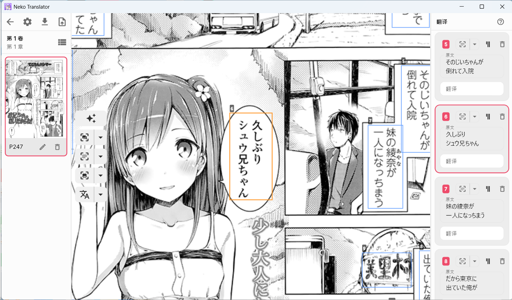

希望这次能走远点咯