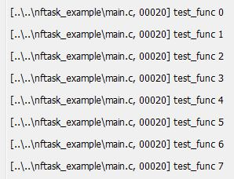
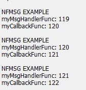
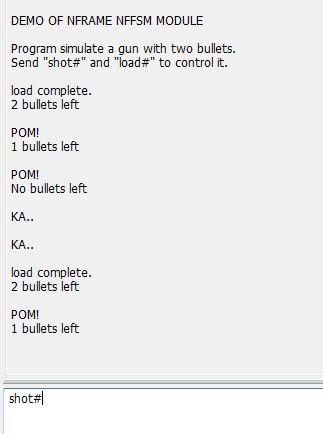
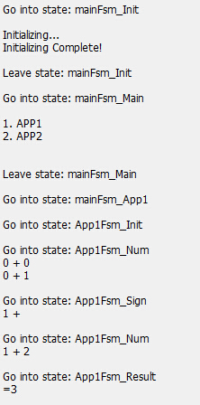

date: 2015-08-22
tags:
- 工具
- 嵌入式软件
---

已废弃

<!--more-->

[git传送门](https://github.com/noodlefighter/Nframe)

## 2015-08-22

先编写了MSG/TASK部分.
本来没有自己做内存模块的想法, 但是用堆内存还是担心申请不到的情况,
还是先获取大片内存然后自己管理比较妥当, 所以增加了内存管理模块.

---

## 2015-10-14

回头看了一下之前写的task部分, 效率太差, 感觉可以参考ucii那套.
现在先做着debug部分 想给printf套一层 又被c89不支持变参宏卡住了..考虑转战c99

参考文章:
[printf 的宏定义版本](http://blog.csdn.net/cp1300/article/details/7773239)

---

## 2015-10-15

给debug模块大致写了个command解析功能, 能帮用户从字符串中提取出参数, 并调用用户的处理函数.
本来打算用msg机制来做传递的, 然而需要传递几个字符串(参数), 垃圾回收很难做, 只好作罢.
真的是一天写一百行啊..

---

## 2015-10-19

完善了NFDEBUG模块 现在已经满意


这几天断断续续地写了TASK DEBUG部分的例子
感觉TASK模块还能做很多优化..(现在根本不能算轻量级啊喂)

这里记录一下MSG模块的设计思路吧:
我希望模块能帮用户维护一个"消息队列",
这个队列在主循环中被逐条处理,

用户可以定义自己的"消息点", 消息点可以有多个"消息处理者"
"消息处理者"包含"消息类型"和"消息处理函数"
当一个"消息点"收到消息, 会根据自身的"消息处理者"的"消息类型", 分发到对应的"消息处理函数"中.

没有多线程,为什么还要这样的机制?
我认为这样的好处是: 可以将消息队列作为平面状态机模块的队列,

把MSG模块重写了 原本脑抽 消息点都用了动态申请内存....
砍掉之后代码少得多了
现在写了demo 运行不正常 发现问题还是在malloc上 莫名其妙会HardFault_Handler..
因为MSG模块会对用户的msg拷贝一次 所以动态申请内存无法避免
看来得自己弄片内存来管理 或者这部分功能强制使用NFMEM模块..= =

---

## 2015-10-21

malloc工作不正常 会跳入hardfault
以前stm32一直用微库 现在尝试把它去掉把它去掉无法进main函数了
<解决STM32调试,无法进入main函数的问题>
http://blog.chinaunix.net/uid-16839253-id-2860462.html

现在加上了这段代码 能在不用microLib之下进入mian函数 但是malloc的问题依旧
看来得看看RealView编译器的手册
```
//#pragma import(__use_no_semihosting)
_sys_exit(int x)
{
x = x;
}
struct __FILE
{
int handle;
/* Whatever you require here. If the only file you are using is */
/* standard output using printf() for debugging, no file handling */
/* is required. */
};
/* FILE is typedef’ d in stdio.h. */
FILE __stdout;
//FILE __stdin;
```

---

## 2015-10-22

10-21 malloc的问题是example里没有填充msgSize, 默认为一个比较大的数.

现在在NFMSG中增加了一个简单的环形BUFFER,
要求销毁要按照创建的顺序.

现在写了DEMO发现运行良好.

NFTASK任务模块DEMO
main函数中设定1s执行一次子程序


NFMSG消息模块DEMO
每隔1s发送一个消息: 一个数字
另一个子程序接收消息 +1并显示


接下来开始NFFSM平面状态机模块的编写.

---

## 2015-11-08

编写NFFSM模块
参照了Miro Samek Ph.D.的"优化的FSM实现"
即使用函数指针表示状态 函数本身就是消息处理程序
根据用户自定的消息类型 在函数内部完成分发

好处大大滴有 不同状态间的程序段相对独立
又不像使用switch嵌套实现的FSM那样 代码乱七八糟不能直视
在函数首部定义static变量 利于对照 嗯很方便!

我定义了两个特殊类型: STATE_INTO和STATE_OUT 用来表示状态进入和退出
这样 编写程序的时候 进入退出的代码就能和消息处理的代码在一起 修改起来很方便

然后这个是FSM模块DEMO效果


```
*        用状态机模拟一把只能打2发的手枪(有这样的东西吗? 我也不知道)
*        有3个状态: 剩余2颗子弹(b2) / 1颗(b1) / 无子弹((b0)
*        用户向串口传入"shot#"时, 剩有子弹时传回"POM!"; 无子弹时传回"KA.."
*        用户向串口传入"load#"时, 填充子弹, 传回"load complete."
*
*                                               <------------
*                                              |             |
*           b2 ---(shot)---> b1 ---(shot)---> b0  ---(shot)---
*           |                 |                |
*           ^              (load)           (load)
*           |                 |                |
*            --------<----------------<--------
```

写DEMO的时候发现NFDEBUG的命令功能还是不好用 总忘修改NFDEBUG_COMMANDLIST_SIZE
所以....这里做了修改工作
修改NFDEBUG模块中 用户命令的设置方式
原本的设置方式
```
/* 用户程序中 */
NFDEBUG_CommandDef NFDEBUG_CommandList[] =
{
    {Command_test, 5, "test "}
};

/* nframe_config.h 中 */

/**< \brief DEBUG命令数量 */
#define NFDEBUG_COMMANDLIST_SIZE        1

```

现在更改为 只需要在用户程序中 这里使用了一个宏定义NFDEBUG_COMMAND_LIST(n)
```
/**< \brief DEBUG命令配置 */
NFDEBUG_COMMAND_LIST(1)
{
    {Command_test, 5, "test "}
};
```

NFFSM模块中 也做了类似的修改 把msgType交给用户来定义.
好处显而易见 不必修改nframe_config.h 用起来更方便

---
## 2015-11-10

完成nKEYSCAN通用部件编写 还有DEMO


还加了个通用PID算法程序 相信配合NFDEBUG模块 整定PID参数时会轻松些

nKEYSCAN使用了大量回调函数 效率明显低了不少 但对于快速开发这是值得的(吗?)..
至少对于初学者来说, 稍微配置一下就能使用完善的程序, 还是挺方便的(其实复制粘贴更方便哈哈)
使用通用部件, 运行效率降低是避免不了的. 嘛..用不上至少还能给人copy是吧.

## 2015-11-12

使用NFRAME尝试编写两层嵌套的平面状态机(手动编码实现一个简单的层次状态机..)
外层状态机向内层传递消息, 并可以根据返回值, 判断内层是否响应了消息.


内层的AppFsm是一个简单的四则计算器..
演示


编写的过程中 发现NFFSM在嵌套的时候缺少了一些必要的功能
所以进行了这些修改:
```
NFFSM_IsRunning();
NFFSM_DeInit();
NFFSM_MsgIn()避免未初始化;
状态定义增加返回值,表示是否成功处理;
NFFSM_StateTran()增加一个参数, 表示进入时顺带传入的参数.
```

__还有些问题待研究__
1. 消息优先级
2. 状态机 用户使用时需要避免的错误(比如 错误的转换以及某些情况可能造成的死循环)
3. 异常处理

要做其他事情, 接下来这个东西会被暂时放置Play了.
