date: 2017-06-21
tags: 

- 键盘
- 嵌入式软件
- osu!
---

nono 3.0版是14年夏天做的
现在已经过去了两年 简单来个小升级吧
nono v4的工作日志

<!--more-->

目标:
=======

* 用于切换歌曲的小滚轮(机械式旋转编码器)
* 替换昂贵而手感不佳的小按键 
* CherryMX -> Cherry MX RGB

---

2017-01-08 第一次打样
========================
编码器:
---------
随手弄了几只 从左到右 松下EVUTXCB16B/美上SIQ-02FVS3/松下EVQWKA001
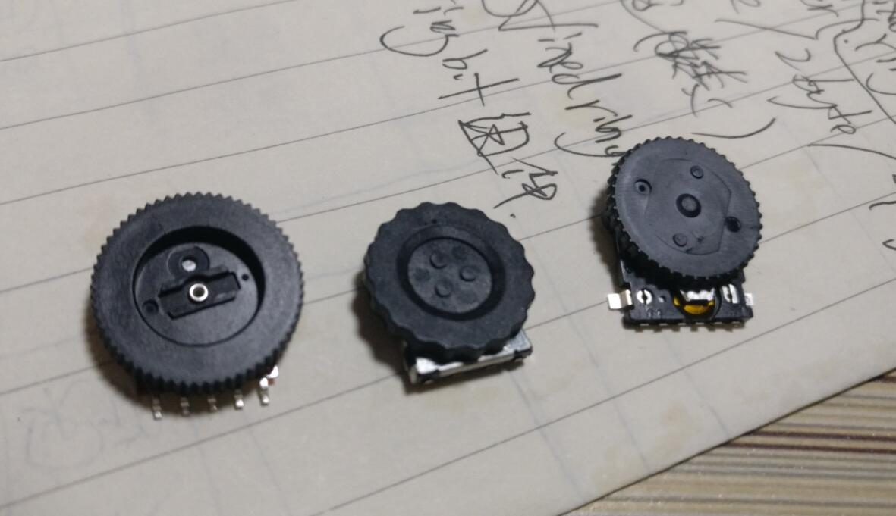
左边的那只没段位感
中间的占PCB面积小, 手感尚可
右边的手感最好但占PCB面积过大, 备选

PCB设计:
----------
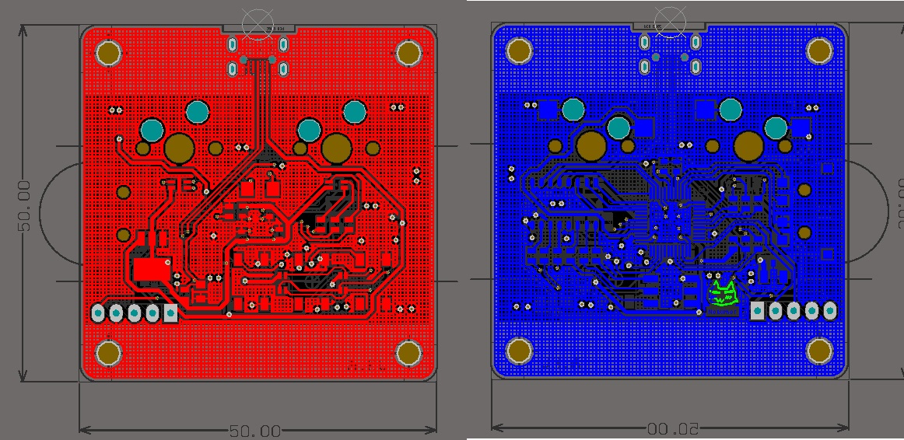 

由于使用RGB轴, 为两个主按键增加了独立可控的RGBLED.
为按键3/4/5(功能键)增加两颗可控RGB作为背景灯
背景灯LED改用5050封装
原先使用0805的电容电阻, PCB尺寸有点吃紧, 现在改用0603封装
加上了为CherryMx设计的接插件焊盘
增加了一只带按钮的旋转编码器(美上siq02fvse)
精简调试口 仅保留SWD调试方式

打样板子:
---------
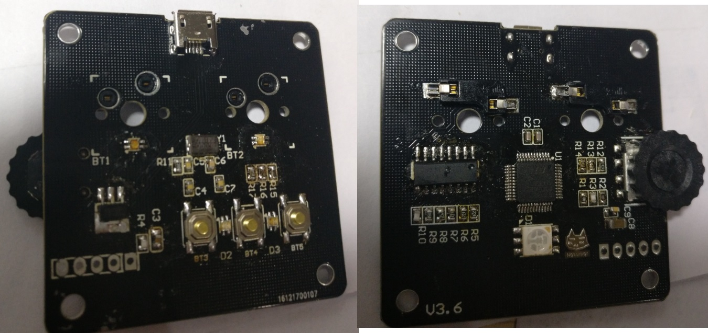

遇到问题:
--------
1.调试接口问题 
精简的SWD口 使用JLink调试 仅接3线时会无法连接目标板 
仔细检查JLink的Jtag口 Pin1为电压参考脚 这个脚是用来探测目标板电压的
该脚接到+3.3之后 成功调试

一直以来使用2.54mm的排针 调试时都不能上外壳 挺不方便的
可以把调试口做成圆孔焊盘+金手指, 可以把线焊在金手指上引出方便调试

-----> 将调试接口上的VCC(USB供电5V)改为+3.3, 调试口加金手指延伸到边缘

2.旋转编码器的位置
现设计在左侧 使用不方便 
管用右手者会使用左手使用nono, 以大拇指操作滚轮为优

旋转编码器高度为4mm 原先设计的两层亚克力均为3.6mm(公差尚不明, 使用高度3.5mm的编码器是否合适?)

-----> 改用更薄的旋转编码器(松下EVQWKA001), 
       旋转编码器位置改至电路板右侧底层
       顶层因为小按键占用了位置, 为了兼容3.0的前面板只能放在底层
尝试(笑):


3.RGBLED的一致性
打样的板子 左侧按键灯的白色比较纯正 而右侧按键灯的白色偏绿
记录一些数据供日后参考
+3.3电气网络测得电压3.23V
测量限流电阻, 以及上电后测量R/G/B上的压降:
        左侧    右侧
电阻R   469     470
电阻G   750     749
电阻B   748     750
压降R   1.887   1.874
压降G   2.421   2.396
压降B   2.625   2.618

计算电流: I = U/R = (3.23-LED压降) / 限流电阻
以下单位mA
电流R   2.86    2.88
电流G   1.08    1.11
电流B   0.81    0.82

-----> 选用一致性更好的RGBLED

4.其他细微调整

* 一些焊盘做得刚刚合适 会提高不良品率: 晶振/ULN2003
* RGBLED的封装和实际购买到的正好相差了180° 有可能是封装画错了 稍后得检查
* CherryMX接插件没在丝印层上画外形的标注 容易焊反

---

2017-02-04 第二次打样
======================

调整
-----

* 旋转编码器未换型号 直接修改壳体设计(开个正合适的槽) 
* 旋转编码器移至右边 增加4个焊盘...更牢固
* 将调试接口上的VCC(USB供电5V)改为+3.3 (供swd调试电平匹配)
* 调试口从2.54mm排针 改为排针+金手指(??)的形式 方便直接焊线
* 更换背景灯RGBLED 使用台产光宝的LED

打样板子:
---------

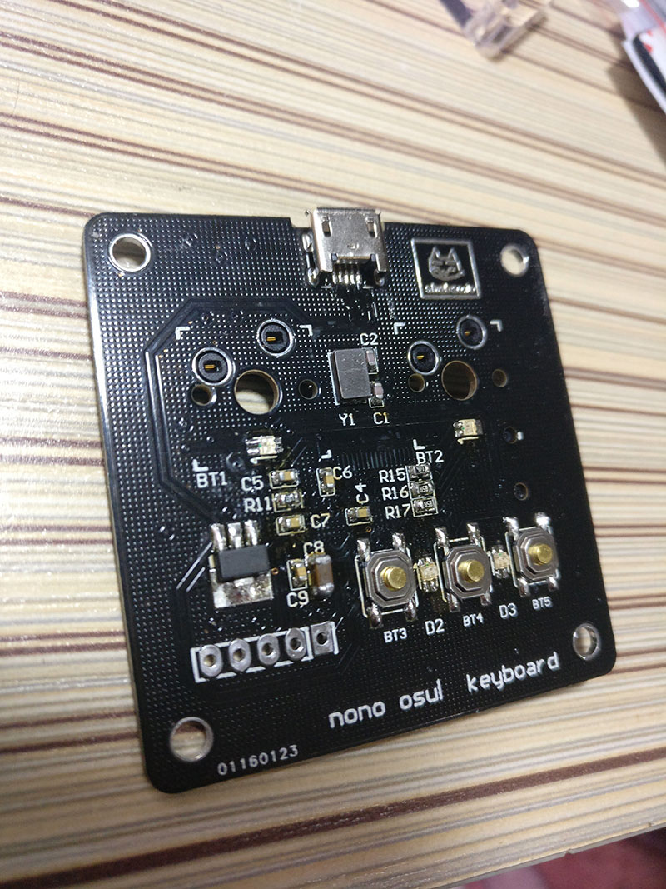

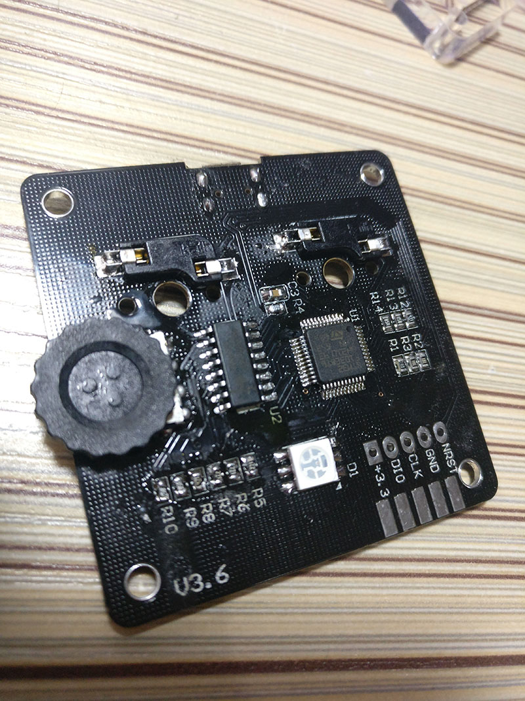

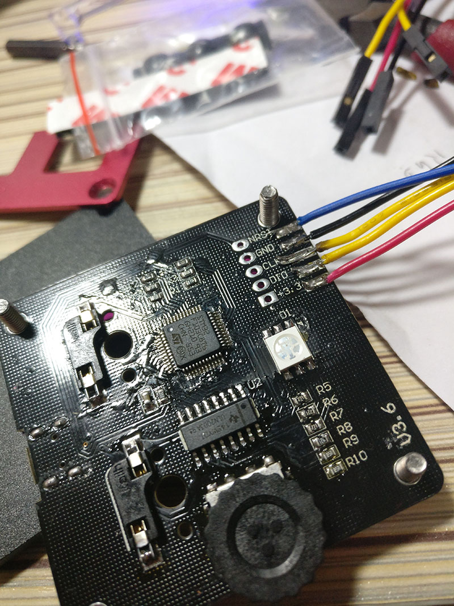

灯光效果:
---------

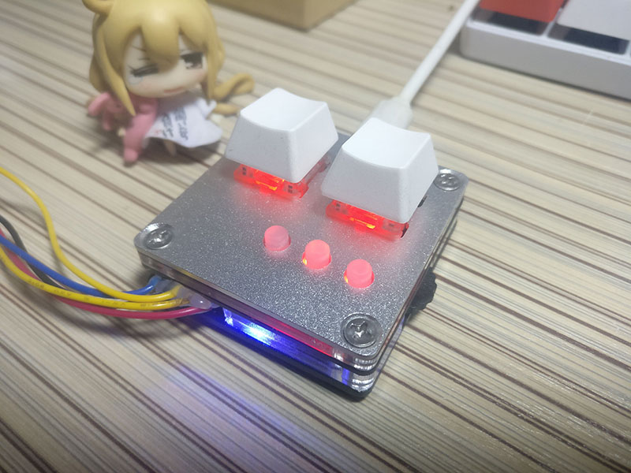

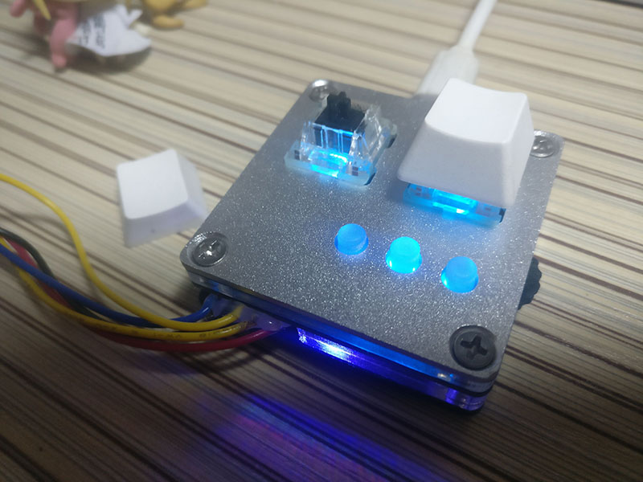

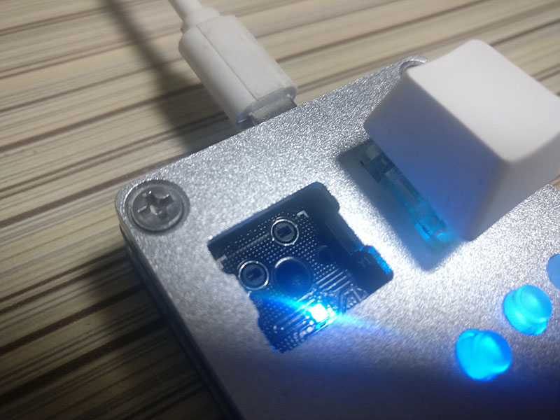

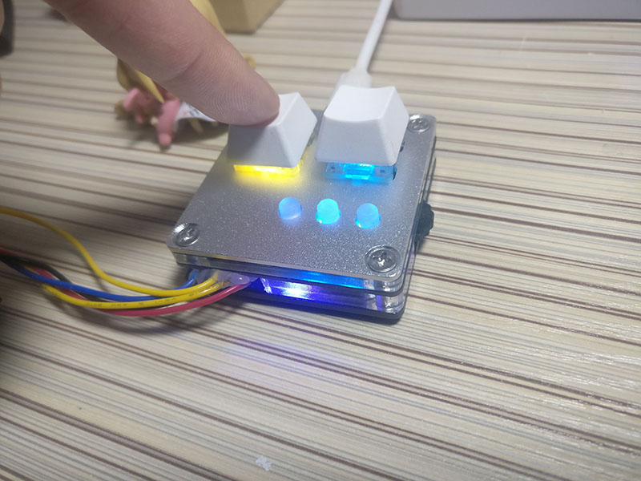

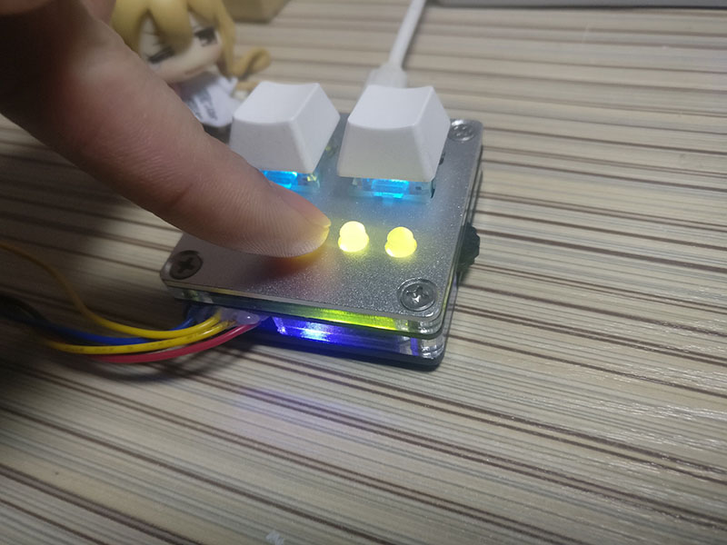

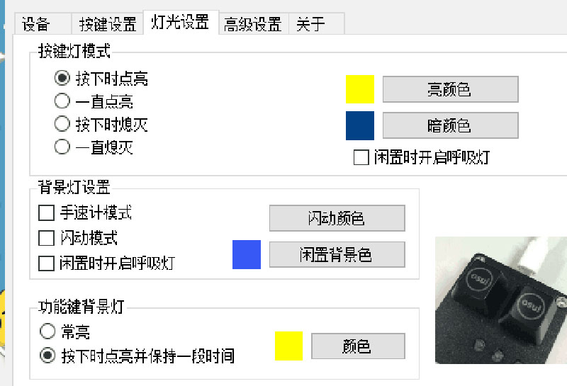

RGBLED样品测试/电阻调整
--------------

之前的RGBLED一致性太差 所以拿了其他一些价格高点的样品: 
深圳光亿 0.12元一颗 / 台湾光宝 0.70元一颗

搭了个简单的电路测试LED一致性 当然是从价格便宜的开始测了
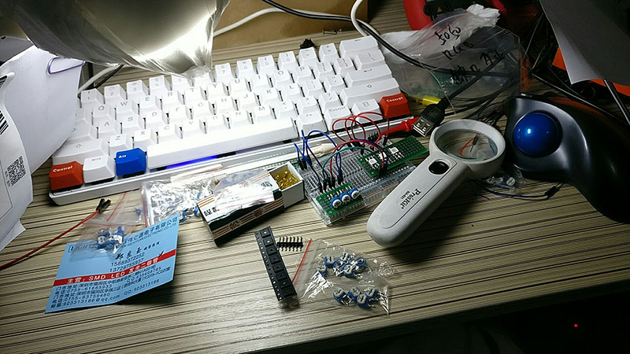

测了三颗 一致性不错.. 就焊上板子了
装上外壳才发现实际效果不行 光混合的效果太差 尤其是从侧偏射出时:
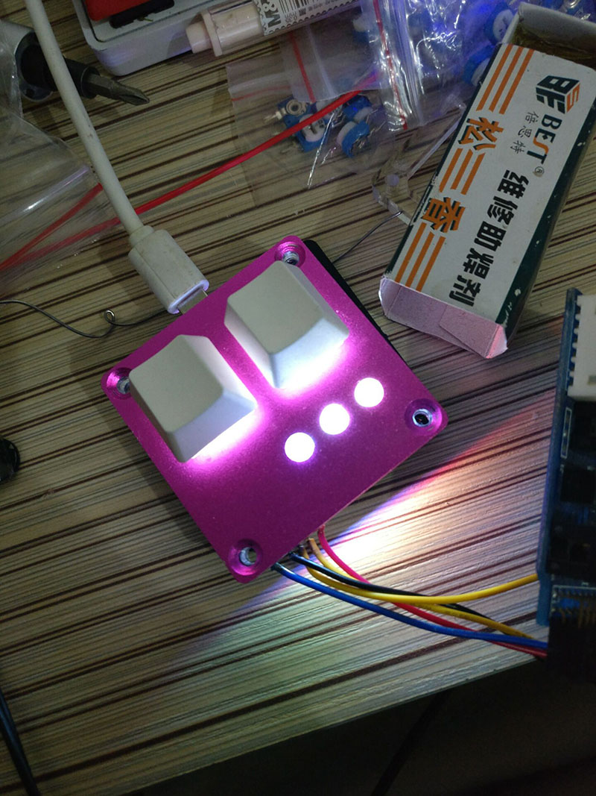

光宝 测试完一致性后就上了板子 混光均匀效果杠杠 就决定是你了:

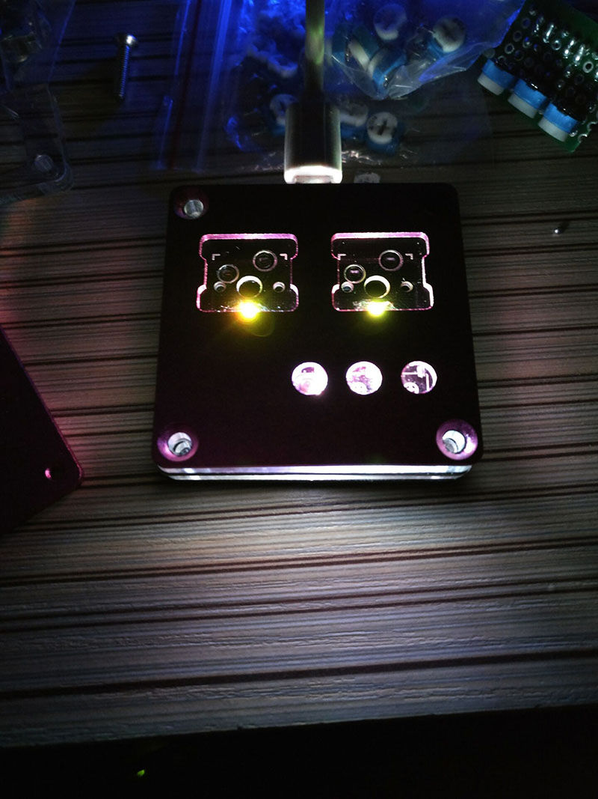

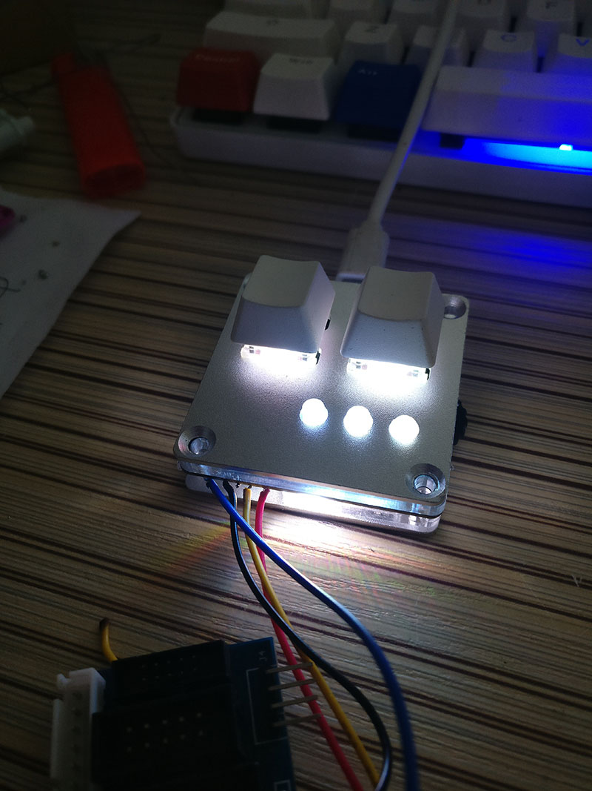

---

2017-02-25 最终打样
===================

为了方便管理版本号
产品版本号改为v4.0
硬件版本号与版本号相同
固件版本也从v4.0开始

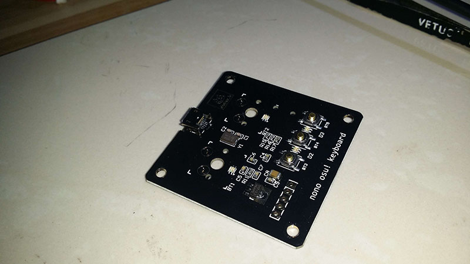

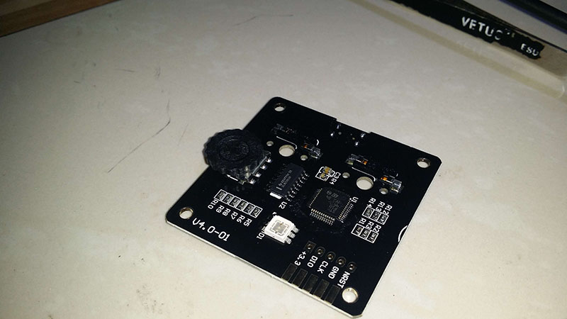

---

2017-06-21
==================

要解决几个问题

1. 根据几个月以来用户反馈 接插件似乎质量不是很稳定 排除掉工艺上虚焊的部分 有部分接插件是质量有问题的
2. 0805LED质量似乎也不是很稳定 成品里大概有超过1%的0805LED的蓝灯有问题 表现为用万用表二极管档测压降只有0.6v, 而正常的蓝灯在1.7这样
3. 5050LED发出的光瞎眼 主要原因是底层亚克力外壳镜面反射 如下图

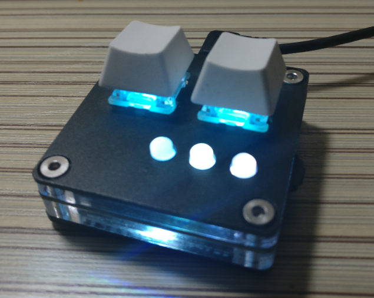

换了0805led重新打样看了下效果还不错:
pcb:
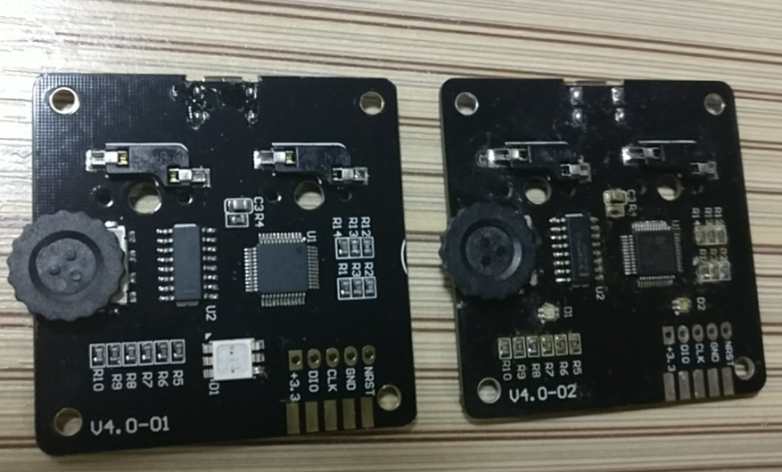

灯效:
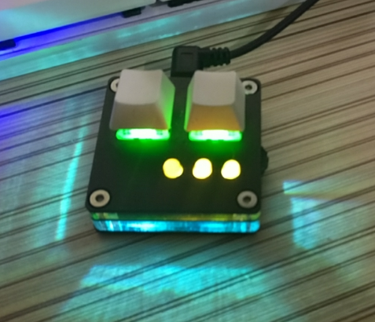

另 版本号变更为语义化版本号
主版本.次版本.修订版本+制造批次
从4.0.0+03开始(实际上是第4次生产= =为了连贯只能这样了)