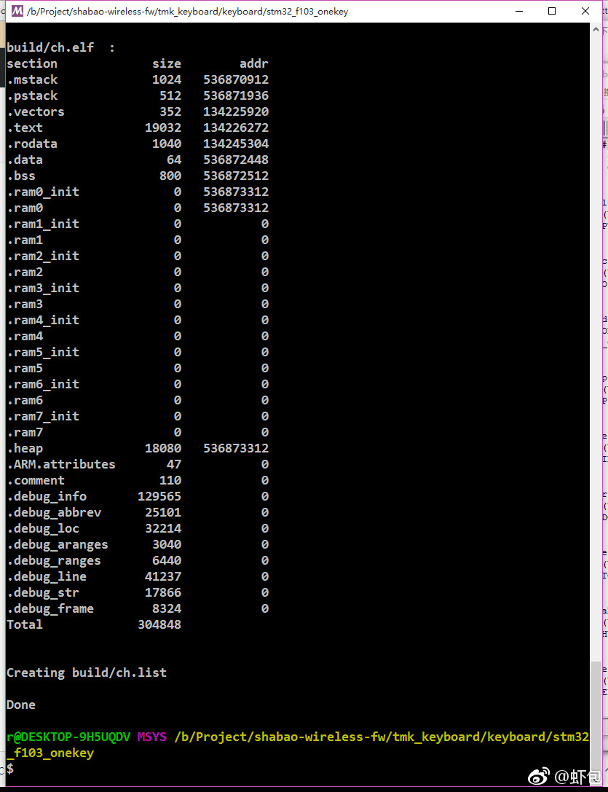
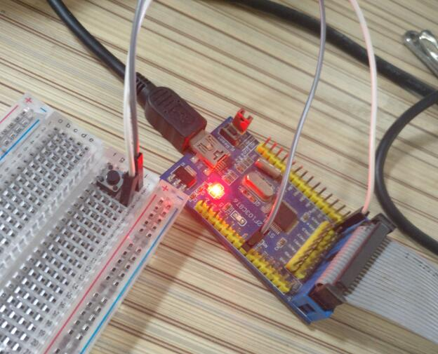

date: 2017-07-05
tags: 
- 键盘
- 嵌入式软件
---

2017-6-21
============
想做个40%无线键盘 麻烦的地方是无线键盘的接收器
tmk_core是个不错的开源库 要实现最简单的无线接收器功能 只需在它的基础上 把按键扫描部分适配上无线通讯即可

<!--more-->

大致写一下想法:
* 使用tmk_core, 自然是GPL了, 嗯硬件也跟着GPL
* 无线使用nRF24L01 2.4G方案 这片子能做到发11mA,收13mA CR2032这种小电池应该能驱动起来
* 通讯 采用单片射频芯片 半双工 角色分为接收器/设备
* 通讯细节 上下行数据使用不同通讯信道 信道固定 接收器闲时保持接收 通讯均由设备发起(上行数据) 接收器返回ACK数据以及缓存着的需要下发数据(下行数据)
* 适配 进入适配模式后 收到设备的设配请求后下发加密密钥 适配后使用该密钥加密通讯

托管在[github上](https://github.com/shabao-studio/shabao-wireless-fw) 总之今天先fork了个tmk_core.

(这里被坑了.. `/tmk/tmk_keyboard/tmk_core`比`/tmk/tmk_core`新....重新fork)

2017-06-25
============
编译并实际跑了一下`tmk_keyboard`里的`stm32_f103_onekey` 可以正常工作

看了下TMK这套的大致实现 它把按键扫描放在了用户程序来做 
看来只需要在这部分适配上无线就能做个无线接收器了

另外发现一篇很好的跳频协议的设计参考(也是很好的入门材料吧哈哈) nRF24L01官方(Nordic)的应用手册<[nAN24-07: Frequency Agility Protocol for nRF24XX](http://infocenter.nordicsemi.com/pdf/nan_24-10.pdf)> 手册简单描述了2.4G无线键鼠如何使用跳频技术来避免工作在2.4G频段的其他设备的干扰

对于键盘而言 大致思路是这样的
接收器和键盘均有一张相同的"跳频图案" 也就是一张表示设备切换频道的顺序的表(这张表中相邻序号的两个频点 分别踩在WLAN的不同信道上 便可以针对性地避开WLAN的干扰)
接收器每隔8ms切换一次接受频率 键盘在每次键值改变时快速地不停地切换发送频率 直到收到应答数据

2017-07-04
============

研究了几天nRF24L01 这个片子的功能挺不错 对开发者挺友好的 难怪爱好者圈子用得很多..
大概需要用到这些特性: 动态负载长度/掉电模式/自动应答/自动重发
跳频对驱动性能有要求 所以驱动需要硬件SPI 看了开源的驱动没有能直接用的 决定做套基于ChibiOs的驱动
在这套驱动的基础上修改 : [chibios-nrf24l01](https://github.com/ranzbak/chibios-nrf24l01)

编写过程中发现这款芯片并没有复位引脚或者SPI复位命令
之后设计硬件的时候应该考虑到MCU非掉电复位的场合 为nRF24设计一个用于复位的mos开关 (mcu处于低功耗模式下应该使mos管保持对它的供电 因为上电复位最多需要10ms 而从power-down恢复仅需要1.5ms)

