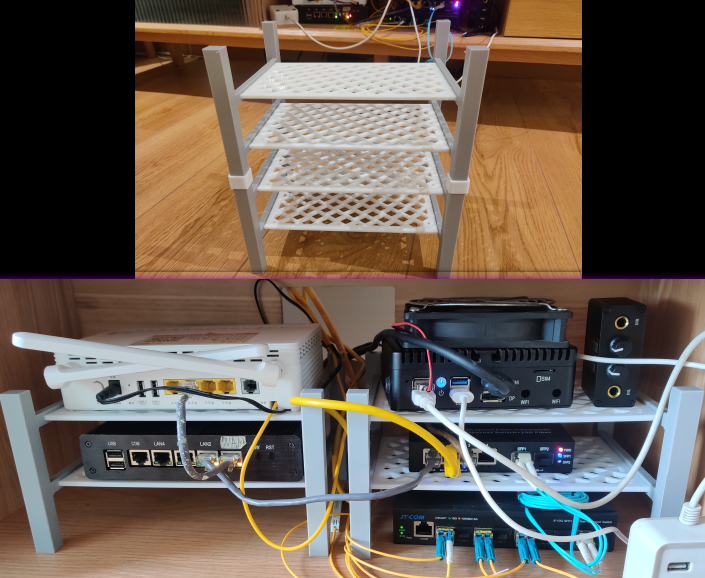
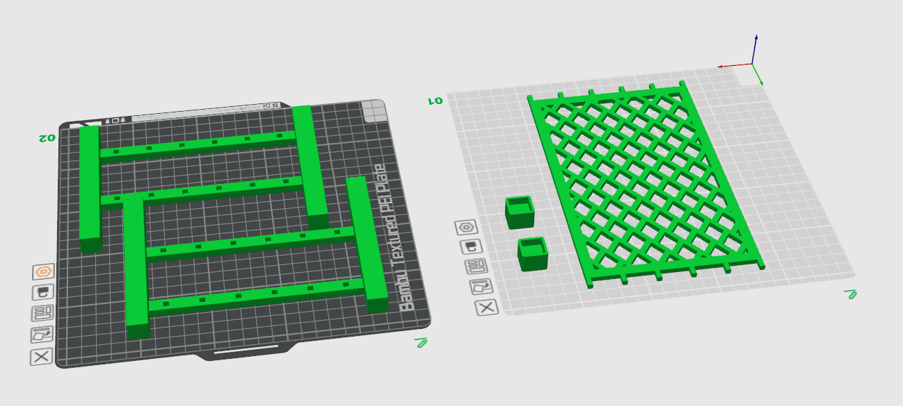
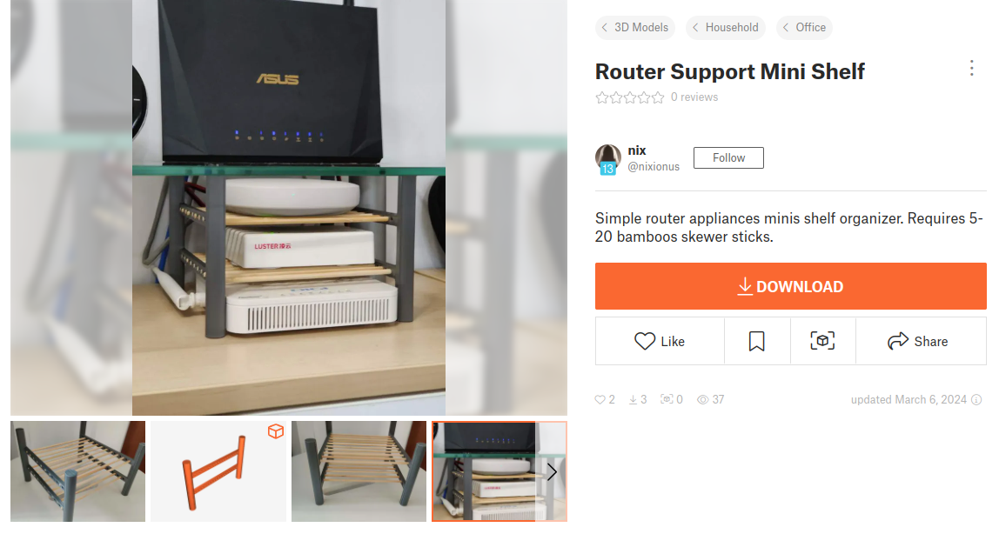

date: 2024-05-04
tags:

- 3D打印

---

分享一个自用的设备架子，单件三层，支持15x20x4cm内的设备，有选配的连接件以支持堆叠。

<!--more-->

推荐打印材料是PETG

主结构：

- 稀疏填充密度：40%

支撑网：

- 顶面/底面/内部实心/稀疏填充图案：同心
- 稀疏填充密度：40%
- 建议关闭部件冷却风扇

堆叠连接件：

- 开启支撑
- 稀疏填充密度：60%

模型发布在printables：

https://www.printables.com/model/869294-home-network-device-rack

> 灵感来自[Router Support Mini Shelf](https://www.printables.com/model/794573-router-support-mini-shelf)，改进合适的木条难获得、圆柱圆孔难打印的问题...
>
> 

