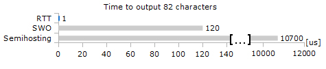
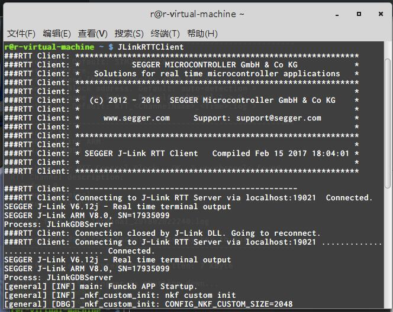
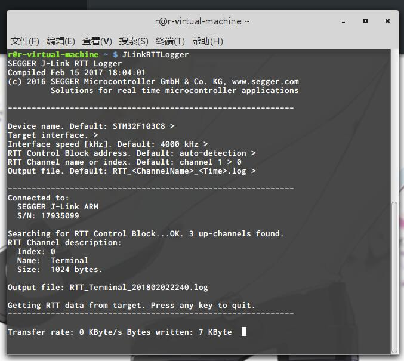

date: 2018-02-03
tags: 

- 嵌入式软件
---

使用JLink调试器, 可以通过RTT(Real-Time Transfer)方式输出log, 不增加引脚占用而且速度很快.

<!--more-->

---

## 只是为了打印一些日志

嵌入式软件工程师拿到一个新的硬件平台，一般要做的第一件事就是把异步串口调通，适配一下libc以便接下来的工作中能用printf打印点log帮助调试。
然而现在硬件变得复杂，要折腾个串口驱动也不见得容易，ARM提供了一些方法能让芯片通过SWO脚通讯, 但是需要增加一个引脚, CM0内核也不支持.
如果你手头的调试器是JLink，要打印点log就简单多了，使用RTT方式可以直接实现, 无需增加新引脚, 也不对目标芯片的内核作要求。

官方的介绍在[这里](https://www.segger.com/products/debug-probes/j-link/technology/real-time-transfer/about-real-time-transfer/)，JLink的用户手册UM08001里有相同的内容。

## RTT做了什么

简单地说，RTT的工作方式就是把数据直接写到RAM上，由调试器将数据取回，所以有很好的性能表现，不会影响目标的实时性能。

性能表现与类似的semihosting/swo方式对比：


## 如何使用RTT
### 官方的RTT实现
官方提供了RTT的实现，它在JLink工具包的`Samples\RTT`目录下，里面也有使用使用例程，执行`SEGGER_RTT_Init()`初始化之后就可以使用其他API了(不初始化似乎也没问题, 但是注释里写了如果程序在RAM里就必须初始化)。
RTT可以有多个输入输出通道，最大通道数可以在Conf头文件里配置，其中channel0是默认通道。
基本上`SEGGER_RTT_printf()`这条API就够用了, 比如以往通道0输出字符串：

```
SEGGER_RTT_printf(0, "printf Test: %%c,         'S' : %c.\r\n", 'S');
```

当目标片上执行了这一句，在host上的客户端里就能看到相应的输出了。

### 选用合适的客户端

JLink工具包里提供了3种客户端: RTTClient/RTTViewer/RTTLogger.

RTTClient最常用也很方便用, 它会不断地尝试连接到Debugger开放的19021端口, 比如开启JLinkGDBServer或者Keil的Debugger之后它就会自动连上去, 显示channel0的数据:

一般场合用它就足够了, 把它开着放在一边就行了, 简单又安静.

RTTLogger就是个日志记录工具, 能单独连接到JLink, 把指定通道输出的数据输出到一个文件里:


RTTViewer只在windows下有, 它能直接连接Jlink或者像RTTClient一样加入到现有的会话(Session)中, 显示各个通道的数据.

### 适配libc以便直接使用printf
希望调用c库的printf时候使用RTT输出吗, 这就需要实现LibC的`_write()`和`_write_r()`回调.
这里也不用自己来实现, Segger也帮你实现好了, 在`Syscall`目录下, 比如GCC对应`SEGGER_RTT_Syscalls_GCC.c`文件, 和自己的工程一起编译即可, 然后printf就会往RTT的channel0输出数据了 

## 其他问题
### 请注意低功耗操作对RTT的影响
要注意RTT仅能在目标片的内核运行时工作，也就是说一旦cpu halt了，RTT就会暂时罢工直到cpu重新工作，比如执行了WFI指令。
所以使用RTT时，请先将低功耗特性屏蔽，比如一些RTOS在cpu空转时默认会使用WFI指令以节省电能，这时候RTT就好像不工作一样。。如果没法通过一些宏开关屏蔽掉这个特性，注释掉WFI指令就能临时解决这个问题。

P.S. WFI指令使内核暂停工作，直到有中断发生。（似乎WFI就是wait for interrupt）

### 丢数据的情况
短时间内输出的最大数据量由Conf头文件的`BUFFER_SIZE_UP`宏决定, 默认配置下爆了buffer就会丢数据, 可以简单地加大这个buffer解决.
这个问题也可以通过改变通道配置成`SEGGER_RTT_MODE_BLOCK_IF_FIFO_FULL` (默认是`SEGGER_RTT_MODE_NO_BLOCK_SKIP`)让buffer不够用时阻塞以保证完全输出, 但它会改变程序时序/降低实时性, 不推荐使用.

### 对系统的影响?

它很快, 基本不会影响系统实时性.

```
The RTT implementation code uses ~500 Bytes of ROM and 24 Bytes ID + 24 Bytes
per channel for the control block in RAM. Each channel requires some memory for the
buffer. The recommended sizes are 1 kByte for up channels and 16 to 32 Bytes for
down channels depending on the load of in- / output.
```
我们看看它对资源的占用情况: 约500byte的ROM, 1KB+的RAM. ROM需求不用说, RAM对于一些小资源片子来说比较吃紧, 可以用RTT的阻塞输出方式来用实时性能换空间.
