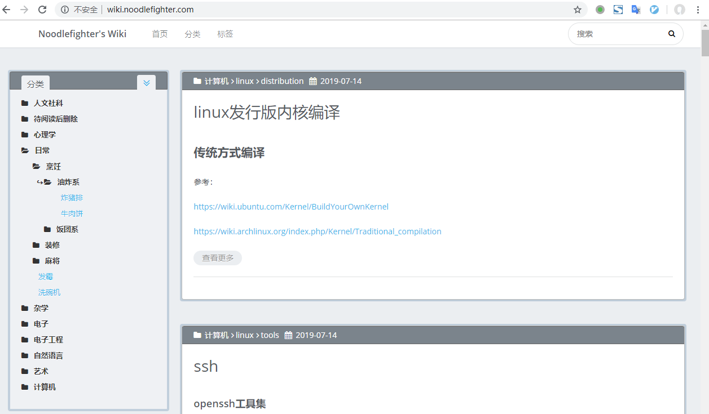
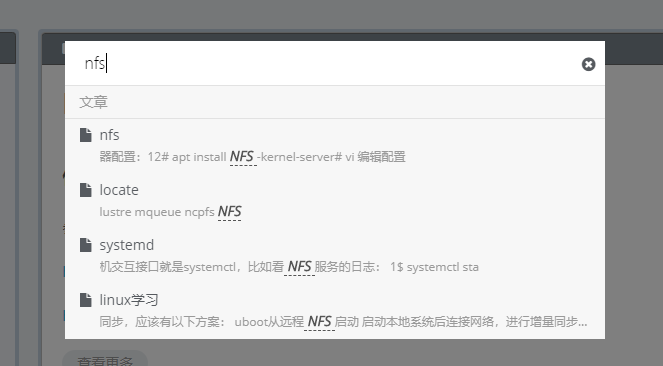
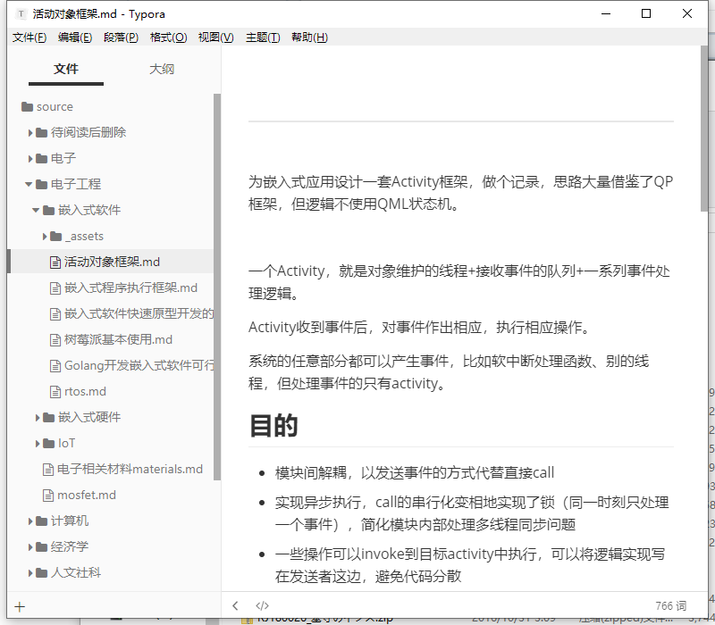
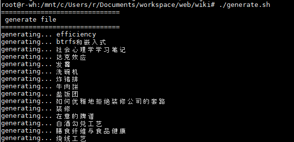
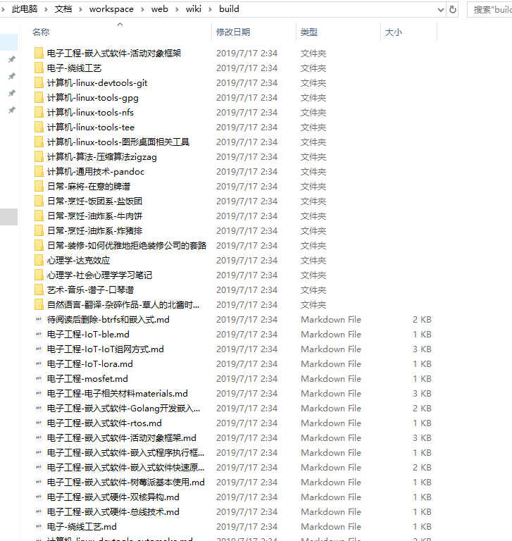
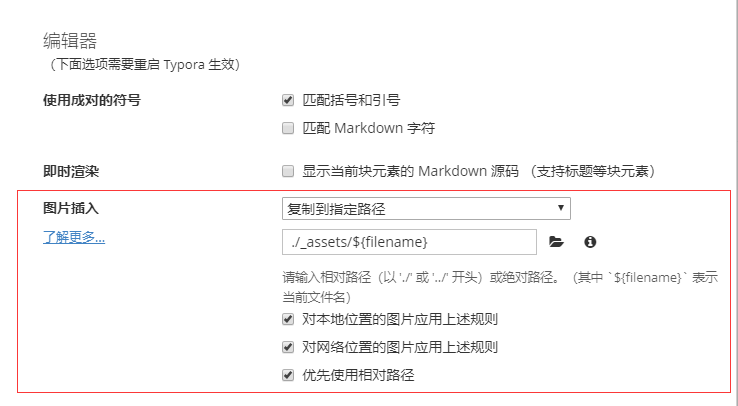
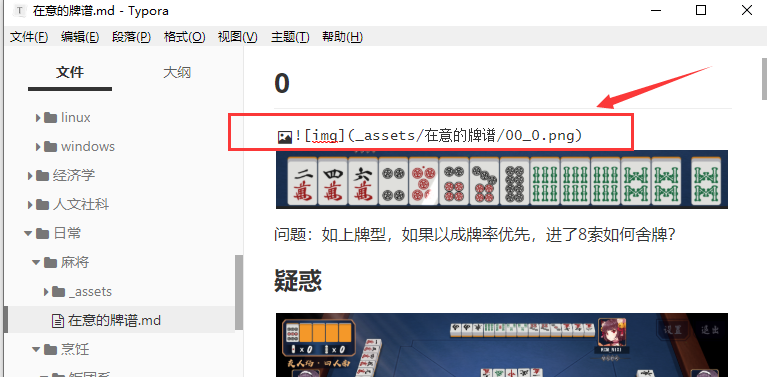

date: 2019-7-15
tags:

- web

---

> 注意！！文章已过时，由于Hexo生成页面速度慢、页面多了还会爆内存，搭建方法也麻烦，已经不推荐用Hexo搭wiki，请参考另一篇使用MkDocs搭建的

**为什么需要个人Wiki？**整理知识，数字时代前人们做纸制笔记、做剪报；现在普遍用博客做笔记、everynote做文章收藏。

工作学习中产生的笔记总会是零碎的片段，尴尬的是——博客本应是展示水平的地方，不适合放零散的笔记；everynote、有道云笔记之类的产品虽然收藏功能强大，但配不上它们作为“笔记”的名头，知识难以归类、编辑体验一般。

细化一下我们的需求：

- 方便编辑，增加文章必须简单；
- 词条的分类必须灵活，因为知识体系随着时间推移会越来越完善，之前的分类在一段时间后就不适用了；
- 需要用笔记时能快速提取，最好支持多种客户端。

纠结了很长一段时间，总算是组了一套找到了贴合这些需求的方案：用Hexo+Wiki模板做渲染，用文件夹组织层次结构，用Typora做Markdown编辑器，Webhook+CI服务器做自动构建、部署。

<!--more-->

先展示一下成品：http://wiki.noodlefighter.com/

Github仓库：https://github.com/noodlefighter/wiki

多级目录：



全文搜索（生成静态索引，速度很快）：



文件夹管理层次结构（而不是用Hexo默认的只能堆在一个post文件夹里），使用Typora作为Markdown编辑器：




## 目录结构

Wiki目录结构示例：

```
.
├── hexo                # Hexo博客的资源目录
│   ├── _config.yml         # Hexo的配置文件
│   ├── package.json
│   ├── scaffolds
│   ├── source
│   │   ├── about
│   │   ├── categories
│   │   ├── _post           # Hexo的文章被要求放在这个目录下，下面自动生成的markdown文件将被放在这里
│   │   ├── robots.txt
│   │   └── tags
│   └── themes
│       └── Wikitten        # Hexo的Wiki主题
├── source              # Wiki的文章源文件
...
│   └── 电子工程             # 一级分类
│       ├── _assets         # 当前分类的资源文件夹
│       │   └── mosfet      # 这是文章《mosfet》的资源文件夹
│       ├── mosfet.md       # 这是一篇wiki文章《mosfet》
│       ├── 电子相关材料materials.md
│       └── 嵌入式硬件       # 二级分类
│          ├── 双核异构.md
│          └── 总线技术.md
├── scripts
│   └── do_copy.sh
├── generate.sh
└── push.sh
```

重点在于重新设计了source文件夹的目录结构：

* 将`hexo/source/_post`搬离到了hexo目录外命名为`source`；
* 以目录层级表示文章分类层级，更好管理分类，修改分类只
* 重新定义资源文件夹的相对于Markdown间的路径：`./_assets/<文件名>`，避免资源文件夹随着同级文章数成倍增加


## 布置Hexo

Hexo是个基于Node.js的博客框架，准备好网页模板，放入用Markdown写的文章，它就能帮你生成静态页。

模板使用[hexo-theme-Wikitte](https://github.com/zthxxx/hexo-theme-Wikitten)，这个主题的作者和我想到一块了，我们需要一个Wiki知识库，十分感谢他实现了Hexo没有的重要功能——多级目录支持。

Hexo的部署请参考[官方文档](https://hexo.io/zh-cn/docs/)，大概是：

* 安装hexo

* 切换Hexo主题为[hexo-theme-Wikitte](https://github.com/zthxxx/hexo-theme-Wikitten)，根据需要进行适当修改

* 测试


## 自动化脚本

为了实现用文件夹自然地组织Wiki目录层次，需要做个脚本辅助，实现以下功能：

* 从文章源码文件夹中提取.md文件
* 自动填写文章分类（即Wiki的层次结构）
* 自动填写对于零碎笔记来说并不重要的时间（从git log中提取）
* 提取`_assets`文件夹中的图片，并把文章中的路径换成hexo的assets文件夹路径

[`generate.sh`](https://github.com/noodlefighter/wiki/blob/master/generate.sh)，遍历source目录下所有`.md`文件，调用`do_copy`处理，并把生成文件copy到hexo的`_posts`目录中:

```shell
#!/bin/bash

#
# 文件名和目录名不允许带空格! 不想处理这种特殊情况了, 垃圾shell脚本
#

set -e

SHELL_FOLDER=$(cd "$(dirname "$0")";pwd)
SOURCE_FOLDER=$SHELL_FOLDER/source
BUILD_FOLDER=$SHELL_FOLDER/build
TARGET_FOLDER=$SHELL_FOLDER/hexo/source/_posts

rm -rf $BUILD_FOLDER
mkdir -p $BUILD_FOLDER

echo "=============================="
echo " generate file"
echo "=============================="
cd $SOURCE_FOLDER
find -name "*.md" -print0|xargs -0 -i $SHELL_FOLDER/scripts/do_copy.sh {} $BUILD_FOLDER

echo "=============================="
echo " copy to _post"
echo "=============================="
mkdir -p $TARGET_FOLDER
rm -vrf $TARGET_FOLDER/*
cp -vr $BUILD_FOLDER/* $TARGET_FOLDER

# call hexo
cd $SHELL_FOLDER/hexo
hexo g
```

`scripts/do_copy.sh`处理指定的`.md`：

```bash
#!/bin/bash

set -e

SOURCE_FILE=$1
TARGET_DIR=$2

SOURCE_DIR=`dirname $SOURCE_FILE`
#echo SOURCE_DIR=$SOURCE_DIR

IFS='/' CGLIST=($1)
IFS=' '
CGLIST_COUNT=${#CGLIST[*]}
DIR_LAYER=`expr $CGLIST_COUNT - 2`
#echo DIR_LAYER=$DIR_LAYER

FILENAME=${CGLIST[$CGLIST_COUNT-1]}
FILENAME=${FILENAME%.*}
#echo FILENAME=$FILENAME

# 生成多层级的分类列表和文件名的前缀
STR_CGLIST=''
STR_FILEPREFIX=''
for ((i=1;i<=$DIR_LAYER;i++));do
	CGNAME=${CGLIST[$i]}
	STR_FILEPREFIX=${STR_FILEPREFIX}${CGNAME}'-'
	STR_CGLIST=$STR_CGLIST'- '$CGNAME'
'
done
#echo $STR_CGLIST

TARGET_FILE=$TARGET_DIR/${STR_FILEPREFIX}${CGLIST[`expr $CGLIST_COUNT - 1`]}
#echo TARGET_FILE=$TARGET_FILE

# get lastest edited date form commit
STR_DATE=`git log --pretty=format:%ci ${SOURCE_FILE}|awk 'NR==1 {print $1}'`

# write file
echo "generating... ${FILENAME}"
echo "title: ${FILENAME}
date: ${STR_DATE}
categories:
$STR_CGLIST
" > "$TARGET_FILE"
cat "$SOURCE_FILE">>"$TARGET_FILE"

# copy images dir
IMG_DIR_SOURCE="${SOURCE_DIR}/_assets/${FILENAME}"
#echo "IMG_DIR_SOURCE=${IMG_DIR_SOURCE}"
IMG_DIR_TARGET=${TARGET_DIR}/${STR_FILEPREFIX}${FILENAME}
#echo IMG_DIR_TARGET=$IMG_DIR_TARGET
if [[ -d "${IMG_DIR_SOURCE}" ]]; then
	#echo "img dir exsit, do copy"
	cp -r $IMG_DIR_SOURCE $IMG_DIR_TARGET

	# \!\[(\S*)\]\(test\/(\S*)\)
	# \n
	sed -i "s?\\!\\[\(\\S*\)\\](_assets/${FILENAME}/\(\S*\))??g" $TARGET_FILE

#else
	#echo "img dir no exsit"
fi
```

另外，为了方便推送新文章到git仓库，这里做了个`push.sh`，直接拉取最新新仓库、与本地仓库合并、提交:

```bash
#!/bin/bash

set -e
set -x

SHELL_FOLDER=$(cd "$(dirname "$0")";pwd)
cd $SHELL_FOLDER

git add --all
git commit -am "quick commit"
git pull --rebase
git push
```


> P.S. 脚本写得很烂，但是能用，让一个不熟悉shell脚本的人写这玩意真会疯，特别是要用sed命令时。


执行效果：





例如，这是一个简单的文章`source/日常/麻将/在意的牌谱.md`：

```
---

记录在意的牌谱

## 0


问题：如上牌型，如果以成牌率优先，进了8索如何舍牌？
```

> 注意：上文实现的自动化脚本还没智能到识别Markdown文件是否存在分隔文章属性和正文的`---`，所以需要手动加上

执行`generate.sh`将生成`hexo/source/_post/日常-麻将-在意的牌谱.md`，可以看到自动填上了文章信息以及改变了图片文件的路径：

```
title: 在意的牌谱
date: 2019-06-09
categories:
- 日常
- 麻将
---

记录在意的牌谱

## 0



问题：如上牌型，如果以成牌率优先，进了8索如何舍牌？
```


## Typora的配置

Typora是个优秀的Markdown编辑器，区别于一般的Markdown双栏编辑器，所见即所得，不需要预览的时候也可以切换到源代码模式，同时满足两派系需求。

这里需要修改插入图片时的相对路径`./_assets/${filename}`，使自动插入的图片路径满足我们的规则：



设置后，插入图片时她会帮你把图片安放在我们期待的位置：




## Webhook+CI自动构建

笔者是自己在服务器上做了个Webhook服务器，收到Push Event后执行自动构建、部署，感兴趣可以看[这篇]([http://noodlefighter.com/post/%E8%AE%A1%E7%AE%97%E6%9C%BA%E6%8A%80%E6%9C%AF-%E5%BF%AB%E9%80%9F%E6%90%AD%E5%BB%BAgithub%E7%9A%84webhook%E6%9C%8D%E5%8A%A1%E5%99%A8/](http://noodlefighter.com/post/计算机技术-快速搭建github的webhook服务器/))。

但不建议这样做，因为有免费的CI服务器+现成的Github Page服务可以利用，建议尝试[travis-ci](https://www.travis-ci.org/)，仓库更新时自动触发部署到Github的page服务上，deploy步骤可以用[hexo的git功能](https://hexo.io/zh-cn/docs/deployment.html)。


## 最后是使用方法

工作流是这样的：

1. 需要增加分类或文章时，直接在`source`目录里增加文件夹或`.md`文件
2. 完成编辑后，执行`./push.sh`
3. git仓库向CI服务器发送Webhook事件，CI服务器开始构建，构建完成后部署到Web服务器


最后吐槽一句，别在CSDN上写笔记了，谢谢，希望能抛砖引玉。
