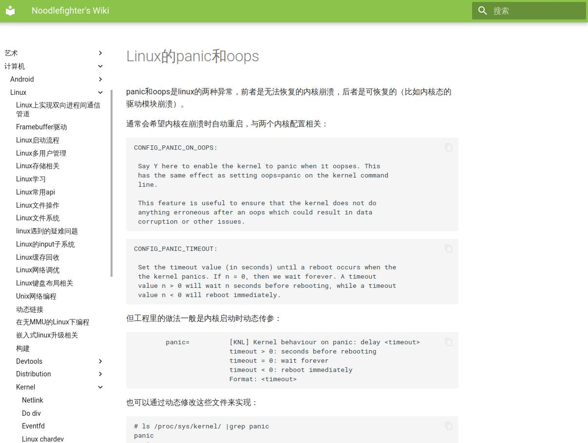
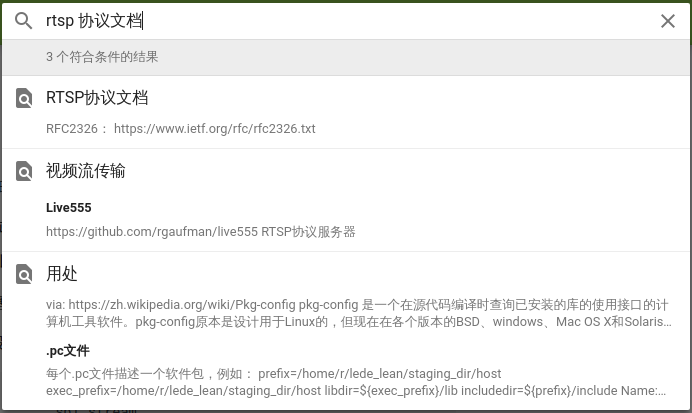
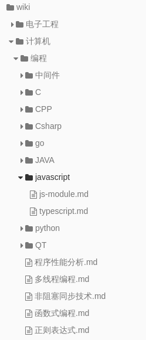
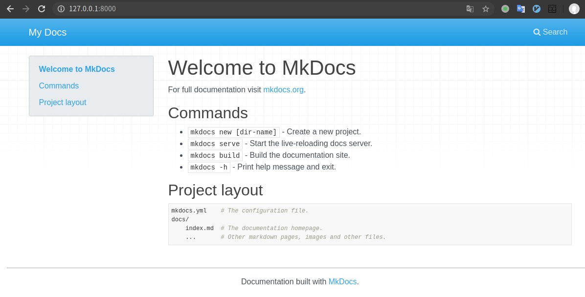
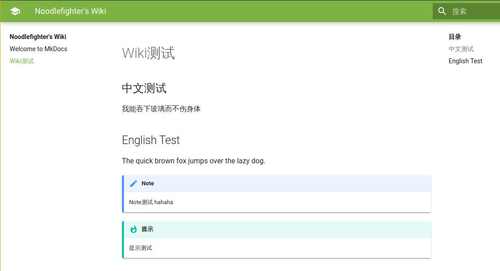

date: 2020-7-26
tags:

- web

---

之前用了一段Hexo搭的个人Wiki，随着页数越来越多，Hexo生成页面就有点吃不消了，后来尝试了MkDocs感觉很适合这个场景，除了搜索功能对中文的支持比较弱以外，表现很棒，无论是易用度、生成速度。

<!--more-->

做个人Wiki的目的，Copy之前的文章：

>  **为什么需要个人Wiki？**整理知识，数字时代前人们做纸制笔记、做剪报；现在普遍用博客做笔记、everynote做文章收藏。
>  工作学习中产生的笔记总会是零碎的片段，尴尬的是——博客本应是展示水平的地方，不适合放零散的笔记；everynote、有道云笔记之类的产品虽然收藏功能强大，但配不上它们作为“笔记”的名头，知识难以归i类、编辑体验一般。
>  细化一下我们的需求：
>
>  - 方便编辑，增加文章必须简单；
>  - 词条的分类必须灵活，因为知识体系随着时间推移会越来越完善，之前的分类在一段时间后就不适用了；
>  - 需要用笔记时能快速提取，最好支持多种客户端。

先展示一下成品：http://wiki.noodlefighter.com/

Github仓库：https://github.com/noodlefighter/wiki

新的方案是MkDocs+mkdocs-material主题，效果如下：




搜索：



以文件夹组织词条分类，每个markdown文件是一个词条：




## 本地环境搭建

安装MkDocs:

```bash
$ pip install mkdocs mkdocs-material
$ mkdocs --version
```

新建一个项目：

```bash
$ mkdocs new test-mkdocs
INFO    -  Creating project directory: test-mkdocs
INFO    -  Writing config file: test-mkdocs/mkdocs.yml
INFO    -  Writing initial docs: test-mkdocs/docs/index.md
[r@r-lh tmp]$ tree test-mkdocs/
test-mkdocs/
├── docs
│   └── index.md
└── mkdocs.yml

1 directory, 2 files
```

运行本地服务器：

```bash
$ cd test-mkdocs/
$ mkdocs serve
INFO    -  Building documentation...
INFO    -  Cleaning site directory
INFO    -  Documentation built in 0.05 seconds
[I 200726 14:07:14 server:296] Serving on http://127.0.0.1:8000
INFO    -  Serving on http://127.0.0.1:8000
[I 200726 14:07:14 handlers:62] Start watching changes
INFO    -  Start watching changes
```

看看效果，这就算成功了：




## 配置MkDocs和mkdocs-material主题

参考[MkDocs文档](https://www.mkdocs.org/user-guide/configuration/)进行配置，这里给出一份经过测试的推荐配置：

```
site_name: Noodlefighter's Wiki
plugins:
    - search
extra:
  search:
    language: 'ja'

theme:
  name: 'material'
  palette:
    primary: 'Light Green'
    accent: 'Pink'
  feature:
    tabs: false
  #font:
    #text: 'Ubuntu'
    #code: 'Ubuntu Mono'
  language: 'zh'

extra_javascript:
  - 'js/cnzz-statistics.js'

markdown_extensions:
  - admonition
  - codehilite:
      guess_lang: false
      linenums: false
  - toc:
      permalink: true
  - footnotes
  - meta
  - def_list
  - pymdownx.arithmatex
  - pymdownx.betterem:
      smart_enable: all
  - pymdownx.caret
  - pymdownx.critic
  - pymdownx.details
  - pymdownx.emoji:
      emoji_generator: !!python/name:pymdownx.emoji.to_png
      #emoji_generator: !!python/name:pymdownx.emoji.to_svg
      #emoji_generator: !!python/name:pymdownx.emoji.to_png_sprite
      #emoji_generator: !!python/name:pymdownx.emoji.to_svg_sprite
      #emoji_generator: !!python/name:pymdownx.emoji.to_awesome
      #emoji_generator: !!python/name:pymdownx.emoji.to_alt
  - pymdownx.inlinehilite
  - pymdownx.magiclink
  - pymdownx.mark
  - pymdownx.smartsymbols
  - pymdownx.superfences
  - pymdownx.tasklist
  - pymdownx.tilde
```

一些提示：

- search选用的`ja`是日本语，这是因为MkDocs使用的lunr.js全文搜索库暂不支持中文分词，配置成日本语勉强能用，稍后需要进行一些魔改
- 使用mkdocs-material主要是为了它的响应式布局，PC、移动端都能用，而且为markdown新增了一些扩展支持，请参考[mkdocs-material的文档](https://squidfunk.github.io/mkdocs-material/reference/admonitions/)


## 尝试编写第一篇Wiki

编辑文件`docs/Wiki测试.md`:

```markdown
## 中文测试
我能吞下玻璃而不伤身体

## English Test
The quick brown fox jumps over the lazy dog.

!!! note20200726143403
    Note测试
    hahaha


!!! tip "提示"
    提示测试
```

本地服务器在检测到文件更改时自动重新构建，能立即看到效果：




## 仍需要解决的问题：中文搜索

Mkdocs使用lunr.js作为静态页搜索引擎，设置成日语勉强能用，但对中文分词效果不好。
