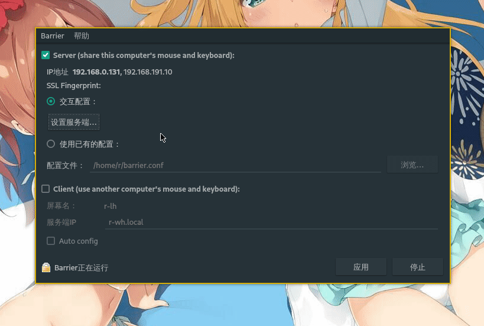

date: 2020-11-27

tags:

- 计算机软件

---

[Barrier](https://github.com/debauchee/barrier)可以让多台桌面计算机，通过网络共享同一套鼠标键盘，从[synergy-core](https://github.com/symless/synergy-core)项目fork而来，基于QT，支持主流桌面操作系统。

这篇文章记录Barrier的使用方法，包括编译、安装、配置。

<!--more-->

## 安装

如果需要安装在Windows/MacOS上，github的[release页](https://github.com/debauchee/barrier/releases)中能找到开箱即用的exe/dmg文件。

如果需要安装在Linux下，请先尝试用各平台的包管理器安装预编译好的二进制包。另外，在Barrier的Github Repo里有[包管理器列表](https://github.com/debauchee/barrier#distro-specific-packages)，比如Arch系中使用pacman命令安装：

```
$ pacman -S barrier
```


## 配置

为了使用方便，如果用于日常桌面而不是专用场景（比如自动部署一群机器给客户用），建议以Barrier的GUI作为入口，修改配置灵活方便。

打开Barrier，界面很简洁：


Barrier中的角色：

- Server端：插着键盘鼠标的电脑
- Client端（可以有多台）：使用Server键盘鼠标的电脑

Server端配置，是GUI所以用录了段GIF，屏幕名称需要和客户端上显示名称匹配，拖动icon可以改变屏幕的摆放位置：



Client端配置更简单了，输入Server的IP或主机名，点击“应用”即可。

配置完成后点击“开始”，不出意外就能用了；如果工作不正常，进菜单中的“Show log”看看日志吧。

<!--more-->

## 编译

大系统都有编译好的程序，大多数情况都不需要自己编译；笔者在Nvidia的jetson(ARMv8)平台下，软件源中没有预编译好的程序所以需要自己编译，系统是`Ubuntu 18.04.5 LTS`。

先下载解压源码包（建议先github网页中的Release里找到最新的版本），执行cmake：

```
$ wget https://github.com/debauchee/barrier/releases/download/v2.3.3/barrier-2.3.3-release.tar.gz
$ tar -xzvf barrier-2.3.3-release.tar.gz
$ cd barrier-2.3.3-release
$ mkdir build && cd build
$ cmake ..
```

执行cmake后，可能遇到的问题：
- 报错`Could NOT find CURL (missing: CURL_LIBRARY CURL_INCLUDE_DIR)`，解决方法是安装`libcurl4-openssl-dev`
- 报错`No package 'avahi-compat-libdns_sd' found`，解决方法是安装`libavahi-compat-libdnssd-dev`
- 报错`Missing library: Xtst`，解决方法是安装`libxtst-dev`
- 报错`By not providing "FindQt5.cmake" in CMAKE_MODULE_PATH`解决方法是安装`qt5-default`

一切顺利的话，输出会是这样的：

```
...
...
-- Full Barrier version string is '2.3.3-release-release'
-- Configuring directory /home/mpc/barrier/barrier-2.3.3-release/build/rpm
-- Configuring file barrier.spec
-- Configuring done
-- Generating done
-- Build files have been written to: /home/mpc/barrier/barrier-2.3.3-release/build
```

这就表示cmake执行成功了，根据当前环境生成了可用的Makefile，接下来执行编译：

```
$ make -j3
```

编译可能会失败ake可能遇到的问题：

- 报错`fatal error: openssl/ssl.h: No such file or directory`，解决方法是安装`libssl-dev`

编译成功后，执行安装，就可以算打完收工了：

```
$ sudo make install
```

## 目前遇到的问题

- Windows做Server端时，在其他客户端上按Win+L会触发Windows锁屏后鼠标键盘共享失效，解决办法是不使用Windows作为Server，或者干脆屏蔽锁屏快捷键，附`disale-win+l.reg`：

  ```
  Windows Registry Editor Version 5.00
  
  [HKEY_CURRENT_USER\Software\Microsoft\Windows\CurrentVersion\Policies\System]
  "DisableLockWorkstation"=dword:00000001
  ```

- Windows做Client端时，在软件申请权限提升时（就是弹出个那个安全提示框框），鼠标会不受控，要等待一下才重新出现在屏幕上，挺影响体验的，目前没找到解决办法