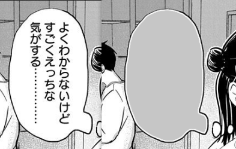

date: 2021-09-24
tags: 

- 设计
- 编程

---

最近在完善 LabelPlus 的 Photoshop脚本 中的漫画对话框涂白功能，这功能需要获取文字附近位置的背景色，用背景色覆盖文字。

但PS中没有直接提供获取区域颜色的API，甚至没有获取像素颜色的API。经过摸索，找到了一种变通的方法——用R/G/B通道的直方图，获取区域大致的颜色值。

<!--more-->

先演示一下这功能具体做了什么：


手动操作就是这样，先用吸色管工具吸取文字周围的颜色，再用画笔覆盖掉文字；这功能就是为了实现涂白操作的自动化，首先就得获取颜色。

LabelPlus 中，文本的坐标已经通过人工标注的方式得到了，问题是获取颜色。

## Try. 1

找遍参考手册，也没找到 Photoshop 用于获取像素颜色的 API，这时候在 google 上一搜，能找到变通方法：

> via: https://stackoverflow.com/questions/48188991/get-the-color-of-one-pixel-at-photoshop-scripts
>
> ```
> // Define the x and y coordinates for the pixel to sample.
> var x = 1;
> var y = 1;
> 
> // Add a Color Sampler at a given x and y coordinate in the image.
> var pointSample = app.activeDocument.colorSamplers.add([(x - 1),(y - 1)]);
> 
> // Obtain array of RGB values.
> var rgb = [
>     pointSample.color.rgb.red,
>     pointSample.color.rgb.green,
>     pointSample.color.rgb.blue
> ];
> ```
>
> 

也就是先把颜色采样到色板中，再获取它的颜色值，很好，似乎这样就能解决问题了。

是的，在大多数测试例中工作得很好，可是偶尔会遇到以下的情况：



经过分析，是因为这一条标注的位置十分靠近文字，而靠近文字的位置通常会存在一些噪点：


一旦正好标注到了这些噪点上，对涂白的结果影响巨大。

## Try. 2

怎么解决这个问题呢，脑子里第一个蹦出的想法，自然是多采几个点嘛，就连PS的取色工具里也有取平均颜色：


于是直接上手实现，对附近的几个像素采样，总之先取了3x3，平均值填色，意外地，效果很不理想：

- 测试下来发现速度很慢，原本20s能处理一张图，现在需要50s；分析发现这个取色的变通方法，跑起来速度很慢，大概半秒一个点，比如3x3采样一次就要4.5s
- 平均值的颜色并不理想，容易被极值干扰；那么，中位数如何？不太能想象

似乎不是一个平坦的路，而且现在看来思路不对，因为这里需要的根本不是平均值，而是一个区域的大致颜色。

> 注：本来还想说有另一个备手——直接录吸色器的动作再转换成代码，比如现在脚本里的魔棒操作就是用动作转换出来的（其实是 Photoshop 更原始的一套API），xtools 中提供了这样的工具。但现在思路错了，那这个备手就没有用了。

## Try. 3

怎么获取区域的颜色呢，问题似乎更复杂了，Photoshop 连取像素颜色的API都没给，又怎么可能有获取区域颜色的API...

答案给我在 xtools 的 [stdlib.js](https://github.com/LabelPlus/PS-Script/blob/master/src/xtools/xlib/stdlib.js) 库中找到了，`Stdlib.getColorAt()`是一个取像素点颜色的库函数：

```
Stdlib.getColorAt = function(doc, x, y, undo) {
  if (CSVersion() >= 3) {
    /* ...(省略)... */
    var sample = doc.colorSamplers.add([UnitValue(x, "px"),
      UnitValue(y, "px")]);
    var clr = undefined;
    try { clr = sample.color; } catch (e) {}
    sample.remove();
    return clr;
  }
  /* ...(省略)... */
  
  // make new 1 pixel selection
  /* ...(省略)... */
  Stdlib.selectBounds(doc, [x, y, x+1, y+1]);

  try {
    function findPV(h) {
      for (var i = 0; i <= 255; i++ ) {
        if (h[i]) { return i; }
      }
      return 0;
    }

    var pColour = new SolidColor();

    if (doc.mode == DocumentMode.RGB) {
      pColour.mode = ColorModel.RGB;
      pColour.rgb.red   = findPV(doc.channels["Red"].histogram);
      pColour.rgb.green = findPV(doc.channels["Green"].histogram);
      pColour.rgb.blue  = findPV(doc.channels["Blue"].histogram);

    }
    /* ...(省略)... */

  } finally {
    /* ...(省略)... */
  }
  return pColour;
};
```

可见 PS CS3 之后，用的之前提到的变通法取色；而之前的版本也许是因为连这个变通法都做不到，而用的直方图数据，只选取一个像素点的区域，然后分别在R/G/B通道的直方图中，找到那一点的位置，就是它的RGB颜色值...

这就是问题的答案！

## 什么是直方图

你可能对图像的直方图没概念，这里先搬出维基的介绍：


摄影中用**图像直方图**来判断画面是否过曝，简单地说，就是统计图中各像素点的亮度，横坐标就是从0-255的亮度值（8bit 图像下），纵坐标就是这一亮度出现的频率。


我们知道RGB色彩模型就是通过把红绿蓝光按比例混合来描述色彩，把RGB图像中的R/G/B分量做亮度统计，得到的就是**颜色直方图**，比如只有黑色、一大片绿色、一小片红色时，黑色(0,0,0)占了大片面积，所以R/G/B中的0有很大的频率，绿色(0,255,0)比红色(255,0,0)的区域大，所以频率更高（柱子更高）：


到这里，就不难理解为什么可以从R/G/B通道的直方图中得到区域的RGB颜色值了，框选了一片肉眼看着是纯色的亮黄区域，看直方图就知道其中还混杂着其他颜色的像素，分别取频率R/G/B中频率最高的色阶得到(255,255,16)即是我们想要的大致的颜色值：


当然，如果想取的是这种真实照片中的色块的大致颜色，只取频率最高的色阶当然不准确，大脑混合出的颜色比大面积的纯色明显更加暗淡一些。但这种粗暴的方法在我的漫画涂色的场景已经够用了，干扰并不多：


## Finally

这是最终的实现，需要先选中区域再执行（是typescript，直接复制时注意修改一下）：

```
function getSelectionColor(doc: Document): SolidColor
{
    function findPV(h: number[]) {
        let max = 0;
        for (var i = 0; i <= 255; i++) {
            if (h[i] > h[max]) {
                max = i;
            }
        }
        return max;
    }

    let pColour = new SolidColor();

    if (doc.mode == DocumentMode.RGB) {
        pColour.model = ColorModel.RGB;
        pColour.rgb.red = findPV(doc.channels[0].histogram);
        pColour.rgb.green = findPV(doc.channels[1].histogram);
        pColour.rgb.blue = findPV(doc.channels[2].histogram);
    }
    else if (doc.mode == DocumentMode.GRAYSCALE) {
        let gr = findPV(doc.channels.getByName("Gray").histogram);
        pColour.model = ColorModel.GRAYSCALE;
        pColour.gray.gray = 100 * (gr / 255);
    }
    else {
        log("getSelectionColor: Color Mode not supported: " + doc.mode);
    }
    return pColour;
}
```

最终涂色效果，啊，成就感满满：


