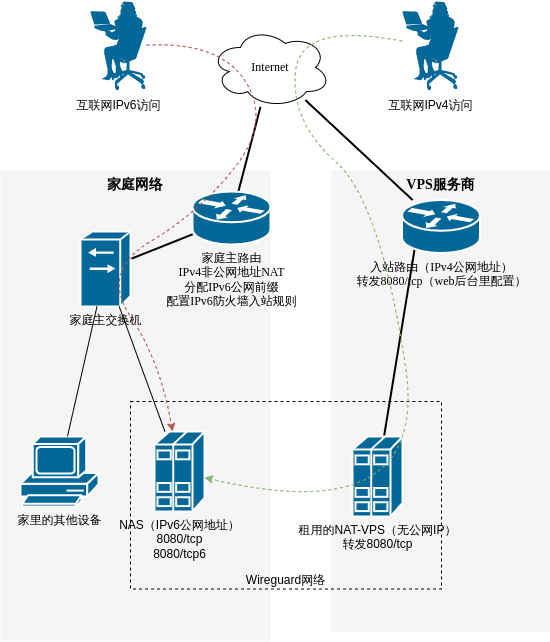
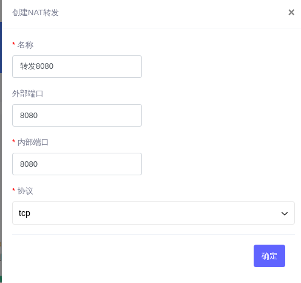

date: 2023-11-23
tags: 

- 笔记
- 计算机网络

---

目前家庭网络接入，常有IPv6公网但无IPv4公网地址，在家庭以外的网络环境可能仅有IPv4，但又需要访问家中的NAS；本文演示，如何用便宜的NAT-VPS作为家庭NAS的IPv4入口。

<!-- more -->

## 拓扑说明

- 宽带入户，主路由器通过IPv4访问互联网，但没有公网地址，所以租用VPS做端口转发，作为IPv4网络入口
- （可选）主路由拿到IPv6前缀，NAS可以拿到IPv6公网地址，开放端口后配置防火墙即可在IPv6公网访问
- NAS与VPS间，透过IPv4互联网，用Wireguard组虚拟局域网

拓扑图如下




## Step0. 购买VPS

本例使用了便宜的，共享入站IP的VPS，即常说的NAT-VPS；网上有很多选择，通常是野鸡VPS商，随时跑路，建议按月购买。

我买的12元一月，50M下行，上行无保证（实测稳定15M），也就是说基本能实现15Mbps的转发。


## Step1. 组建Wireguard网络

将NAS与租用的NAT-VPS组进同一个网络，完成后可无障碍相互访问。

具体方法请参考另一篇博文[WireGuard配置实例](https://noodlefighter.com/posts/8610/)。

本例的Wireguard网络中，NAS地址：10.10.10.2，VPS地址10.10.10.1：

```
MY-VPS$ ping 10.10.10.2
PING 10.10.10.2 (10.10.10.2) 56(84) bytes of data.
64 bytes from 10.10.10.2: icmp_seq=1 ttl=64 time=31.1 ms
64 bytes from 10.10.10.2: icmp_seq=2 ttl=64 time=30.3 ms
...

MY-VPS$ sudo wg show
interface: wg0
  public key: ......
  private key: (hidden)
  listening port: 5432

peer: ......
  endpoint: ......:50241
  allowed ips: 10.10.10.2/32
  latest handshake: 1 minute, 12 seconds ago
  transfer: 1.15 GiB received, 48.07 MiB sent
  persistent keepalive: every 25 seconds
```


## Step2.  NAS上开启需要公网访问服务

此步骤仅举例，从docker容器中映射出IPv4端口8080。

```
$ cat docker-compose.yml
version: '3.5'
services:
  # https://github.com/noodlefighter/docker-webdav
  webdav:
    container_name: webdav
    image: webdav
    restart: always
    ports:
      - "8080:80"
    volumes:
      - /srv/data_dl/data_dl:/var/lib/dav/data/data_dl
      - /srv/ssd0/data:/var/lib/dav/data/data
    environment:
      AUTH_TYPE: Basic
      USERNAME: ...
      PASSWORD: ...
      PUID: 1000
      PGID: 100
      LOCATION: /file
$ docker-compose up -d
```

> 另外，需要IPv6访问的话，还需要配置docker映射出IPv6端口，不在本文讨论范围

## Step4. VPS上配置端口转发

VPS建议使用debian系统，先测试是否能访问到NAT上需要转发的端口，以之前步骤起的webdav服务为例：

```
$ telnet 10.10.10.2 8080
Trying 10.10.10.2...
Connected to 10.10.10.2.
Escape character is '^]'.
333
HTTP/1.1 400 Bad Request
Content-Type: text/plain; charset=utf-8
Connection: close

400 Bad RequestConnection closed by foreign host.
```

安装gost：

```
$ sudo snap install core
$ sudo snap install gost
```

配置转发：

```
$ cat /etc/systemd/system/forward-8080.service
[Unit]
Description=forward

[Service]
ExecStart=/snap/bin/gost -L=rtcp://:8080/10.10.10.2:8080
Restart=always
KillMode=process

[Install]
WantedBy=multi-user.target

$ sudo systemctl enable forward-38888.service
$ sudo systemctl start forward-38888.service
```

开放端口，本例是在VPS-NAT的后台web面板上配置端口转发，如果你的VPS有独立IP地址则可能需要配置防火墙入站规则：




## Step5. 为NAS配置域名解析

本例中，IPv6地址和IPv4地址均可能发生变化

**IPv4**

VPS商的IPv4地址不常变，域名的A记录直接指向VPS即可。

**IPv6（可选）**

家庭网络IPv6前缀常变，所以在NAS上安装了DDNS服务更新域名的AAAA记录（IPv6解析），仅供参考：

```
$ cat docker-compose.yml
version: "3.5"
services:
  ddns:
    image: newfuture/ddns
    container_name: ddns
    user: 0:100
    network_mode: "host"
    volumes:
      - $PWD/config.json:/config.json
    restart: "unless-stopped"
    environment:
      - TZ=Asia/Shanghai
$ cat config.json
{
  "$schema": "https://ddns.newfuture.cc/schema/v2.8.json",
  "id": "",
  "token": "xxxxxxxxxxxxx",
  "dns": "cloudflare",
  "ipv4": [],
  "ipv6": ["nas.xxxx.com","play.xxxx.com"],
  "index4": "url:http://ip.3322.net/",
  "index6": "default",
  "ttl": 600,
  "proxy": "127.0.0.1:1080;DIRECT",
  "debug": true
}
```

配置完成后，即可用域名访问双栈8080服务：`http://nas.xxx.com:8080`

