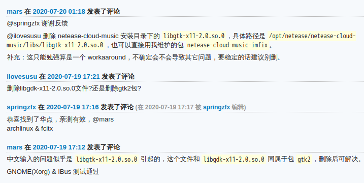
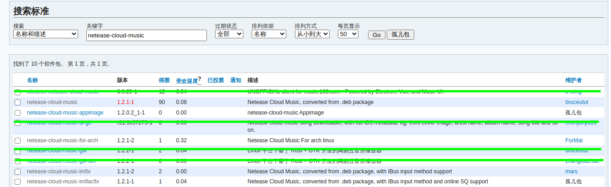
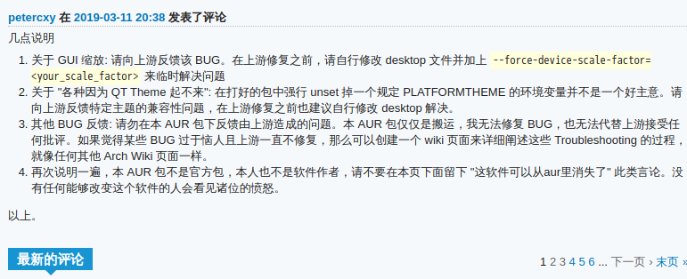

date: 2021-08-02

tags:

- 计算机软件
- linux

---

官方迟迟不修bug——无法播放无损音乐、无法用输入法、DPI问题。网上各种 workaround，用的人多就是好，这里简单汇总一下，目前2021-08-02的官方最新版本是1.2.1。
做了个包上传 AUR，修了无损音乐、输入法问题：[netease-cloud-music-workarounds](https://aur.archlinux.org/packages/netease-cloud-music-workarounds/)

<!--more-->

---

## 解决网易云音乐Linux版无法播放无损音乐的问题

参考[《解决Linux版网易云音乐无法播放无损格式(FLAC)音乐的问题》](https://web.archive.org/web/20210305104641/https://blog.eh5.me/fix-ncm-flac-playing/)：

> 原来, Linux版网易云音乐通过调用后端api获取音频文件URL, 然后就直接交给VLC了, VLC优先通过`HTTP Header`中的`Content-Type`获取文件类型(mime-type), 再根据mime-type选择decoder; 问题就出在这里, 当音频为flac时, 上面提到的音频文件URL获取的`HTTP Header`中的`Content-Type`是`audio/mpeg`, 这是给mp3用的, flac文件正确的mime-type应该是`audio/flac`; 重现一下网易云音乐播放无损音乐的流程, 网易云音乐获取FLAC音频文件URL->VLC通过`Content-Type`获取文件类型为`audio/mpeg`->VLC选择mpeg解码器解码flac文件->VLC解码失败->网易云音乐播放失败.

所以既然没法改官方的闭源软件，那就只能退一步，去魔改VLC，用了这篇文章的作者提供的 patch 重新编译 VLC 的动态库，问题果然得到了解决。

博文的作者也说了，版本1.2.1之后，云音乐依赖的各种库是直接打在包里的，运行时覆盖了`LD_LIBRARY_PATH`环境变量，所以其实编译好的动态库只要复制进`/opt/netease/netease-cloud-music/libs/`路径就可以用了。

## 解决网易云音乐Linux版无法使用中文输入法的问题

最近刚换 fcitx5，在网易云界面中无法使用，在[netease-cloud-music的评论区](https://aur.archlinux.org/packages/netease-cloud-music)中找到了解决方法：



即删除`/opt/netease/netease-cloud-music/libs/libgtk-x11-2.0.so.0`，经过测试，我的环境下测试有效，manjaro+i3wm+fcitx5。

## 解决网易云音乐Linux版不支持高分辨率HDPI的问题

根据`netease-cloud-music`包的维护者`bruceutut`的留言：

> 请自行修改 desktop 文件并加上 `--force-device-scale-factor=<your_scale_factor>` 来临时解决问题

感觉可行的解决方法可以是：通过`xdpyinfo | grep -B 2 resolution`命令拿到DPI，再除以`96`得到倍数。但我现在还在主要工作环境还在用着低分屏，所以暂时没去试这个解决方法。

## 制作 AUR 包

探一下 AUR 上的情况上AUR一搜，好家伙，这么多解决问题的包：



那`netease-cloud-music`这个名字看起来最正式的包为什么不包含这些 workaround 呢？在热闹的评论区里找到了答案：



还有一个`-imflacfix`后缀的包，直接上传了编译好的 VLC的二进制文件，不太敢用，所以最后还是自己做了个包[netease-cloud-music-workarounds](https://aur.archlinux.org/packages/netease-cloud-music-workarounds/)，暴力地从 arch 的官方仓库拖出 vlc 打 patch 编译，再提取出动态库，感兴趣自己看看 git commit 吧。

如果你是 Arch 系发行版用户，可以直接用 yay 安装我制作的 AUR 包：

```
$ yay -S netease-cloud-music-workarounds
```

如果你信任我，也可以用我直接编译好的包（非常不建议你这么做，谁都可以在包里藏毒，我的编译环境也不能保证是安全的）：

```
$ wget --load-cookies /tmp/cookies.txt "https://docs.google.com/uc?export=download&confirm=$(wget --quiet --save-cookies /tmp/cookies.txt --keep-session-cookies --no-check-certificate 'https://docs.google.com/uc?export=download&id=1M-U1MvNqpDYGrtLDZW9VeCxWkCnhuwEj' -O- | sed -rn 's/.*confirm=([0-9A-Za-z_]+).*/\1\n/p')&id=1M-U1MvNqpDYGrtLDZW9VeCxWkCnhuwEj" -O netease-cloud-music-1.2.1-1-x86_64.pkg.tar.zst && rm -rf /tmp/cookies.txt
$ sudo pacman -U netease-cloud-music-1.2.1-1-x86_64.pkg.tar.zst
```

## 最后

网易云官方是不打算理 Linux 用户了，只能这样瞎折腾 ...

**~~没有电没有音乐 桂电别停电~~**

