date: 2018-1-12
tags:
- 笔记
- 嵌入式软件
---

USB学习笔记, 同时希望能帮助快速上手做USB应用开发.

<!--more-->

整理自以下资料:
[Universal Serial Bus Specification Revision 2.0](http://www.usb.org/developers/docs/usb20_docs/#usb20spec)
https://wenku.baidu.com/view/dd150ee3482fb4daa48d4b0a.html
[USB的八个问题和答案(出处不详)](http://blog.csdn.net/ahc2013/article/details/16846101)
[USB基础知识概论 by Crifan Li](https://www.crifan.com/files/doc/docbook/usb_basic/release/htmls/)
[USB OTG协议基础](http://blog.csdn.net/qq_695538007/article/details/41213041)
[OTG中的ID脚风波释疑](https://my.oschina.net/armsky/blog/15322)
[usb设备 配置 接口 端点](https://www.cnblogs.com/darren-715/archive/2014/03/10/3591452.html)
[wiki](https://en.wikipedia.org/wiki/USB)

---

## 什么是USB
### 从接口讲起
对于终端用户来说，对USB最直观的认识就是USB的接口插头，看图：
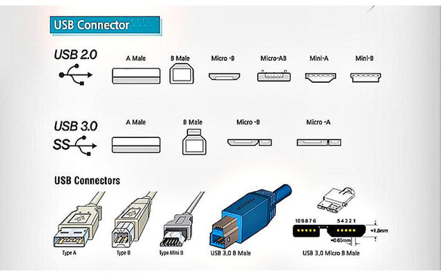

现时间点大家最熟悉的几种USB插头莫过于USB2.0的TypeA、Mini-B、Micro-B；最近开始频繁露脸的USB3.0的TypeA、TypeC。

### 定义
USB是Universal Serial Bus的缩写，中文译为通用串行总线，USB出现之前，计算机领域中的接口太多太繁杂，USB出现之后减少了接口的种类，总的来说就是设计出了一个万能的接口，各种外设都能用同一种接口，所以才冠以“通用（是Universal）”为名。
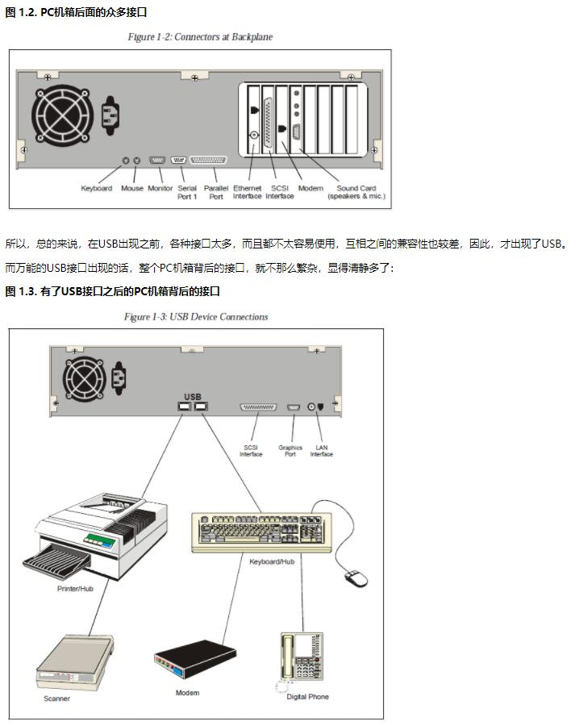

### USB线缆
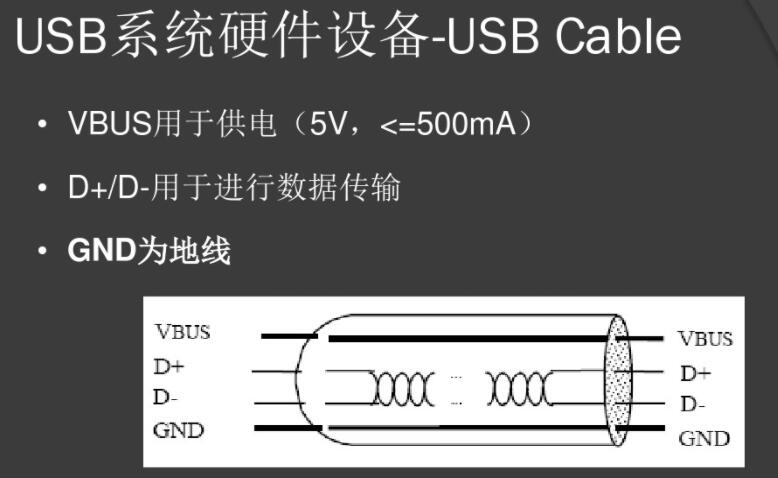

### 特性
* 通用串行总线
* 非对称式总线(Host drive), 就是说任何一次通讯传输都是由主机(host)发起的
* 支持热插拔(Plug-and-Play)
* 支持端口扩展(Port Expansion), 也就是用户可以用USB-HUB(usb扩展坞)来扩充USB接口的数量
* 支持多种速度的设备: 低速(Low Speed), 全速(Full Speed), 高速(High Speed), 还有USB3.0之后的SuperSpeed
* 可以对设备供电(也可以设备自供电)

### 传输速度
维基百科图:
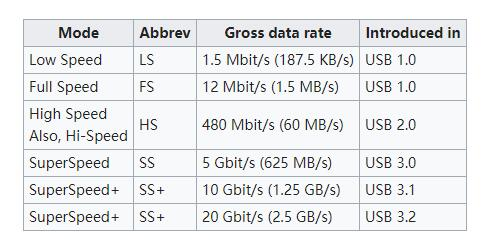

### 版本历史
维基百科图:
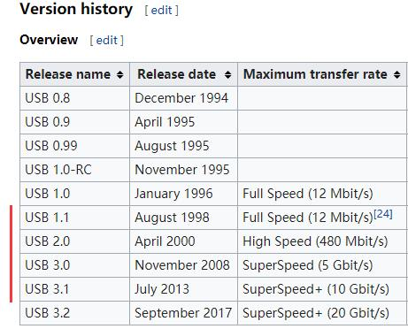

---

## 角色
### USB Host(USB主机)
主机就是USB总线中作主设备角色的设备, 负责管理USB总线中的数据传输及端口管理.
比如一个U盘(USB大容量储存设备)和PC通讯, PC在这里就是USB Host.

### USB Device
USB Device就是在USB总线中作从设备角色的设备

### USB Hub
它的实现也就是USB扩展坞啦
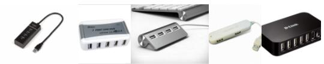

* USB Hub可以将一个USB口转换为多个
* USB Host带有Root Hub
* USB Hub对于上游而言是一个USB Device, 对于下游而言扮演USB Host, 所以USB设备本身不知道自己连接在Hub还是Root Hub上

---

## USB系统架构
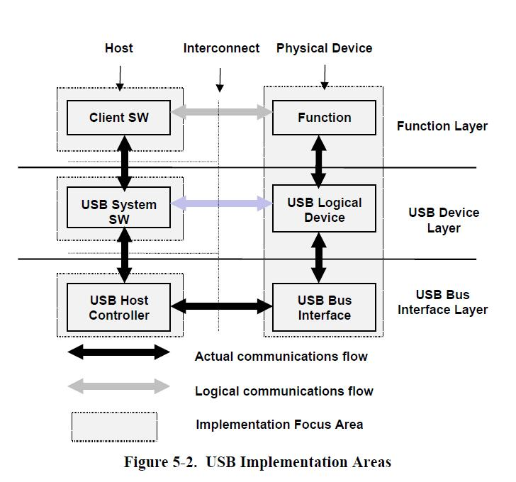
### USB Bus Interface Layer
该层为硬件设备连接. [USB相关的基础知识 - USB相关的硬件](https://www.crifan.com/files/doc/docbook/usb_basic/release/html/usb_basic.html#usb_related_hw)中有更详细的介绍.
Host侧, USB Host Controller(USB主控制器)是Host的具体硬件实现, 如上文所说, 它负责USB总线中的数据传输及端口管理. 具体到摸得着的东西就是PC主板上与USB端口直接相连, 挂在PCI总线上, windows的设备管理器里可以看到这里有3个USB主控制器, 2个EHCI（USB 2.0），1个XHCI（USB 3.0）:
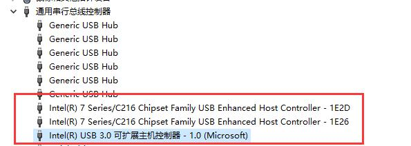
Device侧, USB Bus Interface可以认为是USB Devvice Controller(USB设备控制器).

### USB Device Layer
该层可以理解为USB总线的驱动层, 有关USB通讯的部分由这一层实现, 为上层提供服务.

### Function Layer
Function也就是除了Hub以外的Device, 它为整个系统提供了某些具体能力, 比如U盘为系统提供储存设备.
Host侧, Client SW(客户软件)具体就是对应Device提供的Function的驱动, 不论是Linux下, 还是Windows下，都已经实现了常见的驱动了, 所以一般来说, 很少需要驱动开发者再去写驱动.
Device侧, Function则实现了具体的功能, 这部分通常由软件实现.
比如一个U盘(USB大容量储存设备)接入USB系统后, Client SW为操作系统提供访问储存设备的能力, 而Function则实现了操作存储器件的功能比如在NandFlash芯片上读写数据.

---

## 通讯机制
搞USB开发, 我们关心的是Function Layer层通讯: 设备上Function通过Interface, 经由Endpoint与Client SW通讯.

### Interface
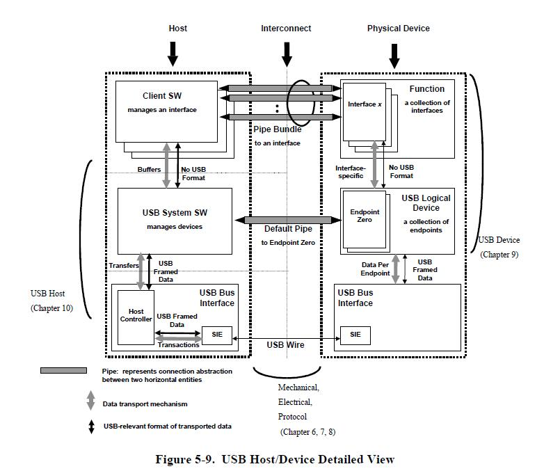
看上面的架构图, 可知一个Function里可以有多个Interface, 比如一个键盘可以和摄像头做在一起, 用两个Interface实现.

### Pipe(管道)/Endpoint(端点)

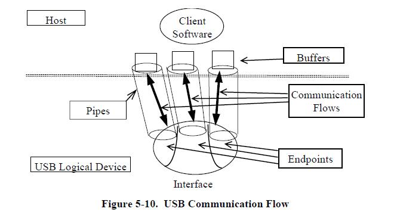

端点是Device中的概念, 有点像Socket通讯中的Port(端口), 用于区分USB总线中当的数据是哪个Interface的, 一个Interface可能使用了多个Endpoint. 端点是有方向的, 可以是IN(Device->Host)或者OUT(Host->Device). 端点可以理解成Deivce上的一个由USB Device管理的缓冲区, 数据到达后通知上层Interface来处理.

管道表示主机与端点间的通讯, 是Host和Endpoint间抽象的传输通道, 可以理解为USB地址(枚举时确定的地址)+EP编号构成, 由Host侧的System Drvier维护EP信息以便上层与Device通讯. 我们可以把端点和管道当做同一个东西.

USB通讯实际上就是端点通讯，在Host看来每一个Device就是一堆端点, Host通过端点与设备进行通信，以使用设备的功能。每一个端点都有它的属性，比如传输方式(Transfers, 后面会讲)、总线访问频率、带宽、端点号和数据包的最大容量等。一个USB端点只能在一个方向承载数据，或者从主机到设备（称为输出端点），或者从设备到主机（称为输入端点），因此端点可看作一个单向的管道。

### Packet (包) 和 事务(Transaction)

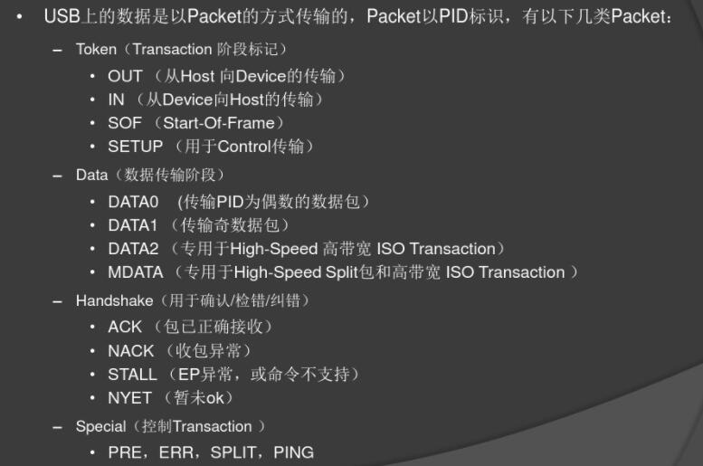

包是在Pipe上传输的数据(包是由"域"组成的, 它是USB数据的最小单位, 这里不讨论).

Transaction翻译成"事务", 我理解为"一次通讯过程", 分别有IN事务、OUT事务和SETUP事务三大事务, 每种事务通常由Token(令牌包)、Data(数据包)、Handshake(握手包)三个阶段构成，这里用阶段的意思是因为这些包的发送是有一定的先后顺序的:

1. 先由主机发出Token, 指定数据包的目标/来源(指定具体地址上的某Endpoint);
1. Data为数据, IN事务时由设备
1. Handshake用来表示传输是否成功.

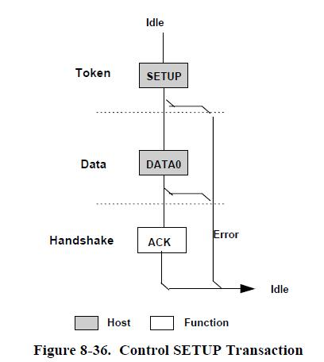

上图就是典型的事务: 主机发Token--数据包--握手包--结束

USB是主从式总线, 所以所有事务都是由主机发送的Token开始, 任一时刻USB系统中仅有一个包在传输.

### 传输 (Transfers)
传输由事务构成, Endpoint的传输方式可以是以下四种中的其中一种.
这部分内容涉及到较多细节, 深入了解可查阅[协议手册](http://www.usb.org/developers/docs/usb20_docs/#usb20spec)的8.5章.

#### Control Transfers (控制传输)

```none
Control data is used by the USB System Software to configure
devices when they are first attached.  Otherdriver software
can choose to use control transfers in implementation-specific
ways. Data delivery is lossless.
```
USB总线保证这种方式下数据不会丢失. 用于Device插入后配置/获取设备信息, 设备也可以自定用途, 比如用于查询设备状态.

SETUP事务图示:


控制传输的Read/Write序列, 读写操作由一串有序的事务组成:

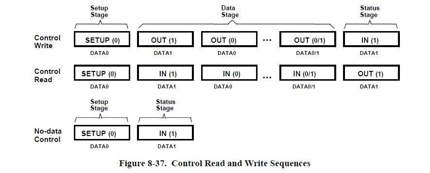

#### Bulk Transfers (块传输)

```none
Bulk data typically consists of larger amounts of data,
such as that used for printers or scanners. Bulk data is
sequential. Reliable exchange of data is ensured at the
hardware level by using error detection in hardware and
invoking a limited number of retries in hardware. Also,
the bandwidth taken up by bulk data can vary, depending on other bus activities.
```

用于可靠传输大量数据, 单次允许传输更多的数据(所以在Device中它们端点的缓存区会更大), 保证数据的正确性但不保证实时性(取决于总线的繁忙程度).
如打印机/扫描仪.

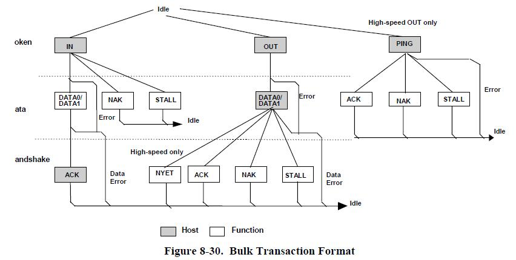

#### Interrupt Transfers (中断传输)

```none
A limited-latency transfer to or from a device is referred to
as interrupt data. Such data may be presented for transfer by
a device at any time and is delivered by the USB at a rate no
slower than is specified by the device.
```

用于少量数据的低延迟传输, Host以不低于Device指定的频率向设备发令牌请求数据, 也可以由Host向Device发送数据.
比如键盘/鼠标/游戏控制器就用这种方式来传输.
通常不用来传送大量数据.

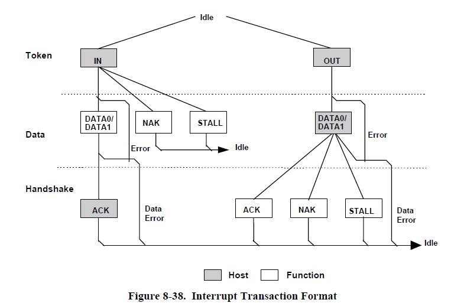

#### Isochronous Transfers (同步传输)

```none
Isochronous data is continuous and real-time in creation,
delivery, and consumption. Timing-related information is
implied by the steady rate at which isochronous data is
received and transferred. Isochronous data must be delivered
at the rate received to maintain its timing. In addition to
delivery rate, isochronous data may also be sensitive to
delivery delays. For isochronous pipes, the bandwidth required
is typically based upon the sampling characteristics of the
associated function. The latency required is related to the
buffering available at each endpoint.
```

用于传输大量数据, 不要求可靠性但要求实时性. 类似中断传输, 同步传输也是由Host周期访问设备, 只是同步传输不能保证数据成功传输.
适用于音频和视频设备, 如麦克风/摄像头.

---

## Class
为了能让最常用的设备普及和提高兼容性, USB组织定义了很多标准Class, 比如HID(人体输入设备), Mass Storage(大容量储存设备), 这些设备接入Host上一般不需要额外的驱动, 因为已经预置了通用的驱动, 做USB应用很多时候都是在某个Class上做开发.
Device的厂商也可以在Class的基础上做一些定义(当然这时候就要在Host上做专门的驱动了).
另外Class下也会有Sub Class, 比如HID下还分鼠标键盘等.

[USB接口设备Class文档](http://www.usb.org/developers/docs/devclass_docs/)可以找到各Class的文档

---

## 枚举

既然USB是种通用串行口, 插入USB设备到主机之后, 主机又怎么知道插入的是什么设备(USB版本? PID/VID? 端点数量和传输能力如何?), 实现了什么功能呢(有哪些Function/Interface?), 把这些信息弄清楚的过程叫做枚举.

该部分内容对应[协议手册](http://www.usb.org/developers/docs/usb20_docs/#usb20spec)的第9章.

### 设备状态
设备状态图如下, 枚举就是从Attached状态转换到Configured状态的过程:

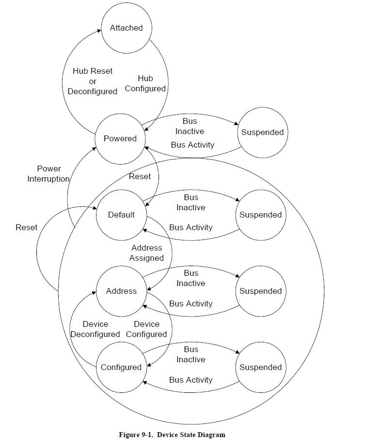

1、接入态（Attached）：设备接入主机后，主机通过检测信号线上的电平变化来发现设备的接入；

2、供电态（Powered）：就是给设备供电，分为设备接入时的默认供电值，配置阶段后的供电值（按数据中要求的最大值，可通过编程设置）

3、缺省态（Default）：USB在被配置之前，通过缺省地址0与主机进行通信；

4、地址态（Address）：经过了配置，USB设备被复位后，就可以按主机分配给它的唯一地址来与主机通信，这种状态就是地址态；

5、配置态（Configured）：通过各种标准的USB请求命令来获取设备的各种信息，并对设备的某此信息进行改变或设置。

6、挂起态（Suspended）：总线供电设备在3ms内没有总线操作，即USB总线处于空闲状态的话，该设备就要自动进入挂起状态，在进入挂起状态后，总的电流功耗不超过280UA。

### 端点0

```none
All USB devices are required to implement a default control method
that uses both the input and output endpoints with endpoint number
zero. The USB System Software uses this default control method
to initialize and generically manipulate the logical device
(e.g., to configure the logical device) as the Default Control
Pipe (see Section 5.3.2).
```

所有USB设备需要实现一个默认的控制方式, 它就是既能输入也能输出的端点0, Host通过这端点0获取设备的描述、配置、状态，对设备进行设置。

端点0在Device上电后就默认存在, 这是STM32HAL库中重置USBD的代码, 可见对EP0_IN和EP0_OUT进行了配置:
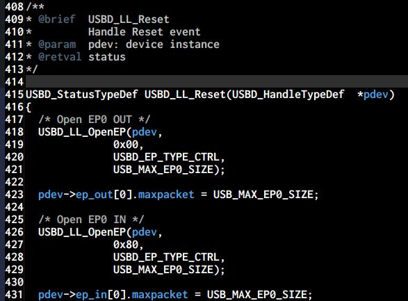

可见, 端点0实际上是IN/OUT两个端点, 以控制传输(Control Transfers)的方式通讯.

### Generic USB Device Operations(通用USB设备操作) / USB Device Requests(USB设备请求) / Standard Device Requests(标准设备请求)

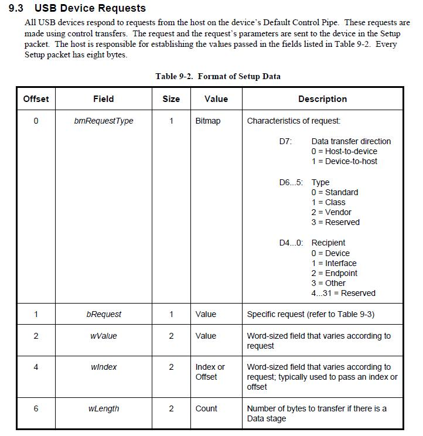

通过端点0, Host可以使用一些"默认的控制方式"完成一些基本的操作, 每个Device都要实现这些操作, 这就是"通用USB设备操作".

阅读bmRequestType定义可知, "USB设备请求"允许Host通过端点0使用控制传输方式向USB设备发出请求, 这些请求可以是"标准设备请求"/"Class求"/"设备制造商自定义请求".

"标准设备请求"是"通用USB设备操作"的具体实现, 它规定了一些命令比如"Set Descriptor"(获取描述符)/"Set Configuration"(设置配置索引), 使用这些命令可以完成枚举过程(但不仅用于枚举).

### Descriptors (描述符)
描述符储存在设备中, 有几种描述符储存着设备的各种信息, 枚举过程中主机通过标准设备请求从设备获取这些描述符.
标准描述符(Standard USB Descriptor)包含以下几种:
* 设备(Devcie)描述符, USB版本号、设备类型等信息，一个USB设备只有一个设备描述符;
* 配置(Configuration)描述符, 描述一个USB设备的属性和能力等配置信息，如接口总数、当前配置、供电方式、远程唤醒和须获取电流量等，一个USB设备可以有几种相对独立的配置;
* 接口(Interface)描述符, 描述一个接口的属性，如接口类型、使用了哪些非0端点等。一个配置可拥n个接口，每个接口有唯一编号;
* 端点(Endpoint)描述符, 描述非0端点的属性，包括输入/输出方向、端点号和端点容量。需注意的是端点描述符是作为配置描述符的一部分来返回给主机的，而不能直接通过控制传输中的``Get_Descriptor``或``Set_Descriptor``来访问;
* 字符串(String)描述符, 用于存放一些字符串, 其他描述符可以用索引号来引用其中的字符串

各类描述符的具体定义请参考[USB2.0协议手册9.6章](http://www.usb.org/developers/docs/usb20_docs/#usb20spec)及其他资料.

### 配置描述符集合

主机获取配置描述符时, 接口描述符/端点描述符/等等相关的描述符附着在它后面一同提交.

梳理一下Endpoint/Interface/Configuration间的关系:
* 一个Device可以有多个Configuration, 提供多个Configuration, 枚举期间由Host按需选其一
* 一个Configuration可以有多个Interface (多个Interface的设备称为组合设备Composite Device)
* 一个Interface可以使用多个Endpoint(也可以不使用端点)

假设一个配置集合包含2个Interface, 均为XXX Class, 每个Interface两个Endpoint, 那么它大概是这个样子:
```
配置描述符(bNumInterfaces=2)
接口描述符(bInterfaceClass=XXX, bNumEndpoints=2)
XXXClass描述符
端点描述符
端点描述符
接口描述符(bInterfaceClass=XXX, bNumEndpoints=2)
XXXClass描述符
端点描述符
端点描述符
```

### 枚举过程

这部分在[USB基础知识概论的4.4章](https://www.crifan.com/files/doc/docbook/usb_basic/release/html/usb_basic.html#emulation)中讲得很清楚了, 这里为了防死链复制一份[pdf](./i/note_usb_application/usb_basic.pdf).

---

## 其他资料和工具

#### 协议文档
对于工程师来说, 文档永远是你最值得信任的伙伴(除了文档还太新没几个勘误表的时候..).

#### <圈圈教你玩USB>
这本书很大白话, 实现了HID鼠标/HID键盘/CDC串口/MIDI设备/U盘/自定义设备和驱动开发, 推荐.

#### USBTreeView
[官网](http://www.uwe-sieber.de/usbtreeview_e.html)

免费/开源软件, 显示USB设备树形结构, 显示设备连接信息/描述符, 枚举时调试比较方便.

#### BusHound

[官网](http://perisoft.net/bushound/)

强力的调试工具, 能抓USB包, 免费版只能捕获最多32条数据, 每条数据最多8字节, 完整版价格400刀每用户.

#### USBlyzer

[官网](http://www.usblyzer.com/)
付费软件, 看起来很强大, 没实际用过.

#### USB论坛提供的工具
[USB3.0工具](http://www.usb.org/developers/tools/)
[USB2.0工具](http://www.usb.org/developers/tools/usb20_tools/)
