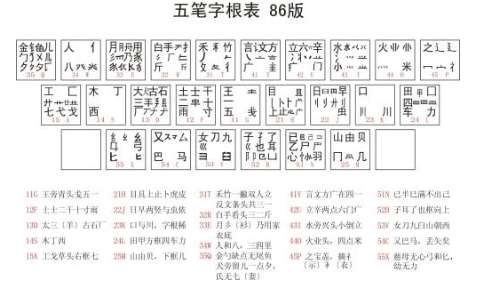
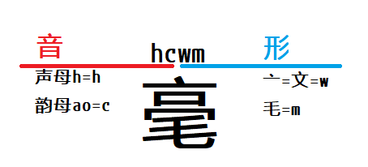
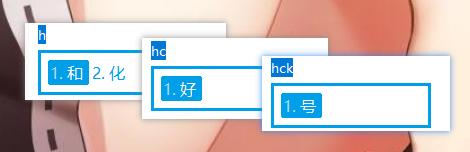
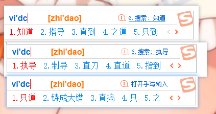
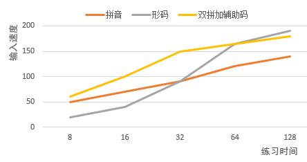

date: 2019-3-6
tags: 
- 输入法
- 方法论
---

好的输入体验应该是流畅、有节奏的，双拼+形码辅助是一种低成本提升中文输入体验的方法，适合人群：

* 已经比较熟悉键盘，但输入速度难进一步提升的人
* 厌烦了拼音输入法的重码，不想废眼睛废时间选字
* 痛恨某些输入法的广告，想转其他输入法但又不想降低输入体验的人


<!--more-->

## 中文输入法的历史

早期输入法，因为计算机的机能限制，是无法使用大词库的。
拼音输入的联想功能很差，词库小，更不用说智能整句输入了，效率很差，这时候想要高效率输入就得用五笔之类的短编码输入法。



后来计算机性能强了，输入法不再受机能限制了，拼音输入法有了大词库，加上联想功能大大减少了选重的麻烦，超低的门槛——仅需懂拼音就能打字，拼音输入法可以说统一了中文输入法市场。


原来的各种短编码输入法变成了少数的人工具，五笔、郑码这种全形码，虽然能通过一定练习获得比较高的输入效率，但因为学习难度大，渐渐淡出新一代人的视野。

当形码还大行其道时，双拼加形的输入方式的也开始露脸，鼻祖大概是1989年发布的自然码，这里引用维基百科对它的介绍：

> 音形码输入法是编码方式以拼音（通常为拼音首字母或双拼）加上汉字笔画（偏旁或字根）辅助的输入法，因易学、智能且接近形码的少重码体验等特点而受到部分用户的欢迎，较好的平衡了拼音输入法重码多、输入效率低，而形码输入法学习较困难的情况。

## 理解选重对输入的影响

当今的拼音输入法能“猜”你想要输入的内容，把可能性最高的放到第一候选项，全拼中可以这样打：


```none
nimamahannihuijiachifan（空格）->你妈妈喊你回家吃饭
（击键24）
```


双拼中可以这样打（小鹤双拼方案）：


```none
nimamahjnihvjxiifj（空格）->你妈妈喊你回家吃饭
（击键20）
```

可见码长缩短，原理很简单，把超过1个英文字母的声母、韵母分别编码某个按键上，举个直观的例子，打“闯天下”，全拼`chuangtianxia`，双拼`iltmxx`，其中`i=ch`、`l=uang`、`m=ian`、`x=ia`。

从全拼到双拼能提高不少体验，降低手指的疲劳度、一定程度上提升打字速度。但它本质上和全拼相同，不能减少重码。

加上形辅之后，就要这样打（小鹤音形方案）：


```none
n（空格）mama（空格）hjk（空格）n（空格）hvjx（空格）iifj（空格）->你妈妈喊你回家吃饭
（击键23）
```

可以发现输入这句时击键数会多于纯双拼，但实际上辅助码减少了重码，在更多时候能减少选重的时间开销（其实这就很能体现纯双拼在日常聊天时的表现），`n`对应的汉字只可能是`你`，`mama`对应的词也只可能是`妈妈`，省去了大量选重的时间。

比如下面用双拼和双拼加形辅同打一段话，可以看到后者几乎无需选重：


## 简单介绍小鹤音形

### 打单字

打单字时，以“毫”为例：



大部分单字可以用1、2、3级简码打出：




### 打词语

打词语时，小鹤双拼使用很小的词库，例如`vidc`（全拼是zhi'dao），只能打出“指导”（请无视截图里2、3候选，那是我的辅助提示）：


而更常见的“知道”、“直到”，则被编码在了`vd`中：


像这样的词被称为“二简词”，有很多这样仅用两个按键就能打出的词，提高了挺多效率。

看到这里该明白了吧，牺牲了词库量，换来了基本无需选重的效果，我们再来看看一个“zhidao”在搜狗里有多少重码：



其他例子：


## 学习曲线

很久之前试过五笔，没坚持下来，败在了适应过程中，打字太慢所以经常在拼音和五笔间切换。

学习拼音输入法应该是最快的，但因选重后期速度提升得付出很大努力；学习形码的过程应该是比较长，但后期容易达到比较高的速度；而双拼加辅助码比较容易学习，后期也能达到比较高的速度。练习时间和打字速度的关系大概是这样：




一个全拼用户，转双拼的成本是很小的，比如我自己，从全拼转双拼只用了大约3周，就恢复到了原来使用全拼时的速度。

一个双拼用户，转双拼加辅助码方案的成本也是相对小，我原先使用智能abc双拼方案，后转到小鹤音形，大概花了20天练习，就恢复到了原来双拼打简单文章的速度，大概是每分钟90-100左右。


## 入坑指南


### 只是想试试双拼

如果的只想试试双拼，继续使用高准确度的搜狗输入法大概是最优选择，在设置里启用双拼功能即可。（还是无法摆脱恶心的广告）

只管练习就是了，挑简单的文章来打，不怎么用选重的那种。

### 入坑小鹤音形

恭喜你可以摆脱某狗的广告骚扰了。

方案在[官网](https://www.flypy.com)上有详细介绍，入门教程可以去[小鹤双拼贴吧](http://tieba.baidu.com/f?kw=小鹤双拼)。

小鹤音形官方提供有windows/android/ios的输入法软件。

需要在其他平台下使用小鹤音形方案，可以使用[Rime](https://rime.im/)，自行导入输入法码表，不同平台可以使用同一份配置文件，[这里我自用的配置](https://github.com/noodlefighter/rime-config)。

看教程入门后，一开始可以找简单的文章打，遇到不会打的字去[小鹤查形](http://www.xhup.club/)查询。

有一定熟练度后，可以尝试打500常见字、二简词表等专项练习，此外还可以去打打佛经（手动滑稽）。


## 神叨叨几句，输入是个自动地过程

有人觉得双拼、辅助码很“别扭”，比较常见的理由是——脑子里响起的字的声音，你却要我输入一些别的东西，甚至还要先想那字怎么写，反人类啊。

这里试着解除这样的顾虑，我认为熟练的输入是“自动地”完成的，即输入过程并不需要表层意识参与。

比如打“强”字，对于一个全拼使用者，打字的过程并不是：想要输入“强”->想到读音qiang2->想出拼音韵母q和声母iang的声音->想出应拼音字母->想出字母在键盘的位置->移动手指去敲击qiang。
而是：想要输入“强”->移动手指去敲击。即中间的过程是“自动地”。

学习新的输入法的过程中的大量练习，强化的就是这个“自动地”中间过程，建立起字与手指敲打方式的关系，对于不同的中文输入法，输入时都是“想输入某字->移动手指去敲击”。
