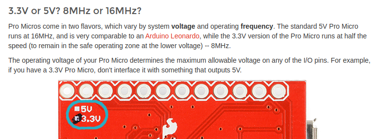
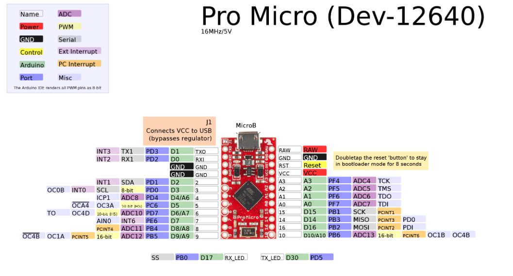
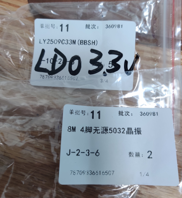
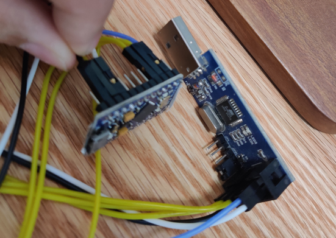
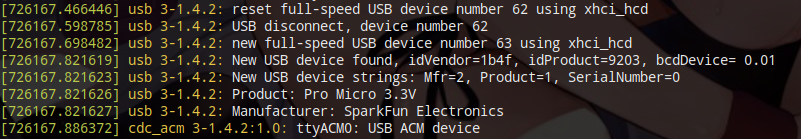

date: 2023-08-01
tags: 

- 嵌入式软件

---

Pro Micro是一块Atmega32u4的Arduino开发板。
手上只有Pro Micro 5v，临时需要改成3.3v，本以为很简单，只是改个LDO就行了，没想到也折腾了一个晚上，所以简单记录一下。


<!--more-->

## Step0. 确定修改方案

先看Pro Micro的资料：[Pro Micro & Fio V3 Hookup Guide](https://learn.sparkfun.com/tutorials/pro-micro--fio-v3-hookup-guide#faq-reinstall)



看来不仅仅是换个LDO，晶振也需要换，意味还要重新烧bootloader..

**需要更换的器件**：

- 随便一只CE为高电平使能的SOT-23-5封装的LDO
- 8M的4脚无源5032封装晶振

**用来烧bootloader的AVR的编程器**：

- 编程器可以是另一块Ardunio，烧上Arduino ISP固件后，就可以用来烧bootloader了，参考：
  - https://learn.sparkfun.com/tutorials/installing-an-arduino-bootloader#resources-and-going-further
- 我用的是一块USBasp

**好不容易找到的bootloader**：

- 编译好的hex
  - https://github.com/sparkfun/Arduino_Boards/blob/master/sparkfun/avr/bootloaders/caterina/Caterina-promicro8.hex

- fuse配置
  -  https://github.com/sparkfun/Arduino_Boards/blob/master/sparkfun/avr/bootloaders/caterina/program.txt

参考的烧录命令：

```
avrdude -p m32u4 -P usb -c avrispmkii -U flash:w:Caterina-promicro8.hex -U efuse:w:0xfe:m -U hfuse:w:0xd8:m -U lfuse:w:0xff:m
```


**另外附上一些资料**：

> TMK键盘固件的WIKI对Pro Micro的bootloader烧录的一些提示：
>
> https://github.com/tmk/tmk_keyboard/wiki/Pro-Micro#fuselock-bits-setting
>
> 
>
> 板子的引脚定义：
>
> 


## Step1. 硬件修改

> 使用的器件，仅供参考：
>
> 


建议改硬件前，先烧一份Blink程序，方便验证硬件修改效果。

打开Arduino IDE中的文件->示例->01.Basic->Blink，把`LED_BUILTIN`改为`LED_BUILTIN_RX`（因为这板子没这个LED），并添加：

```
#define LED_BUILTIN_RX 17
```

上传程序，可以看到板子上有一个LED每隔一秒反转一次。

用恒温加热台加热到230度，直接替换LDO和晶振。

因为改了16MHz晶振但没改bootloader和fuse配置，修改完硬件后，Pro Micro的USB接电脑，应该能观察到以下现象：

- 电源灯亮起
- USB设备会无法枚举
- Blink程序的LED闪烁，但慢了很多

如果现象不对，可能是焊接或者器件出了问题。


## Step2. 烧bootloader

把USBasp和Pro Micro连接到一起，用到的引脚有：VCC/GND/RST/SCK/MISO/MOSI，对着接就行。

> 不知道为什么，我的USBasp得把电平设置为5v，才能正常烧进去



使用avrdude烧写，我这里是用USBasp，所以和Step0中的参考命令有些不一样：

```
$ sudo avrdude -c usbasp -p atmega32u4 -v -e -U efuse:w:0xFE:m -U hfuse:w:0xD8:m -U lfuse:w:0xFF:m
$ sudo avrdude -c usbasp -p atmega32u4 -v -e -U flash:w:Caterina-promicro8.hex -U lock:w:0x0F:m
```

参考输出：

```
avrdude: Version 7.2
         Copyright the AVRDUDE authors;
         see https://github.com/avrdudes/avrdude/blob/main/AUTHORS

         System wide configuration file is /etc/avrdude.conf
         User configuration file is /root/.avrduderc
         User configuration file does not exist or is not a regular file, skipping

         Using Port                    : usb
         Using Programmer              : usbasp
avrdude: input file 下载/Caterina-promicro8.hex auto detected as Intel Hex
         AVR Part                      : ATmega32U4
         Chip Erase delay              : 9000 us
         PAGEL                         : PD7
         BS2                           : PA0
         RESET disposition             : possible i/o
         RETRY pulse                   : SCK
         Serial program mode           : yes
         Parallel program mode         : yes
         Timeout                       : 200
         StabDelay                     : 100
         CmdexeDelay                   : 25
         SyncLoops                     : 32
         PollIndex                     : 3
         PollValue                     : 0x53
         Memory Detail                 :

                                           Block Poll               Page                       Polled
           Memory Type Alias    Mode Delay Size  Indx Paged  Size   Size #Pages MinW  MaxW   ReadBack
           ----------- -------- ---- ----- ----- ---- ------ ------ ---- ------ ----- ----- ---------
           eeprom                 65    20     4    0 no       1024    4      0  9000  9000 0x00 0x00
           flash                  65     6   128    0 yes     32768  128    256  4500  4500 0x00 0x00
           lfuse                   0     0     0    0 no          1    1      0  9000  9000 0x00 0x00
           hfuse                   0     0     0    0 no          1    1      0  9000  9000 0x00 0x00
           efuse                   0     0     0    0 no          1    1      0  9000  9000 0x00 0x00
           lock                    0     0     0    0 no          1    1      0  9000  9000 0x00 0x00
           signature               0     0     0    0 no          3    1      0     0     0 0x00 0x00
           calibration             0     0     0    0 no          1    1      0     0     0 0x00 0x00

         Programmer Type : usbasp
         Description     : USBasp ISP and TPI programmer
avrdude: auto set sck period (because given equals null)
avrdude usbasp_spi_set_sck_period() error: cannot set sck period; please check for usbasp firmware update
avrdude: AVR device initialized and ready to accept instructions
avrdude: device signature = 0x1e9587 (probably m32u4)
avrdude: erasing chip
avrdude: auto set sck period (because given equals null)
avrdude usbasp_spi_set_sck_period() error: cannot set sck period; please check for usbasp firmware update

avrdude: processing -U flash:w:下载/Caterina-promicro8.hex:i
avrdude: reading input file 下载/Caterina-promicro8.hex for flash
         with 4086 bytes in 1 section within [0x7000, 0x7ff5]
         using 32 pages and 10 pad bytes
avrdude: writing 4086 bytes flash ...
Writing | ################################################## | 100% 0.07 s
avrdude: 4086 bytes of flash written
avrdude: verifying flash memory against 下载/Caterina-promicro8.hex
Reading | ################################################## | 100% 0.00 s
avrdude: 4086 bytes of flash verified

avrdude: processing -U lock:w:0x0F:m
avrdude: reading input file 0x0F for lock
         with 1 byte in 1 section within [0, 0]
avrdude: writing 1 byte lock ...
avrdude: 1 byte of lock written
avrdude: verifying lock memory against 0x0F
avrdude avr_verify() warning: ignoring mismatch in unused bits of lock
        (device 0xcf != input 0x0f); to prevent this warning set
        unused bits to 1 when writing (double check with datasheet)
avrdude: 1 byte of lock verified

avrdude done.  Thank you.
```


## Step3. 完事了跑个Blink验证一下

把下载bootloader的线全拔了，重新把Pro Micro接USB连电脑，可以看到枚举成功，并显示为Pro Micro 3.3V：



再次烧上Blink，看到闪烁，验证结束，打完收工。
