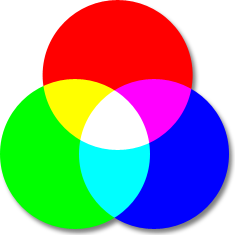
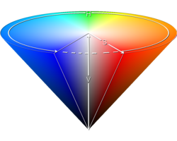

date: 2018-9-2
tags: 
- 色彩空间
- 设计
---

本文为 http://colorizer.org/ 的译文，图片素材也均来自于该网站。

RGB/HSB/HSV/HSL/HLS/HSI/CMYK/YUV/Lab/YCbCr

<!--more-->

## RGB色彩空间

RGB，也就是大家最熟悉的红绿蓝色彩模型，明天都会出现在我们生活中。这种色彩空间由3部分组成：

* 红（0-255）
* 绿（0-255）
* 蓝（0-255）

RGB色彩模型是一种做加法的模型，也就是说，使用三元色相加得到其他颜色。
例如，“红色”可以表示为[R=255, G=0, B=0]，紫色表示为[R=238, G=130, B=238]等等。

一般用下图像表示：

## HSB色彩空间

HSB（Hue, Saturation, Brightness）色彩空间由3部分组成：

* Hue: 色相，颜色种类，如红、蓝、黄，范围0-360° ，每个值对应着一种颜色
* Saturation饱和度: 颜色的强度（颜色的丰满程度），范围0-100%，0表示没有颜色，100表示强烈的颜色，降低饱和度其实就是在颜色中增加灰色的分量。它有时候也被称为“纯度purity"，by analogy to the colorimetric quantities excitation purity.
* Brightness明度(或Value值): 颜色的亮度，范围0-100%，0总是黑色， 100时根据饱和度，可能为白色或饱和度更低的颜色.

一般用下图像表示：

HSB也被称为HSV(Hue, Saturation, Value)。HSV模型被Alvy Ray Smith于1978提出，它是一种RGB模型的非线性变换。换言之，它并非被定义为基本色的简单的组合（相加、相减），而是数学上的变换。

Note: HSV和HSB是相同的东西，但和HSL不同。

## HSL色彩空间 

HSL色彩空间，也称为HLS、HSI，表示为：

* Hue: 色相，颜色种类，如红、蓝、黄，范围0-360° ，每个值对应着一种颜色
* Saturation饱和度: 颜色根据亮度（lightness）变化，范围0-100%，0是黑白轴的轴心.
* Lightness亮度(Luminance or Luminosity or Intensity): 范围0-100%，从黑到白.

一般用下图像表示：

HSL和HSB相似，区别在于HSL的明暗程度是均匀的：

* 在HSL中，饱和度分量（Saturation）总是从完全饱和的颜色变为等效的灰色（在HSB中，明度B为最大值时，从饱和颜色变为白色）
* 在HSL中，亮度（Lightness）始终涵盖从黑色到所选色相（Hue）到白色的整个范围（在HSB中，明度B分量只有一半，从黑色到所选色相）

在我看来，HSL能提供比HSB更准确（即使不是绝对的）的色彩。

## CMYK色彩空间

CMYK色彩空间，也被称为CMJN：

* Cyan青：范围0-100%（大多数应用中）
* Magenta品红：范围0-100%（大多数应用中）
* Yellow黄：范围0-100%（大多数应用中）
* blacK黑：范围0-100%（大多数应用中）

一种减法颜色模型，用于印刷。它的原理就是把青、品红、黄三层图片叠加起来。

（译注：使用的原因是，其实就是把）

一般用下图像表示：

与RGB颜色模型一样，CMYK是原色（青色，品红色，黄色和黑色）的组合，这可能是他们唯一的共同点。CMYK能呈现的颜色少，这是CMYK到RGB之间转换时，会发现色彩存在差异。

为什么要用这种模型？为什么要使用黑色？这是为了实用目的，Wikipedia上说：

* 为了提高打印质量、减少[莫尔条纹](https://zh.wikipedia.org/wiki/%E8%8E%AB%E5%88%97%E6%B3%A2%E7%B4%8B)，文本通常以黑色打印，还有些细节（如衬线）；如果使用三种墨水印刷文本，就需要对三层颜色的图像进行极其精确的对齐。

* 再者，青色、品红色和黄色颜料相组合，很难产生纯黑色。

* 将三种颜色的墨水混合在一起表现黑色，在不使用干墨粉时相当湿，在高速打印中会造成问题，纸张必须非常快速地干燥才能避免在另一张纸上留下印记，还有纸质不好时（如新闻纸），如果太湿可能会导致纸张破裂。
* 使用黑色墨（而不是使用三色组合），可以显着节省成本，黑色墨水通常更便宜。

## YUV色彩空间

YUV模型根据一个亮度和两个色度分量定义颜色空间，并且类似于YPbPr和YCbCr：

* Y：亮度分量（luma component）或亮度（brightness）。范围0-100％（在大多数应用中）
* U、V：色度分量（chrominance components），蓝色、红色亮度差分量，它的表现取决你使用的YUV版本

YUV颜色模型用于PAL、NTSC和SECAM composite color video standards。

相比标准RGB模型，YUV可以在计算机图形硬件中使用，可以更近似地模拟人类对颜色的感知。

一般用下图像表示：

---
以下为补充：

## Lab色彩空间

Lab通常指CIELAB，[详见wiki](https://zh.wikipedia.org/wiki/Lab%E8%89%B2%E5%BD%A9%E7%A9%BA%E9%97%B4)：

* L：亮度
* a：从绿Green到红Red，范围-128到128
* b：从蓝Blue到黄Yellow，范围-128到128

## YCbCr

摘自[Wiki](https://zh.wikipedia.org/wiki/YCbCr)：

> YCbCr或Y'CbCr有的时候会被写作：YCBCR或是Y'CBCR，是色彩空间的一种，通常会用于影片中的影像连续处理，或是数字摄影系统中。Y'和Y是不同的，Y就是所谓的流明（luminance），表示光的浓度且为非线性，使用伽马修正（gamma correction）编码处理。Y'为颜色的亮度（luma）成分、而CB和CR则为蓝色和红色的浓度偏移量成分。
> Y'CbCr不是一种绝对的色彩空间，是一种针对RGB资讯所做的编码。真正的颜色显示是根据实际RGB色盘（colorant）来决定的。因此Y'CbCr所表示的值只有在标准RGB色盘或是ICC数据（ICC profile）有提供的时候才能计算。
> YCbCr不是一种绝对色彩空间，是YUV压缩和偏移的版本。YCbCr的Y与YUV中的Y含义一致，Cb和Cr与UV同样都指色彩，Cb指蓝色色度，Cr指红色色度，在应用上很广泛，JPEG、MPEG、DVD、摄影机、数字电视等皆采此一格式。因此一般俗称的YUV大多是指YCbCr。

参考：
[色度抽样](https://zh.wikipedia.org/wiki/%E8%89%B2%E5%BA%A6%E6%8A%BD%E6%A0%B7)

[伽马校正](https://en.wikipedia.org/wiki/Gamma_correction)

