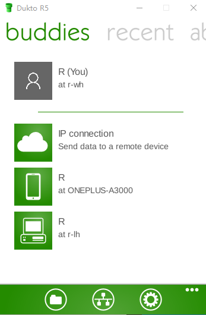
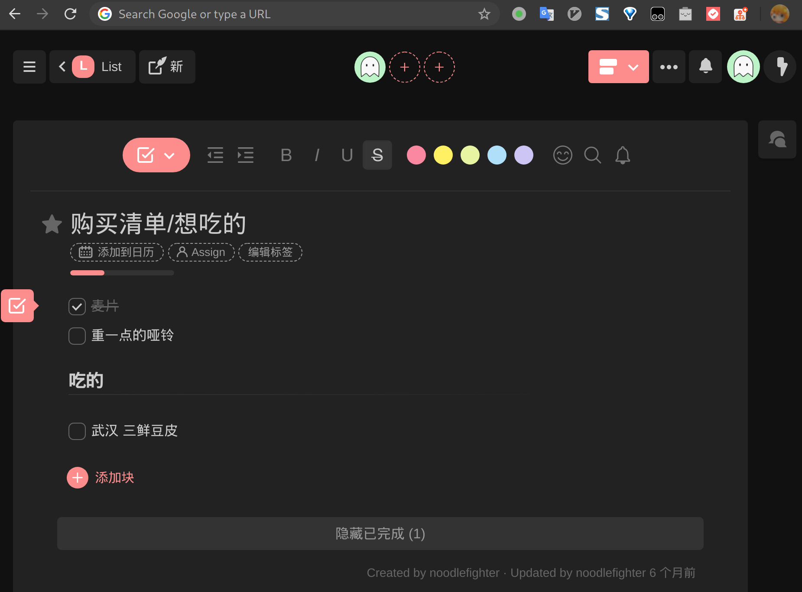
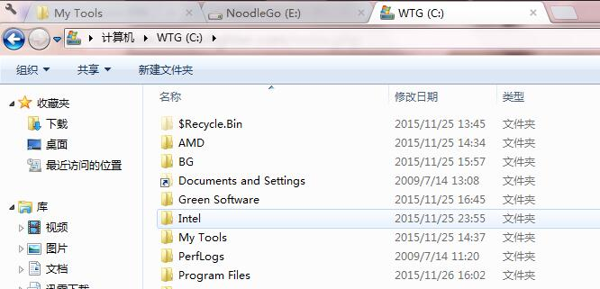
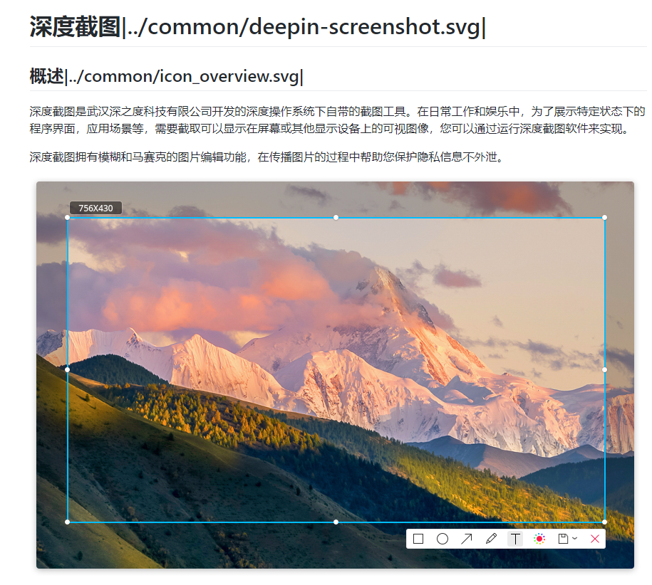
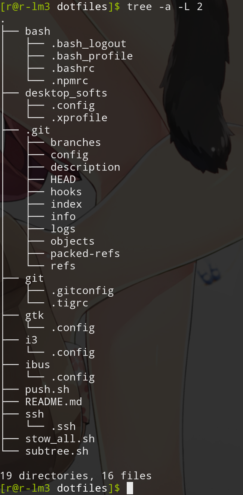
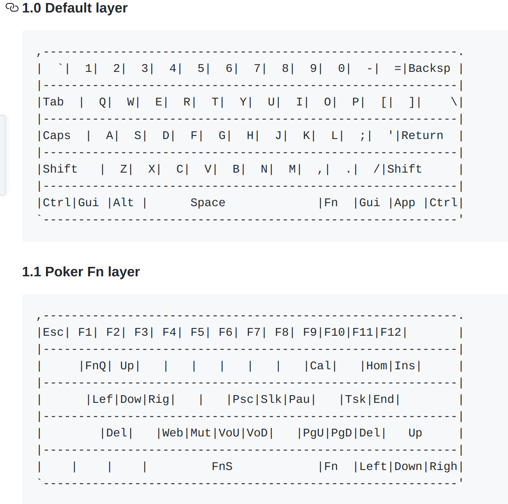
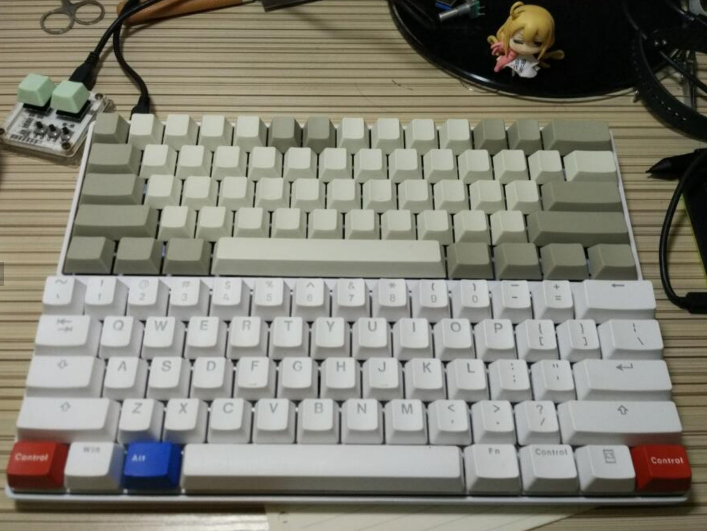
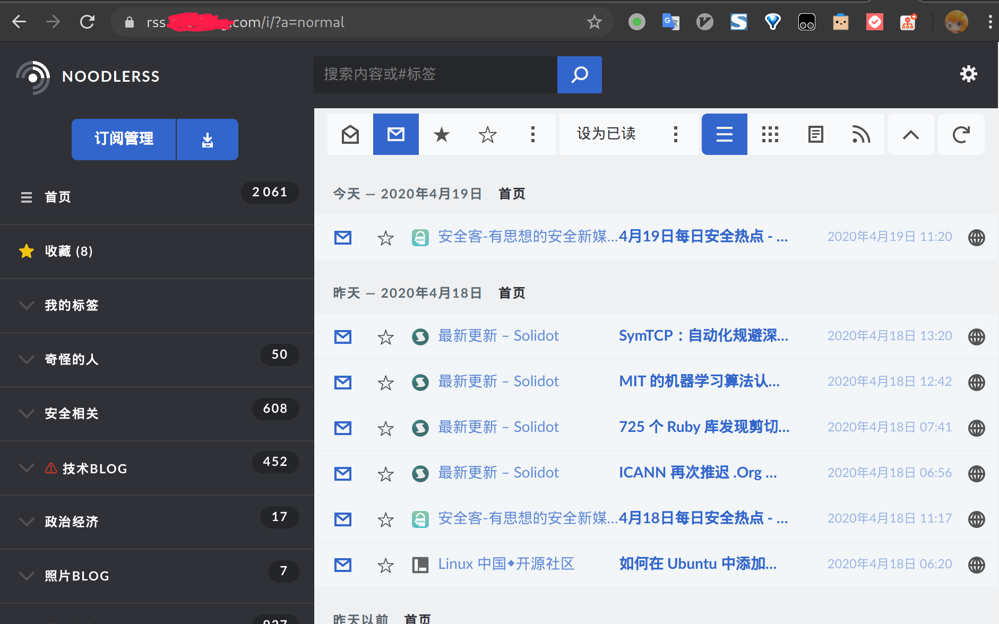
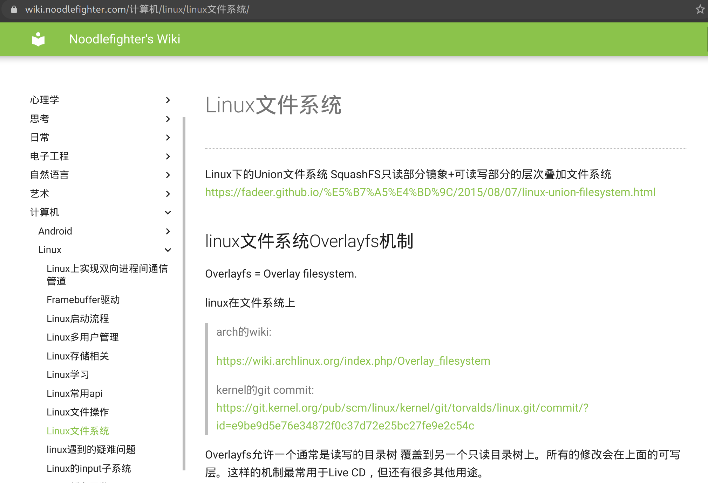
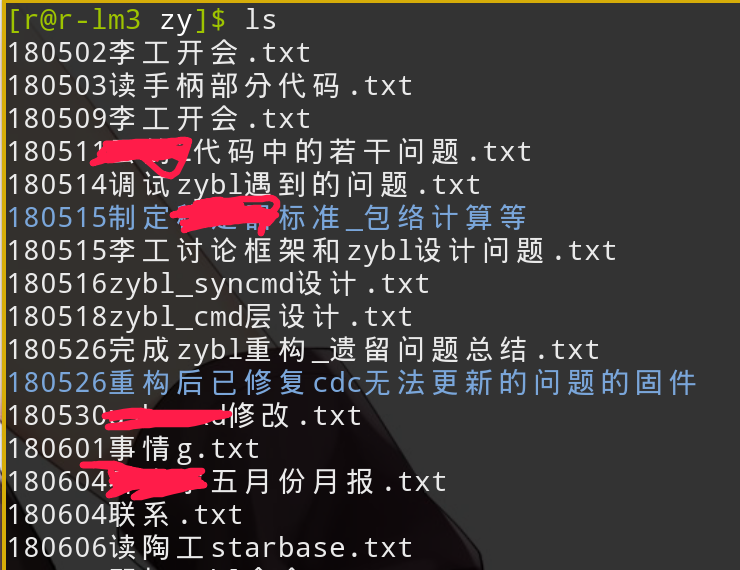

date: 2020-04-19
---

摸鱼写一篇文 记录自己觉得用起来很方便的工具、工作方式。

2015-11-26 初版
2018-12-03 更新
2019-09-22 工作环境基本在Linux这边之后，做点补充
2020-04-19 补充数据同步、效率提升

<!--more-->

## 桌面环境

~~因为主业是嵌软开发，大量工具链在windows这边，所以把win作为宿主，linux放虚拟机里跑。~~

windows下跑Linux虚拟机实不好使用，直接多装了一台实机，所以现在两台实机，分别装win+linux，用barrier共享鼠标键盘。

### ~~win下的unix兼容环境msys2~~

~~相比cygwin，跑得更快，带包管理器，和arch用的一样pacman。
就这两项，使用起来就要舒服得多。
能用很多unix工具，比如我不会写bat脚本，有这个在win下也能用shell脚本了。~~

> P.S. win10出了个WSL子系统，原理也是做了层翻译，比msys2速度快，已经转用WSL了

### ~~mint linux~~

~~体验不错的桌面环境，ubuntu的包基本都能用，免折腾。~~

### Manjaro Linux

易用的Arch系Linux，选用它主要是软件源的策略对开发者友好，而且有强大的AUR源，用过就不想离开了。

窗口管理器选用i3wm，大量操作摆脱了鼠标。

## 跨平台桌面工具

### Typora

单栏Markdown编辑器，用了一段时间，感觉适合写作，对于日常笔记还是有点“重”。

现在写Blog和Wiki都用这个，很好使，所见即所得（也可切换到源代码模式），在插入图片时可以自定义资源文件夹的相对路径，体验很棒。

### Dokto

局域网内快速分享文件、文本的工具。重点是跨平台，开源免费，QT写的，好多年不更新了但同类工具真没见过能打的，Windows/Linux桌面下都挺好使，Android端体验不佳但聊胜于无。

Ubuntu/Arch的AUR源都有二进制包，Windows的话：https://sourceforge.net/projects/dukto/

### Todo List工具

推荐taskade，这货有Chrome的New Tab插件，在各平台上也客户端。

### Barrier

共享键盘鼠标，几台电脑能使用同一套键鼠。

其实就是从Synergy那fork过来的，Synergy的build要收费，这个不用。

## Windows桌面工具

### ~~Clover~~

~~"给资源管理器加上标签页"~~

> __P.S. win8之后稳定性变差，已弃用，改用FreeCommander__
> (2019-01-14)现在已经沦落为国产垃圾，会擅自安装广告软件

### ~~f.lux~~

~~这玩意可以根据日落时间调节屏幕色温 减少眼睛疲劳 是个好东西
看视频的时候暂停掉就好.~~

> Win 10已经自带了夜间模式

### Rolan

快速启动工具 很好用 (也可以把它装到u盘里, 路径可以设置成自适应的.)

像这样, 想启动程序的时候, 热键呼出, 输入拼音首字或者英文, 回车就能启动.

有了快速启动工具，就可以放空桌面了，配合的Win+R和everything能完成大多数程序的启动。

### Alt Drag
按着alt键就能拖动窗口/更改大小/改变透明度之类的...很方便

### win自带的工具

calc.exe mspaint.exe charmap.exe

~~哦 还有一个win7下的截图工具(SnippingTool.exe), 名字太长了, 我把它加在rolan里了.~~

> __P.S 截图工具改用snipaste了__

### FreeCommander

易用的文件管理器。

### snipaste

免费截图工具，很好用。

特色是贴图功能，能把截到的图暂时“贴”到屏幕上，有时候开发需要参考，或需要把截到的几张图拼起来：

### everything

快速找文件的利器，输入文件名字（支持通配符、正则表达式）能快速找到想要的文件。

### ~~7-zip~~

~~免费、开源的压缩解压工具，包括rar格式在内的常用档都能解，值得一提的是7z格式本身就很优秀。~~

> P.S. Bandizip的GUI的体验比7-zip好太多，换了

### Bandizip

免费闭源，压缩解压工具，有一些用户友好的细节，比如右键菜单中有文件预览、不用压缩就能预览图片。

### notepad++

免费开源，超轻量编辑器，notepad的替代品，语法高亮，宏。

适用场景，临时改点代码。

### Beyond Compare

这个用来做对比很管用 
有时候需要对比文件夹差异还有手工合并一些文件..
这个能派上大用场 效率工具，是收费软件

### MobaXterm

开源SSH工具，有免费许可，用于替代putty和winscp，功能丰富，用户友好。

关于它的免费许可（Home Editon），是允许商用的，但要求软件必须由个人下载，而不能由公司分发。

## Linux桌面工具

### Alacritty

号称Linux上最快的终端模拟器，确实好用，配置简单。

### nemo

图形化文件管理器，有一点特别好用就是访问远程目标，比如SMB、SFTP之类的，常用的直接做成书签，就不用手动搞FUSE了。

### 深度截屏（deeppin-screenshot）

不得不说还是国人懂国人，一款类QQ的截屏工具。

https://github.com/linuxdeepin/deepin-screenshot

## Linux命令行工具

常用CLI工具实在太多了，可以去翻[我的wiki](https://wiki.noodlefighter.com)的“计算机/Linux/Tools”分类。

Linux环境下整个习惯和win下不太一样，工具比较少有大而全的，比如二进制编辑，win下可能专门开个十六进制编辑器就上了，而那边就会使用xxd工具先转译成十六进制文本，再`xxd -r`转回去。

正因为命令行下工具丰富，用各类脚本把工具粘在一起实现自动化就很方便，而win下要做自动化很多时候得用AutoHotkey之类的模拟对GUI的操作，相信用电脑时间长了之后，都会想把一些低效的重复操作自动化，win的局限性就在这了，所以我现在更喜欢在Linux那边干活，在Win这边娱乐。

## 数据同步

在用着的几台式机/笔记本/平板，再加上移动设备会做双系统，反复地配置、同步就成效率问题了。

### 软件配置同步

Windows下的软件，布置环境的时候用chocolatey批量安装要用的软件，要用的时候再手动配置一下，幸好现在写程序基本用vscode自带同步插件（吐槽一下，之前用eclipse时得整个打包到处copy）。现在的软件基本把配置放User目录下了，应该也能统一管理，但没动力去研究方法。

Linux下的大部分软件都使用`$HOME/.config/*`中的文本配置文件来配置，加上用的pacman这种无脑给升级到最新的包管理器，只要软件升级时跟着更新配置就行了，用stow+git就能很方便地做版本管理/同步，网络上一搜就能找到相关文章（关键词：“gnu stow dotfiles”）

### 输入法配置同步

如果你是搜狗拼音使用者，能忍受它的广告、缓慢、隐私泄漏等问题，那你很幸运，常用平台上基本有可用的同步功能。

如果你是形码等小词库输入方案用户，这里强烈推荐使用RIME输入法平台，很多方案在这个平台下都有实现，而它在各个平台下的配置文件是相同的（因为使用了通用的输入法库librime），常用的平台上都有对应的前端实现，用git管理起来即可，如[我的rime配置](https://github.com/noodlefighter/rime-config)。

### 键盘相关的配置

Windows用户喜欢用AutoHotKey来实现键盘宏，在其他平台下就无法用了，为了统一不同平台的体验，建议使用TMK/QMK固件的键盘，把键盘宏放到键盘固件里，最常见的是GH60：

### 使用云服务

关于文件同步，坚果云是一个可用项，常用平台都做有客户端，我主要用来同步一些私人笔记；如果有更高要求，自建NAS在今天已经相对容易，各运营商已经支持IPv6，上行带宽也相对充裕了。

一些不方便同步配置的软件，自托管服务（Self-Hosting）也是一个选项，比如RSS阅读器如果不自带同步功能，阅读进度很难用其他方法同步，这时候就可以用自托管的服务器软件，数据都在服务器上，阅读进度就自然地在多个端上同步了。

## 个人效率优化

### 笔记

好的笔记是第二大脑，我使用Wiki+日志相结合的方式：

* Wiki是个知识库，按知识层次检索，以备不时之需，可以参考[我的Wiki](https://wiki.noodlefighter.com/)

  	

* 日志是流水账，这些东西可能是一次性的，按日期检索，用于日后回溯发生了什么事情（以及甩锅XD）

  

### 精力管理

对于把时间打包按月出租的工薪阶层来说，**精力管理>时间管理**，有精力就能做额外的事创造更多个人价值，一种提高效率的方式。

* 少做耗精力的事：比如与人争论、做无谓的选择都会消耗精力
* 把精力放在重要的决策上：决策会消耗精力，所以人会不自觉地避免做消耗精力的事，导致“延迟选择”或者“不做选择”，重要的决策要有意识地投入大量精力
* 沉浸式，工作时排除干扰，包括邮件、干扰
* 专注于一件事而不是多件事，注意力会被分散，快速耗尽精力
* 少忍耐，多做自己喜欢做的事，忍耐会快速消耗精力，做自己喜欢做的事能恢复精力；
* 早睡早起，睡觉能恢复精力，早睡能避免上午被噪音阳光影响睡眠质量，早起意思是避免睡回笼觉因为补充精力的效率很低
* 保持运动，运动能让精力槽上限up，而且心情会好，瑜伽垫、弹力绳、哑铃就能做很多运动，一起来撸铁啊

### 高效沟通

先明确沟通的目：达成共识，并做出承诺付诸行动。
1. 同理性倾听（不一定同意但要换位思考地听），先找到对方的目的
2. 再思考，自己要付出什么、要如何说，才能达成共识
3. 达成共识后，让对方承诺付诸行动
