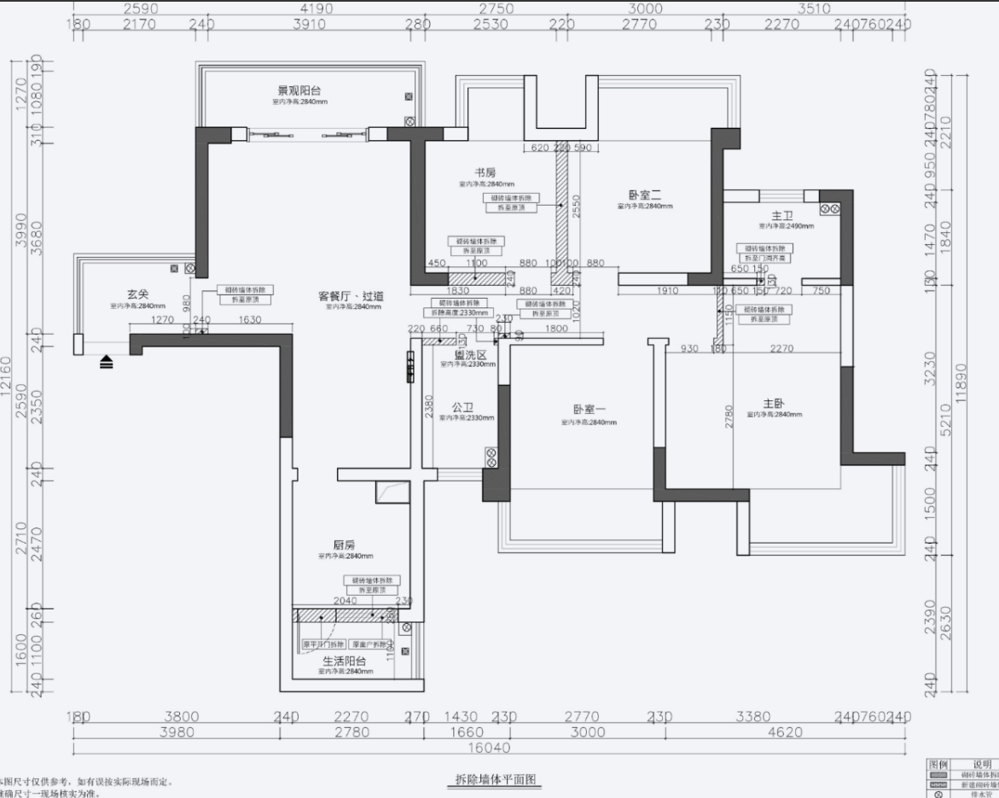

date: 2021-10-22
tags:

- 日志

---

装修是大事，普通人一辈子也没几次装修的机会，不请装修公司，自己做工头难免踩坑，相信会是宝贵的实践经验，所以以日志的形式记录下来。 **持续更新中...**

<!-- more -->

装修是复杂工程，涉及到的零杂项目很多，每一项都它的门门道道。

装修公司把这个复杂工程做了封装，而接口就是他们的设计师和监理，但也带来了不透明的问题，所以一些人会选择撇开装修公司自己装。

虽然复杂，但怎么说也不像软件工程一样混沌，有人指点的前提下还是有信心自己做好的。

## 先说清一些情况

**自身情况**

- 2016年交房至今一直空置，主要是当时刚毕业，一直攒不下钱装修
- 房子在南宁，而我一直在外地工作，对装修的事也没上心，直到周边配套成熟之后，市场上租房需求旺盛，租金也上来了，一直放着觉得怪可惜的，于是决定把房子装起来

**为什么会选择不请装修公司，自己装修？**

父母的朋友有自己装修过几套房的经验，家里人很动心，我简单做了一些功课，觉得自己 hold 得住，就铁了心这么做了。

**风格？预算？**

日式现代简装；预算，设计费用+硬装+基本的家具不做柜子，10-15万；装修好打算先出租，后面如果回家再自己住，所以会按自己住的标准做设计、做硬装，而其他方便更换的东西都尽量往出租屋的级别看齐。

**具体怎么操作？**

自己请设计师出施工图纸，自己联系工人施工，自己把控好施工工艺，再由工人来列材料清单，自己去建材市场买材料；联系设计师是我本人，具体施工由我的父母负责（因为我一直在外地）。


为了尽量让读者理解中途可能遇到的困难，日志会尽可能细致地还原当时时间点遇到的状况、做出的一些决策，所以文章会显得啰嗦，请见谅。


## 户型介绍和装修风格

小高层的低楼层，住宅面积115平，套内100平，原始户型图：


套内100平，硬是塞下了四个房间+三个阳台+两个卫生间，结果就是各个空间都很极限，各卧室都是属于做了柜子就难放下1.5米床铺的尺寸，但是飘窗 **真 的 是 很 大**。

注意，开发商给的平面布置图里的物件比实际尺寸小了一圈，比如看下面的次卧，宽度标的3米去掉墙算2.8米，一般的床长2米，图中的只有约1.7米，普通成年人睡个觉脚都要伸出来的长度。

先看布局：

- 进门先是个很迷你的入户阳台，已经入住的邻居，基本会选择封阳台作为玄关；
- 然后到客厅，宽度够放个三座的沙发，距离电视4米也可以有不错的观感，尺寸虽小但不影响功能；
- 迷你尺寸的餐厅+厨房+生活阳台；餐厅，走道占去一部分空间，厨房，开发商给出的平面布置是个约3米的U型台面，实际用起来空间会比较局促，因为我喜欢自己做饭，这会是设计的重点
- 儿童房，最小的一间房，飘窗也小，打算当书房
- 下面那间次卧，飘窗很大，得好好利用
- 主卧的形状别扭，过道长长

实际看房

- 采光和视野：主卧和飘窗小的次卧，视野和采光最好；景观阳台对着小区内部花园；飘窗最大的次卧对着楼体自身；入户阳台也没什么视野，封了一点不可惜；
- 通风：站在客厅，感觉通风十分的好，因为南北朝向吧

客厅：


餐厅：


厨房和生活阳台：


过道：


主卧飘窗：


## 2021-04-14 建立自己的初步构想

自己做了初步设计，当时也没想好要不要请设计师，总之想着要先有自己的一些想法。要

### 风格

日式简单装修，「让人感到放松的、朴素的」，大量白色打底+原木色为基调，风格参考：


家具风格参考：


少做吊顶，需要筒灯时可以直接外露：


玄关：


> 参考： https://www.isibasi-koumuten.com/gallery_house/house_h29u.html

### 换气方案

南宁很潮湿，每年3、4月份更是潮湿到溢出，就是所谓的“回南天”，所以一直很想让自己的房子用上新风系统，不用开窗就能换气，顺便维持室内湿度。

先看了**吊顶新风**：

优点：

- 空气净化、带湿度控制，保持室内空气干爽舒适
- 热交换，空调效能提高
- 不用开窗，室外的灰尘进不来，打扫卫生频率降低

缺点：

- 初装贵，除了新风机，还要布管道，大概需要多花3万起步；
- 走管需要过吊顶，降低层高，也增加了费用；
- 不是装上之后就能愉快地一直用下去的，管道需要注意保养，比如需要定期更换过滤网，一旦管道被污染就很难处理，因为是隐蔽工程

综合考虑考虑到房子大概率要出租，初装和维护成本都属于不必要承受的，只能放弃吊顶新风。

然后研究了壁挂式新风，好处是不用布管，但效果不如吊顶新风，也难以维持室内湿度，似乎和我的初衷不符。

如果不想开窗，还有一种选择，换气扇，比如松下的FV-10PH3C：


房间之间可以通过安装换气孔实现空气流通：


换气扇便宜，带一定的过滤功能，而且会有点噪音，也算是备选方案。

### 电位


- 到每个房间、客厅电视柜的线，各走2根管，一根管走网线（纯铜超五类线）、一根预留空管，放一根占位用铁丝（日后用于光纤音视频等用途预留）
- 到吸顶无线AP的网线，各走1根管的网线，并配上电线

> 参考：[2020年再谈家庭网络布线](https://zhuanlan.zhihu.com/p/270243321)

### 地面

- 做踢脚线
- 玄关阳台厨房卫生间瓷砖（约22平）
- 全屋复合木地板（约60平），考虑房间之间直接铺通（后面打消了这个念头，后面再说怎么回事）
- 飘窗安装人造石

### 客厅

- 直线吊顶
- 不考虑音箱布线，之后可使用无线音箱方案
- 电视柜从简，不做背景，找个差不多的成品电视柜
- 空调看位置只能在电视柜的上方了，注意空间...

### 餐厅-厨房-阳台

这三个区域得放在一起考量：

- 原方案：厨房小

- 方案A：改餐厅到厨房的墙、拆生活阳台的墙，厨房改双排；优点，厨房可用台面变大，生活阳台也保留；缺点；餐厅动线严重受影响，需要靠边摆放餐桌，不然平时得绕过餐桌才能到达厨房

- 方案B：只打掉生活阳台的墙；优点是厨房从5平变到8平，宽敞了不少，而且餐厅的角落能做柜子；缺点是没专门晾衣服的地方了，得把景观阳台变为生活阳台

- 方案C：打掉生活阳台，厨房也改双排，得到一个最大的厨房；方案AB的缺点同时存在


为了验证方案A是否能安排下想在厨房安装的电器，嵌入式的洗碗机、消毒柜、烤箱，尝试着自己做了厨房柜的布局，结论是可以放下，但备料空间比较局促：


为了做布局图，关于尺寸的问题还是花了不功夫查资料的，这里是总结的一些需求：

需求：

- 想根据橱柜的设计确定电的位置，方便做水电改造，所以需要个简单的橱柜布局设计
- 需要做吊柜，吊柜做到顶，不要留缝隙
- 台面的挡水条要一体的
- 烟道左侧做电器柜，做足插座
- 灶台左侧安排一个放调味料的拉篮
- 台下水槽，至少沉200mm，PP材料下水管
- 嵌入式电器尺寸
  - 烤箱（600x590mm）
  - 洗碗机（600x800mm）
  - 消毒柜（600x590mm）
- 冰箱宽度留够730mm
- 考虑厨下直饮水和垃圾处理器，留2个插座
- 注意入户燃气位置，留热水器的插座
- 台面插座留足，小家电很容易占满插座

尺寸相关参考商品：

- [意驰 调味拉篮 150宽](https://detail.tmall.com/item.htm?spm=a230r.1.14.20.329e4b1bSkhUKa&id=587415394027&ns=1&abbucket=3&skuId=4484135701645)
- [米桶](https://detail.tmall.com/item.htm?spm=a230r.1.14.36.5d90158amZ9a1O&id=568569338584&ns=1&abbucket=3&skuId=4479412376918)
- [海氏 HO-M10嵌入式电烤箱](https://detail.tmall.com/item.htm?spm=a230r.1.14.30.406f1d6cbARQad&id=546330648784&ns=1&abbucket=3&skuId=3302115897552)
- [海尔电冰箱136L](https://detail.tmall.com/item.htm?spm=a230r.1.14.284.7e17445bWf6ZxJ&id=639419962786&ns=1&abbucket=3&skuId=4588232333387)，客服说左右各留5cm
- [海尔洗碗机450宽](https://detail.tmall.com/item.htm?spm=a230r.1.14.238.566e589cyEMK4H&id=637862992200&ns=1&abbucket=3&skuId=4748823766895)

尺寸相关参考资料：

- [橱柜尺寸指南](https://zhuanlan.zhihu.com/p/137256927)
- [厨房设计数据经验](https://zhuanlan.zhihu.com/p/158920548)
- [中国家用电器协会 嵌入式厨房电器一体化指南（2013 年版）](https://www.cheaa.org/upload/att1.pdf)

### 卫生间

公共卫生间

- 考虑做干湿分离，空间局促就算了..  做的话不买成品淋浴房：淋浴帘用玻璃，地板用石材


主卧卫生间

- 卫生间入口藏在主卧柜子里，拉门轨道在厕所内
- 不做干湿分离，设定上不常淋浴
- 做较大的柜，大镜子，镜子前记得做灯


### 平面布置

- 保留生活阳台，厨房改双排，台面加长到我能接受的程度了；但对应的，从客厅到厨房的动线被影响了；
- 餐厅旁做的柜子是考虑到弱电箱的位置，网络设备需要用柜子来放，比如光猫、交换机和他们的电源；
- 次卧和客卧，放1.2宽的床比较合适；
- 主卧用柜子遮住卫生间门口；


### 跑本地的建材市场和家具城看了下材料价格

- 一般的瓷砖30-50一平
- 复合地板90一平，水洗110-130一平包安装
- 入户房门1000-2500，普通厚实的2000，卖家说一些品牌在锁上下重料所以贵，而门本身可能差不多
- 房间门800-1000一套，实木拼接；厕所门800左右；厨房门定制约500一平
- 厨房柜800-1000一米，面料基本都是石英石，柜体材料石头和木头差价不大，高度正常是80-85（90的话要补差价）
- 铝扣吊顶100-120一平
- 小号马桶500-700
- 家具五金在家具城溢价很高，网上买划算

## 2021-06-27 请了设计师

做了很多功课，但对施工是一点经验都没有，虽然网上能查到一些大体的步骤但感觉巨多细节没提到。

所以决定请设计师，能指导着我们施工的那种；正好一同学是设计师，聊了一下，她觉得不请监理也行，就是我父母要常跑工地，麻烦点，家里觉得可以，就这么定下来了。

设计费用按设计面积算，会设计到的地方就会算面积，每平120元，从量房到出施工效果图需要约一个月：

- 先量房
- 几天后，设计师给出平面设计图方案，确定平面设计方案，交一半的设计费用；
- 设计师开始做施工图、效果图，第一稿出来大概需要半个月时间，然后需要和用户沟通，直到效果满意；
- 结清剩下的费用，设计师给出完整的设计图、效果图大图；
- 后续施工中设计师跟进，指导施工步骤；对影响最终效果的步骤，比如水电改造环节，会帮忙和工人交底、验收

装修公司，如果只设计不找他们施工的话，会收双倍设计费用，而私下请设计师会便宜一半。

顺便研究了下当地请监理的情况，按工程费用总数的百分比收费，负责联系工人、交代施工、验收、施工过程中会到场几次。

## 2021-07-11 和设计师敲定平面布局

设计师给出了两个平面方案

方案一：厨房改U字型，最高的空间利用，景观阳台变为生活阳台；公卫洗手池到外边实现干湿分离；把书房改小为卧室二腾出柜子空间，也使房间适合放双人床，从两边下床都方便；


方案二：改生活阳台，宽敞的L型厨房，台面也足够用，必要的话可以在台面对面放上置物架；改主卧门口，加宽主卧空间，还收获一个大衣柜，但卫生间对着床尾，梳妆台对着床，主卧的门也对着过道


设计师会很耐心地把设计思路、设计的优点缺点考量都过一遍，设计师会注意到一般难注意到的点，比如：

- 床靠边放，如果有两个人睡，靠内睡的人起夜就困难，所以要考虑功能——会不会有两个人睡这间，比如父母会不会一起住；
- 如果分租，少一间房，租金就少了一份；
- 公卫的洗手池放在外边可以减少争抢厕所的情况；
- 沙发、床铺的朝向，需要考虑窗外景观

研究了好一阵最终敲定的是这样的布局：


- 厨房是考虑动线和餐厅好做柜子，加上L型台面已经够用，就不做U型了

- 对于房间的改动，主要还是舒适性拉满了，尽可能地多挪出一点空间，麻雀再小也是肉了

- 主卧的改墙，吃了一截过道的面积让房间宽敞了些，卫生间门只是对着床尾，门口对着过道没对着入户门也不算穿堂，梳妆台可以用这种翻盖式的，还能顺带给物品防尘：


关于风格，这一阶段设计师会给出一些意向图让客户选择，好确定风格方向：


## 2021-08-01 和设计师定施工图

第一稿施工图效果图出来了：拆墙图、砌墙图、地面铺装图、强弱电位图、给水点位布置图、天花板布置图、照明开关控制布置图。

确实会有很多施工图，怪不得设计师说平面布置定稿了之后尽量别动了，宁愿先想好晚点再确认也不迟，毕竟一动平面设计，这些图都要改。




看了基本没什么问题，就是客厅灯的开关，放在过道的尽头有点不合理，改了就没什么了。

然后到效果图：


给出的效果图和我心中的“日式现代简装”有挺大差距，不够放轻松，日式元素显得有些用力过猛，提出的改进方向：

- 减少日式风格的灯饰、少用饰面板比如床头的木板
- 多功能房的床头的柜子方向错了，不做嵌入式的组合书柜，就放一个不带书架的普通的实木书桌
- 衣柜使用原木色表面
- 餐厅不要做饰面板的墙，把柜子做高

## 2021-08-11 完成设计

设计阶段，家里人总会有各种顾虑，比如“改这么多墙，会花很多钱吧”、“开发商原来这么设计的，也有他的 打算吧”、“别家都不改，就按别家的来做得了”；只能说方案都是各有侧重的，最重要的还是想清楚房子的用途，如果自住，就要想方设法地让设计倾向于更宜居，毕竟平面布局直接影响到居住体验。

定方案的过程中，和家里各种争吵、妥协，最费精力的还是在人上面，对于这个我是一点办法都没，毕竟施工不是自己弄，辛苦的是家里人；如果你不是自己掌控施工，在决定不请装修公司之前一定要想清楚了，家里人的配合程度如何，愿不愿意承受掉头发伤脑筋。

设计师给出了最终的工程包，没啥问题我就结清了尾款。


施工图没什么好贴的，效果图更新了：


## 2021-08-17 厨房的考量

考虑厨房的问题，设计到这里我才意识到，按现在装修公司的设计方式，室内设计师一般是不负责设计厨房水电的，而是交给更专业的厨柜公司，所以需要去找橱柜公司拿水电位设计方案。

听起来挺简单，但实际操作起来遇到了困难：品牌橱柜公司不做石材柜体，而路边小店不会提供水电设计。

南宁很潮湿，虽然颗粒板柜体是主流但一旦工艺材料跟不上，该坏的还是会坏，所以还是想做耐用省事的石材柜体，而且感觉花了大价钱还买不到自己想要的材料，觉得很不值。

材料优缺点很多文章都有提，现在最常见材料是石英石+颗粒板：

- 台面材料：人造石英石、大理石、不锈钢、实木板等
- 柜体材料：颗粒板（刨花板）、多层板、实木板、石料等
- 柜门材料基本是木材基材：实木板、三聚氢胺板、吸塑板、UV漆板、亚克力门板、晶钢门板

能定制橱柜的地方：

- 厨房定制橱柜公司（也就是品牌橱柜），会给你各种套餐、风格选择，套餐一般包括一定长度的台面柜体吊柜，高柜和五金另外收费；也有完全分开计费的方式，台面、柜体、吊柜、五金会分开计费
  - 找志邦问了方案和价格，质保十年，材料就是常见的石英石+颗粒板，台面、柜体都是每米一千多左右，4米大概1.3w；高柜印象中是5000一米，0.6米算3000；五金基本500-800一件，而我需要抽屉x3拉篮x2转角拉门x1；统下来大概2万多
  - 还找了爱阁工房，让售前估价，说估不出让我到门店实际看看
- 路边小门店，台面+柜体800-1000一米，吊柜也差不多价格，柜体用颗粒板/花岗岩料，价格都差不多，一万以内能下来

总之结论就是，现在品牌橱柜公司不接石料柜体的定制，应该是出于品控和方便定制的考虑——他们可以在自己的自动化工厂完成定制，再依托现在方便的物流服务送到用户手上。感觉就是经历了一次产业升级，定制、安装不便的石料柜体只能在路边小店或者自己找工厂做了。

了解了一圈，还是发挥了下传统手艺，打开CAD软件自己简单做了设计：


同时，水电位也就有了：


可以简单算出，台面4.2米，高柜0.6米，吊柜能做2米左右。

设计师指出我的设计的一些问题，还帮在施工图上加了电位：

- 电器柜的两个插座没错开，因为要在墙壁上不能走横槽，所以必须错开
- 台面的插座可能不够高，现在是100cm，因为要考虑挡水板10cm，加上台面可能不止80cm高，所以改到了120cm


## 2021-08-24 开始施工

施工前，需要去物业审核施工图纸、交管理费；还让物业安排一块临时堆放建筑垃圾的区域，砸墙会产生大量建筑垃圾，如果有堆放地就可以先堆放后清运；家里讲究开工时间的话，还要先提前看好日子（汗）。

还有记得开通水、电，燃气开户申请装表，这些开发商可能帮开好户了，但还是要用户去完善信息，开通户号才能交费使用，具体情况问物业和邻居，部分操作能在手机上完成，建议去营业厅前先研究一下免得浪费时间。

总算是正式开工了，物业那边帮接了电，设计师到现场定位改墙、定水电位。

施工工人是一个小团队，包揽改墙、水电改造、卫生间防水回填包管装便盆等，是我妈的朋友之前用过觉得手工过得去的工人，手工费用：

- 水电改造，按房屋面积计算40一平
- 打墙，单砖墙35，双砖墙50一平；砌墙，130一平
- 包管，180单管，250双管
- 卫生间，安装便盆250一个，刷防水10元一平，回填800一个卫生间

先是拆除、改墙，再到水电。

设计师朋友从现场回来之后，给我打了通电话，提到担心的一个风险，就是我们请的水电改造工人，如果是按照建筑面积计价，可能会走“野马风格”，也就是工艺怎么便宜怎么来，所以要我们和工人确定一下工艺。

最后我们和工人重新定了计价方式，要求按照我们指定的施工方式走线，15元一米。

设计师对水电走线工艺的建议是：

- 水管走顶，漏水时能及时发现
- 电线套管，用管卡固定，每个管卡之间不超过80cm，确保线管不松动变形
- 只存在横纵方向走线，墙上只有竖槽；线管的拐弯处用大弯工艺，保证抽线灵活，后期方便维护
- 强弱电分离，交叉处做屏蔽处理


贴出设计师给的资料包里的装修步骤：


## 2021-08-28 确定一些细节

### 打了墙之后不砌墙？

妈来了通电话，问书房和卧室间的墙，打了之后是不是可以考虑不砌墙了，只用柜子隔着，省事省钱又省出空间：


怕柜子隔音不行，不冒这个险，pass。

### 封阳台

考虑到做完水电之后的事，就到封阳台、换窗户，是时候把封阳台的方式定下来了，需要封的地方是这两处：


入户阳台：


先看一下楼上邻居封的，栏杆未拆，加上了防盗网，在内部封了落地窗：


决定直接照搬方案，但未超过护栏的部分使用固定的玻璃，上面是活动的窗，留通风的余地。

再到厨房的窗：


看这个样子，可以考虑拆除护拦，或者直接在护拦内砌墙，与包后的管子形成一个整体，再在砌的墙上装对外开的窗。

### 还没有方案的燃气管道

厨房里还有拿不定的是燃气管道，表该装在哪、怎么走管、隐蔽工程怎么做，这些目前还看不到，所以打算分多步走：

- 先报装燃气表，请燃气公司的师傅上门实地看，给出建议，燃气表该装在哪、怎么走管、隐蔽工程怎么做之类；
- 让水电师傅该开的槽开好，再联系燃气的师傅上门走管；
- 做完隐蔽工程，后面装用器设备，再叫师傅上门接线；


### 水管

营销和价格最厉害的是伟星，大厂有日丰、金德、联塑等，这些看着评价都差不多。材料基本上用PP-R，似乎网上有提到这种材料温度低于5摄氏度不宜施工和使用，南宁就不用考虑这问题了，主要还是看施工的质量吧，验收时要加压。

水管的规格有4分、6分管，等着看师傅要买哪种了。

另外打算装个前置的金属水滤，带反冲清理功能的，滤除一下大颗粒，看了评价说慢道这牌子性价比不错，百来块钱。


## 2021-09-03 拆除工作

开始了第一步的拆除工作，这一步要把该拆的都给拆了，我这套要拆的主要是墙和部分外墙瓷砖。

墙打完了，心累，说说打墙过程中遇到的一些破事。

### 邻居说她家楼板开裂了

拆墙拆到一半，楼下的业主就通过物业找到我，说你家昨天开始打墙，今天我回家发现天花板开裂了，快让人来看一下。

心里一惊，拆个墙怎么会让别人天花板裂了... 根据多年远程 debug 经验，可能是个现象描述，也许只是墙表面涂料开裂了...  再去搜了案例，还真有过装修敲裂楼板的，赔了钱还要自己花钱修复楼板。

立马联系师傅让去楼下看，回头说谈妥了，只是震动导致表面开裂，到时候帮修复一下就好。虚惊一场。

### 工人把带钢筋的墙给拆了... 拆了... 拆了...  拆了！

**拆双砖的墙，一定要给工人提前打预防针！如果遇到钢筋水泥一定要停下来和你确认，别搞得像我一样受惊吓...**

拆完了工人才说，打到这里遇到了一小段带钢筋的柱子，说按照施工图是要拆除的，但打了是不要紧的，所以直接打了：


问了建筑行业的人才放心，说二次结构（就是做完承重结构才加上的一些不承重的结构）的柱就不要紧，属于构造柱，主要是为了防止墙体开裂... 我和家人还是不放心，打算用拆下的钢筋补回一根柱子。

回头看，拆除工作最麻烦的就是这书房和卧室间的墙了，要是一开始知道施工会这么麻烦，大概就会妥协，选择微调...

### 拆厨房-原生活阳台的墙遇到了梁

施工图“拆除到原顶”，但实际上遇到了梁，从天花板下来有 40cm。


这倒不成问题，净高2.8M，吊顶拉平40厘米还有2.4M；和设计师确认，也说没问题。

## 2021-10-09 水电改造前

敲完墙之后一直停工，师傅去装其他户了，零散接活的师傅会有这个问题，他有活就会接，怕出现空挡。现在师傅终于得空列单了，国庆后开始砌墙、做水电。从9月到现在做的事：

- 去南宁中燃，开通报装交费，700+元
- 购买轻质砖，水泥、细砂，2000+元，用于砌墙和后续地面找平
- 购买水管、下水管、走电线用的管；全用的金德，声称终身质保；水管用它家的纳米蓝色管，外层蓝色内层白色，全用的热水管；一共4100+元，列单时师傅会多写一些，记得和商家确认，用不完是要退的
- 网上购买前置水滤，买的慢道QZ06，400+元
- 购买电缆，南宁银杉，还没买

师傅列的水电改造的材料单/商家的发货清单：


买到的料：


### 来聊一下，自己请工人真的又好又省吗

这段时间一直在思考，自己请工人能做到又好又省吗？自己装修应该以什么形式比较合适？虽然开始装修了再提这个问题也有点晚了，但之前对于装修公司的认知还是不足，所以心里也没个谱。

先说优点，也就是——自己充当监理，直接与做工的工人沟通，能精确控制细节。

再到缺点：

- 要处理的事情很多很杂——联系师傅、谈工艺谈价格、师傅列清单后去买材料、到现场收材料；每个工序的开工前交底、现场监工、完成后验收，全都要自己完成；期间还可能会冒出各种意想不到的事要处理，比如现场和设计图有冲突需要临时做决策，比如需要补救前面没做好的工序
- 议价能力弱，装修公司可以让工人一直有活而散客不能，价格低的活工人不愿意接活，比如打墙师傅，你只打个3平米的墙，别人带着装备跑一趟就赚个百元
- 经验不足，验收困难——工序是一环扣一环的，前面没做好会影响到后续工序的效果，比如地面找平没做好，到最后铺木地板时才会发现，这时你可能已经联系不上找平的工人了；再有个极端的例子，有人被瓦工忽悠，地砖当作墙砖铺上了墙，直到安装步骤才发现钻头根本钻不动，墙上想挂个全身穿衣镜都得钻半天

目前我觉得，比较好的方式是「做装修公司做的事」，而不是「做包工头做的事」，装修公司做了什么？

1. 售前招揽生意，让设计师给出免费平面设计、帮做大致的预算
2. 签了单子，让设计师出具体的稿子、效果图，并和客户确认效果
3. 施工过程，买材料，让施工队入场施工

可见，装修公司起到了「客户」「设计师」「施工队」间的粘合剂，努力从「客户」手中多拿钱，再努力少给「设计师」和「施工队」钱；我们能做的，是尽量把自己带入装修公司这个角色。

### 同事的80平出租屋硬装预算单

同事考虑把一套投资性的房子装修起来出租，找的施工队给的预算，设计、材料、工艺都不讲究的那种装法，硬装4万7。


## 2021-10-17

这周一总算开工了

### 购买电缆

电线用量不大，懒费心思，跟师傅说了直接拉满，找了本地口碑好的品牌，让水电师傅列的单：

```
4平方：红色x2卷，蓝色x2卷，黄色x2卷
2.5平方：红色x1卷，蓝色x2卷，双色线x2卷，黄色x1卷，绿色x1卷
电工胶布x10卷
```


稍微了解下电缆，摘一段（https://zhuanlan.zhihu.com/p/70495873）：

> 常见的家装电线横截面积有六种——1.0、1.5、2.5、4.0、6.0、10.0，单位都是mm2。**常说的1.5平方、2.5平方指的就是1.5平方毫米和2.5平方毫米的电线。**其中最常用的就是1.5、2.5、4.0、6.0四种横截面积的电线。
>
> 横截面积越大的电线，可承载的功率越大，即负荷越大。若是用细电线承载高于其额定功率的负荷，会导致线路温度过高，进而导致铜芯的氧化或熔断，严重时会引燃外壳绝缘层或外层PVC线管，引发火灾。
>
> - BV：俗称硬线，**只有一根铜芯。**
> - BVR：俗称软线，由多股铜丝绞合成一股铜芯。
> - RV：也叫软线，比BVR线更软。由更多的铜丝绞合成一股铜芯，相同直径下，RV的铜丝股数比BVR的铜丝股数更多，每股铜丝更细。
>
> 同等横截面积下，多股铜丝的软线承载的电流较大，但是对于普通家用来说并没有太大含义，因此在家用电线的选择上一般选择BV硬线。

这里是买了 BVR 才去了解，家装的话 BV 和 BVR 两种都用得多。其中 BV 是硬的，更便宜，难施工（难穿管），但相对更安全，寿命更长，师傅会偏好 BVR 因为软线更好施工，还是用 BVR 吧，网上的帖子都说 BV 施工起来太麻烦了。


师傅说不要把线材堆在工地，怕丢，要用了再少量来取。

### 补漏，买了个入户水阀

开发商给每户配的水阀不在室内，室内维修水路要关水就很麻烦，之前没考虑到这点，没买水阀，现在补买一个。

做了点功课，家装的水阀一般用两种，球阀/截止阀：


球阀拧个90度就能开关，用起来方便；截止阀通常要拧好多圈，但更便宜，据说一般寿命更长。

给个图片和价格参考，金德的铜球阀230元，不锈钢截止阀75元：


师傅的建议是用截止阀，说现在PPR管都是热熔焊死的，如果之后坏了，截止阀可以直接换阀芯，而球阀不能。所以最后购买了截止阀。

## 2021-10-19

检查电位图施工图，发现几空调插座全漏了，联系设计师帮重新出了图，和师傅对了一遍电位。

### 和水电师傅明确水电改造的要求

虽然之前和师傅谈好了走线的大致要求，但准备施工了，还是要再提一次细节，而且网络走线只有点位也没细化。

- 横平竖直走线，水电均走地
- 水和电都要从墙上打孔进入卫生间；卫生间内电路走顶
- 照明电路的开关，记得留零线，方便日后做智能家居改造
- 网线走管要按照示意图来做，管内预留铁丝，拐弯处做大弯，防之后抽不动线

### 家庭网络布线

考虑到把网络设备全塞在弱电箱里不现实，网友也已经踩过很多这方面的坑。

弱电箱在餐桌旁，一开始的设想是在那放一个矮柜，但本来就小的餐厅就会变得更挤了，最终设计是把入户光纤从弱电箱拉到电视机柜，网络设备放在电视机柜里，再从这里分别接入各个房间。


（红色线是入户光纤，绿色线是网线）

### 生活阳台改阳台后封墙

直接在原来的围栏内砌了一截墙，之前已经让燃气公司帮把燃气管从上面移了下来，之后直接封窗就行了。


### 更换空气开关、漏保开关

> 参考：[浅谈家装中的强电配电设计 篇一：空开、漏保及回路布置](https://post.smzdm.com/p/75172/)

开发商配的开关：


全屋的电线都换了，空开的功能就是防过载，能过多大电流的线就要配对应电流大小的空开，2.5方线对应16A，4方线对应32A，显然和我换后的线不匹配，而且这看着螺丝都有些生锈了，还是换掉比较安心，这配电箱看着也简陋，一起换了吧。

考虑空气开关这种东西，坏了也能很快地替换，只要产品合格就问题不大，对比了各品牌价格和口碑之后，决定用德力西的。

## 2021-10-22

### 楼下邻居把我的入户阳台下水管给切了

现场在接水管，水管从原本的入户阳台入户：


接水管时流出了些水，发现绿色箭头指着的这个下水堵了，里面塞了些塑料啥的，怀疑是楼下邻居把这里堵上了，于是找物业帮忙看一下，师傅二话不说就把水管疏通了，然后告诉我们，这里是个回水弯，楼下私自把水管切了... 


水直接流到楼下去了，楼下很快就找上来，和我们抱怨暴力装修，打墙时弄裂他们的墙，现在又漏水下来... 让物业来说明，楼下业主才反应过来，他们请的装修师傅是个大聪明，切了管也没和业主打声招呼。造成这样的后果当然我们没责任，物业来协调，处理结果是直接用水泥堵上，墙面我们帮个忙修补一下。

也不知道该哭还是该笑了，这时完全可以要求他们恢复下水管，损坏的墙面他们自己补，为了和谐的邻里关系，忍了。

---

装修还在继续，日志持续更新...
目前处于流水帐状态，完工后再整理成专题
