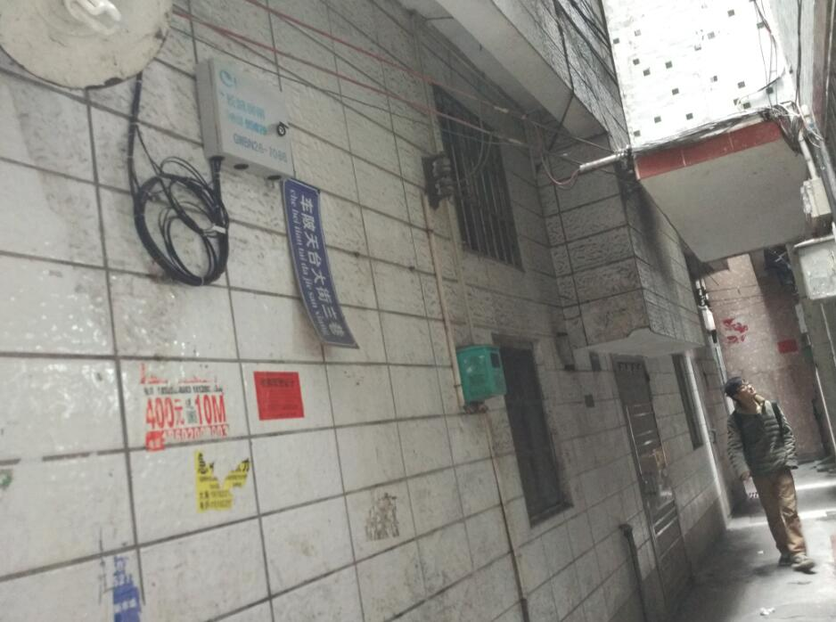
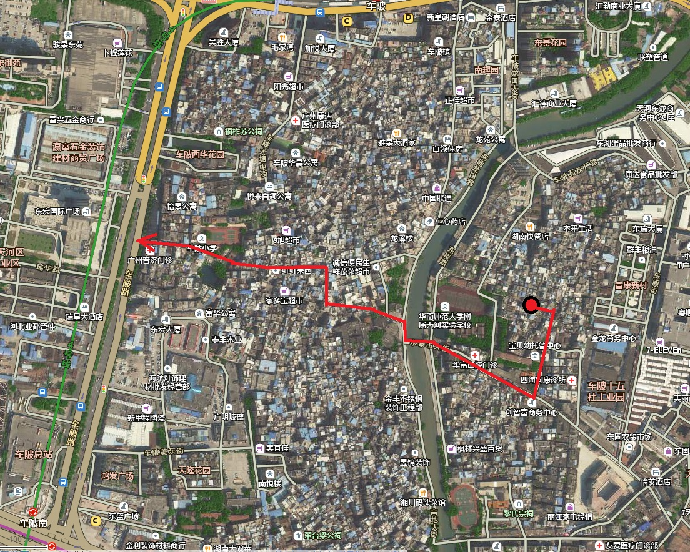

date: 2016-03-03

tags:

- 碎碎念

---

接近晚上10点了 从公司走路回出租屋
城中村的主要通道上 人还是挺多
看穿着打扮 基本都是上班族
估计不是加班 就是下班之后 在外边玩到这个点吧

二月底来广州实习
公司给的钱只够吃饭
宿舍条件比较艰苦
果断选择了自己租房

一时脑抽
选了城中村深处的出租屋
说实话 搬东西进来的时候 后悔了..（原因后面会提）
还好 生活了几天 慢慢的习惯了

虽说死宅在哪都一个活法
但是在城中村里生活了近两周
也算是见识到了新的世界
有种想记录下来的冲动

<!--more-->

## 找房
来这边之前 提前做了些功课
大概搞清楚在哪片有房子租

结果还是大意了——租的地方离公司挺远

房东把信息挂出来的时候
通常会把离地铁口最近的小区名附上（“xx小区旁”）
然而...我租到的地方 实际上离那个地点不是一般的远啊
嘛...上班走走路也没什么对吧.
当时是这样想的 于是就租下了

其实也算对比了好几个房东的房子
没租对地方只能怪我一开始没调查清楚..
不知道离上班地点近的地方哪里有房租

## 搬入

行李有点多
随身带着背包+行李箱
还有三件东西用德邦物的快递服务寄过来了（一袋被子、两个箱子..加起来一百斤这样吧）
填写收货地址的时候 地址写的是公司的
结果东西到了才知道 城中村这片不是他们的区域

只好商量了一下（嗯当然是用_简单快捷_的方法解决的）
才让快递小哥帮忙送到了城中村的深处
正好送货开的是电动三轮车 才能进城中村深巷里整个过程还是很折腾人的
电动三轮上堆满我的东西 不能再载人
我就沿着大路 一路跟着电动三轮跑......狼狈

就是搬东西的时候 心里有点后悔了
原因是 巷子实在太深
搬入搬出大件的东西很困难
本来打算买洗衣机和冰箱的 只能作罢

## 迷路
巷子真的很深 直接导致的后果就是——一直在迷路
* 搬行李的时候找不到路..找房东带的路
* 上班迷路..看着导航 方向大致对了 却还是没法走对出口 导致一开始去上班时都得早出门十分钟
* 回屋迷路..走大路得绕得很远 一次下班早 就试着从城中村中穿过顺便买点生活用品..结果迷路了 绕了一大圈
* 不小心迷路..某日晚上加班 路上听歌想事情 走着走着旁边就没人了..路也不认得..迷路了 用手机导航找到了自己的位置 直接往大路方向走..总算绕回去了

说起来惭愧 一直宅在家所以方向感不是很好 认路也算一种锻炼吧= =
来一张上班时穿过城中村 大致路线图

## 生活
吃的用的 城中村超市很多 似乎有些是24小时营业的
药店也不少 菜市和卖菜卖米的铺子走走物价嘛就能见
总之价格便宜又容易买到东西 毕竟城中村能容纳好多好多人..

物价嘛
够吃一整天量的咖喱 土豆洋葱咖喱块胡萝卜猪肉 算上用电 20元不到就能解决
原料在超市买估计还得再往上算

---

**2021-06-04更新**

## 还是路

上班时间是早8点30，通勤需要20分钟，所以早上8点出门。
8点是前后正好是通勤高峰，衣着光鲜的上班族从各个角落涌出来，城中村路很窄，走在人流里会不自觉地加快脚步，慢慢走着反而会觉得不自在。

路不平整，不好走，下了雨就更难，要正好晚上下雨就要更加小心了，因为那时候喜欢穿板鞋，穿到漏水也懒换；但就算是下雨天+晚上，比起早上明显更舒服，虽然晚上9点路上也挺多下班赶着回家的人，但人流的密度低了太多，慢慢走着也不会有被推着走的感觉。

晚上的通勤路上，印象比较深的是带着大量监控画面的治安岗亭，画面里都是分不清是哪的深巷的画面，摄像头有夜视功能，看到的画面比肉眼看得清楚得多。虽然路很深，但对治安没什么担忧，没听说什么偷盗抢劫，更多的是担心哪天突发急病，在出租屋里死掉没人发现。

## 深夜鼓捣

为什么经常晚上10点才回到家，想了好久，是因为实习那段，被要求使用公司的硬件方案做毕业设计，内容挺无聊的，只想早点把设计做完，好早点回学校搞掂论文和答辩，所以常搞到保安大叔要关门了，赶人才走；对了，公司9点就关门，再晚就不给加班了。

回到家之后冲个凉就开始了深夜鼓捣时间，也是焦虑吧，觉得自己学什么东西都是半桶水，总之先学点东西来填满焦虑的坑，常常搞到两点才睡，一天不到6小时睡眠。

至于鼓捣了什么，现在完全不记得了，去翻自己 Github 2016年上半年的动态是完全空白；记得的只有无线鼠标很难用起，城中村里的无线环境很糟糕，当时 WiFi 设备全是 2.4GHz 频段，无线路由发出的信号显示满格，但根本连不上，用罗技优联的无线鼠用着一顿一顿的，但也勉强用着了。

## 搬离

毕业设计做得算快，在公司内答辩完，组里第一个溜的，返校搞毕业的事。问题就来了，我的一堆家当怎么办，房子继续租着，每个月花钱供着吗？当时没收入，几百块的房租也很肉疼，网上搜索仓库出租，找到了一家叫“迷你仓”的，大概就是可以按月租箱子，都是几个立方的空间，一个月一两百块，见挺划算就租了个。

想得是很美，但由于租的房子那蛋疼位置，搬重物的师傅只能停车到离房子百米多远的地方，把行李从没有电梯的4楼搬下来，再用推车运到车上，十分折腾，所以还加了钱，住城中村首选靠大路的位置。

## 回顾

那段日子挺迷茫的，生活工作节奏、每天面对的环境，和自己想的不一样，但也不知道自己想要什么。
现在得闲，复盘一下。

当时没觉得迷茫，觉得只要方向没错，其他什么都可以——工作内容、地点、甚至薪资都没什么想法。

这第一份工作，是在广州致远电子，大三下学期就拿到的 offer，软件平台部门，当时老板给画的饼是“先搞几年技术，再让你做产品经理”，当时我自己的定位就是这个方向，以至于整个大四对于找工作只抱着玩玩的心态，拿了其他的 offer 也没深入了解，如果当时去了深圳，现在生活的画风会变个样吧，感慨。
