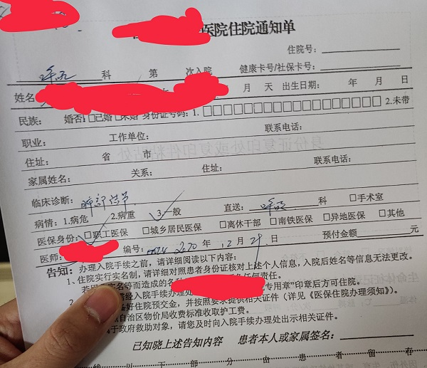
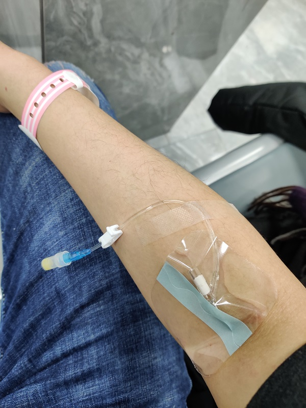
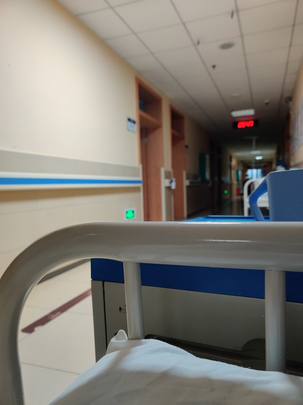
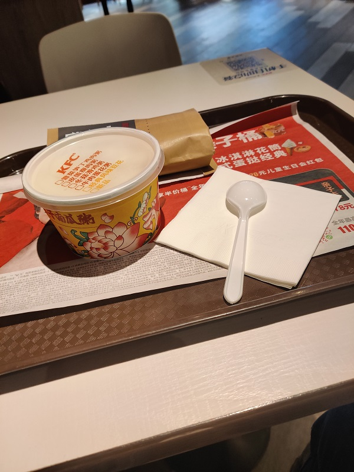
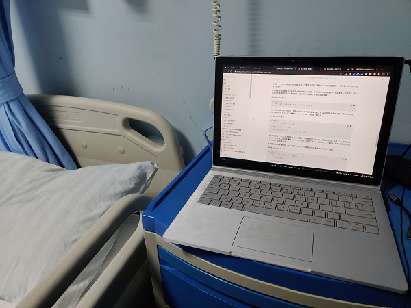
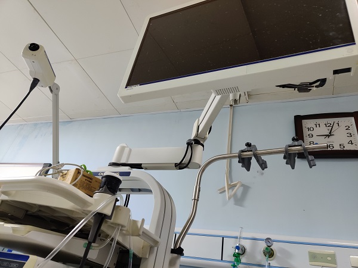
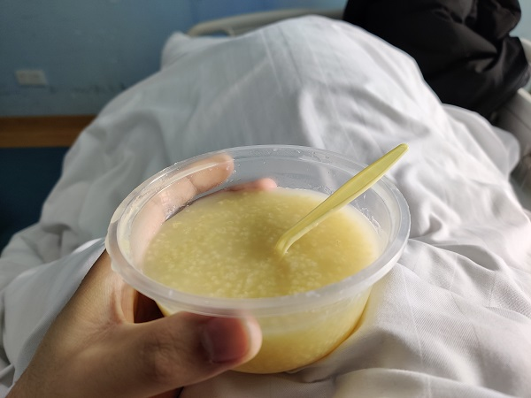
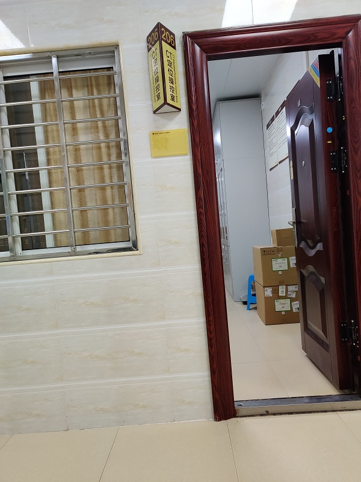
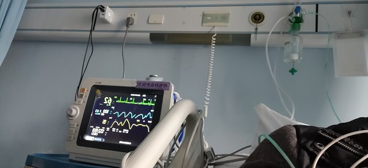
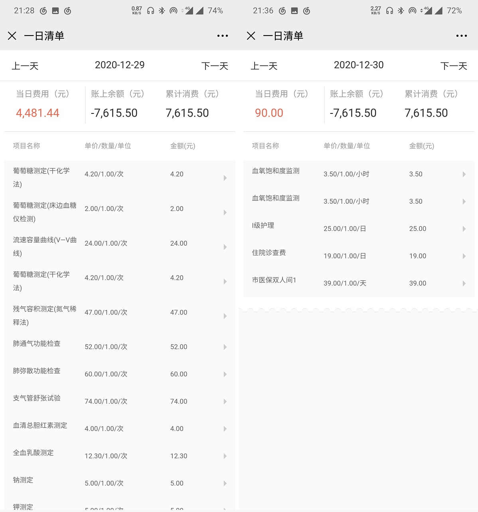

date: 2020-12-30
tags:

- 博客

---

体检ct胸部平扫，在右肺查出了一处“实性结节，9x12mm，密度不高。住院检查，记录一下。

反正住院无聊，记流水账，可能对后来的人有帮助，大概。

<!--more-->

之前发生的事情，虽然可能和这次检查不相关。

- 09-05 早上做了力量训练，下午又去游泳好像运动过量了，加上没注意补充水，晚上出现了一次棕色的尿，头晕恶心，大量饮水后尿变清澈，网上查了下症状可能是横纹肌溶解
- 09-06 去附近医院的体检中心检查了血常规、尿常规、B超，除了尿检隐血有两个+以外一切正常，医生说不要紧
- （这之后就感觉身体很虚，特别是疲劳后心脏附近容易阵痛（停止呼吸能），不敢做运动，转做简单的有氧运动）
- 09-17 同事带了个血压计来公司，就试了试发现自己血压偏高，于是自己买了个血压计平时监控着血压，发现早上起床之后血压一直都偏高，90/140左右
- 11-11 因为一直感觉身体不太舒服，就做了个大体检
- 11-19 体检结果出来了，发现了这个结节，医院能直接调出体检中心的影象，医生看了给出判断，可能是病毒、真菌感染，也可能是肿瘤，让我抽时间入院做检查，看情况可能要做肺部穿刺活检
- 12-29 入院

## 12-28

看着网上的文章，做住院的准备：毛巾、挂毛巾的衣架（没用上，睡走廊时需要这个）、洗漱用具、水杯、内裤内衣袜子、抽纸、耳塞、眼罩（忘了带上，睡走廊很需要这个）、充电宝

## 12-29

***报道，住走廊***

挂门诊的号，和医生说趁着元旦把检查给做了，问了下大概要住多久院，医生说正常来说1月1号就能给出诊断，但1-3号元旦放假医院是没人做手术的，如果要切除啥的是做不了的。

医生给写了张“住院通知书”，拿着这纸就能来住院部报道，接待的护士会查身份证，说是要核实医保信息。签了几张告知书承诺书（比如不允许递红包的承诺书，住院管理制度啥的）。

住院的科室是“呼吸及危重症科”，除了有呼吸系统病的人还能听到有其他问题的，比如一些多器官都不太行的老人，大概因为是冬天，能看到的也大多是老人。

住进来的时候病房满了，只能睡加在走廊的床，运气不好还被安排在了厕所旁边，时不时会传来味道。

***第一天的检查***

入院后做了一堆检查，除了最基本的几个常规项目，还做了心电图、肺功能检查、增强胸部CT，还有一堆关于肿瘤的检测。

最主要还是这个增强CT，目的是看结节附近有没有血管，因为是肿瘤的话周围会长出血管，所以能帮助判断是不是肿瘤。做这个之前，医生会扎个置留针在手壁上（抽血那位置），实际做的时候是由机器自动泵入药液来增强血管显影的（所以要求血管足够粗，老人+血管细的话医生会谨慎），机器扫第一次是普通CT，然后泵入药液，第二次扫描才是增强，所以说是增强CT，实际上是普通CT+增强CT。顺便这个药液是“碘帕醇注射液”，不能和“皮质类固醇药物”同时用，所以做之前医生会问有没有高血压、糖尿病来排除常见用药。

喔，手腕附近还打了个针皮下的针，说是肺结核检查，三天后才能看结果。

***没有年轻人的住院部***

一个下午就有两个老人来让我帮助解决手机问题，一个用红米开不了抖音，在主流安卓机6GB内存的今天还用着3GB内存的手机，判断大概是内存问题，重启一下就好了；一个是之前手机坏了，想拿一个老手机顶着用，但登入不上微信，看了是要安全验证，有三个方式，回答安全问题、用之前的手机扫码、找之前的两个好友帮忙发一串验证数字到这个账号上，尝试前两个都失败了，后面让他找好友帮验证，他找了同室的病友，解决了。唔，这住院部基本都是老年人，虽然护士基本是年轻人，但她们是没空理这些老人的这种事的，忙不过来。

***研究起了医保***

琢磨着晚上也没什么事，是不是要问医生能不能回家住呢，然后自己先查了一下，发现医生放人回去住是承担风险的，风险在于管理医保的人会查滥用医保的情况，逻辑是这样：医保倾向于减轻住院的人员的负担，~~很多住院的项目都是可以全额报销的，而门诊就只能报部分~~（这个说法是错误的，只是住院的报销比例更高，而且住院开销越高的部分，比例越高，后面会说）；而一个不需要住院的人，住了院并且用了医保，就是滥用医保，医师是要负责的，所以医保管理人员会不定期进行检查。

关于职工医保，生病前虽然知道他能省很多钱，但不知道能省这么多钱，怪不得商业医疗保险的免赔额度一般是去掉医保后的。入院第一天就做了3000元的检查，但医保不覆盖的项目只有不到1000元。

***晚上值班的护士很忙***

晚上尝试叫了外卖，医院没管很严能直接送到病房来。

护士在大概7点交班，晚上值班的都是同龄人，但人比白天少很多，只看到了两个护士和一个值班的住院医师，听她们和病人说我们两个护士是要管七十号病人的，请体谅一下，点滴打完了先把流量调到最小。看她们真的很忙，12点前基本没停过，走路都是小跑着的，而且还得忍受患者的抱怨。

天气预报晚上会转凉，温度一下子从接近20度降到5度。而且住走廊，通风不要太好，但是被子意外地厚，应该不要紧。

## 12-30

***没睡好***

夜里2点50分，醒了，医院的被子很厚，即使是降温到了6度，穿着一条加绒外裤还是没法睡，出了点汗，可能是被热醒的，也可能是被隔壁病床吵醒的，我戴着蜡球耳塞依旧能听到他的声音。

大概是因为正好过了第一个睡眠周期，异常清醒，摘了耳塞听护士和住院医生的对话，这病人是插着不知道什么管子（可能是呼吸机的管子），非常痛苦所以总是去动管子，护士找来束缚带把他绑起来了不让他动。

病人不停在叫“医生医生 啊啊 好难受”，发出模糊的声音，听着呼吸就很困难还在不停地喊，看护的家人和他说“休息几分钟吧已经两点五十分了”，他说“好痛，好痛”，“哪里痛”，“一阵一阵地，一呼吸就痛”，虽然就隔着床，但听得不是很清，因为操着桂柳口音。

有点惊讶自己的适应能力，才一天就听习惯了病人的呻吟，反而是心疼值班的医生和护士。

唔，被子好厚，热，走廊的灯光好刺眼，加上病人在叫喊，3点半才重新睡下。

本来就没好好睡，早上六点就被护士弄醒，采了几管血，大概是那几项肿瘤测试。

***悠闲的早上***

八点起床，去做了腹部和心脏的B超，没发现问题。做完检查也没什么事做，跑出医院，去隔壁的KFC坐了一个早上，看看动画水一水群，快到中午才打包吃的回医院。

说起来回来的时候风变大了，有风的时候在室外还是挺冷的。

顺手取了昨天的CT诊断，报告说和11月11日的片子没什么变化，增强CT没发现结节附近有血管，基本就排除肿瘤了。

***和医生谈话***

回到住院部，吃了午饭，护士和我说病房空出来了，要不要搬，我当然说要搬。

这之后，负责我的住院医师就让我去办公室找她。

一个大概30多的女医生，挺好看，跟我说了现在的情况和之后的检查方案。大致就是做了这么多检查，没发现是肿瘤的证据，所以基本就是细菌或者病毒感染了，由于不同原因的用药方案不一样，所以还是得做入侵式的检查。

计划是明天早上先做支气管镜，就是类似胃镜一样，只不过从鼻腔进入，如果能取到样，就万事大吉，这个是无风险的；如果失败了，取样效果不理想，就要做肺部穿刺，就是依靠ct，插一根针进胸部，避开肋骨、穿透肺组织取样，最有可能遇到的风险是气胸，医生说就算中招了也是小问题，然后我签了风险告知书。

> 医生：这个风险不用怕的，年轻人最常遇到的肺的问题就是气胸了，就算得了，插根管把气体排出来，再住院个三天就行了
>
> 我：。。。
>
> 医生：你有家人朋友在这边吗，有人陪同吧
>
> 我：家人不在这边，一个人做不了吗
>
> 医生：这两个小手术都要人陪同的
>
> 我：好的，那我叫人来帮忙
>
> 医生：是女朋友吗
>
> 我：啊，不是，是同事
>
> 医生：（笑）
>
> 我：。。。（笑）
>

只好麻烦同事第二天帮个忙了，最理想的情况是上午就能解决。

***在病房里偷听外边的对话***

下午终于搬进了病房，两人间，还挺宽敞，有独立卫生间，也很干净。

护士帮搬完床，我就开始没事做了，在床边边和傻屌群友聊天，边看《编程珠玑》（翻译真是烂，看着很吃力，实际上也没看得下几页），病房我也没关门，能听到隔壁新入住病人和医生的谈话。

医生和一个年纪挺大的男人，

> “你现在有收入吗”，“没有”，“原来是靠什么谋生的啊”，“就是农民工务工”，“喔，那家人在这边吗”，“没有”，“两年治疗花了多少钱”，“自费花了6000多”……

医生和一对夫妇，应该是男的胃出了问题，

> “那你怎么转到我们医院了呢”，“县下面的医院说这个治不了，得到市里面”，“刚过来吗”，“27号过来的”，“入院手续办完了吧”，“嗯”，“那现在有收入吗”，“夫妻两个人一起上来的，现在没收入了”，“那还有小孩要养吗”，“嗯最小的那个三岁半”……
>

同房间的病友住进来了，一个大叔，又是有女儿陪同，饭点有老婆送饭来；聊了一下，昨晚他没睡着，昨晚走廊那病人闹了一晚上没停。

## 12-31

***依然没睡好***

昨晚没什么事做，而且前一天晚上睡得很差，十一点就睡下去了。

睡在病房，走廊的声音没那么容易传进来，好受多了，本以为能睡个好觉，事实证明我还是too young too甘い，一个晚上还是被弄醒了好几次，隔壁床吊针换药、测血压、血糖，每开灯一次我就醒一次。

早睡是绝对正确，而且意识到了，眼罩乃住院必备物。

> “建议早睡” ——不是鲁迅说的

***真。一个人做手术***

做支气管镜前是不能喝水进食的，计划是上午10点做，医生嘱咐6点之后禁止饮水。

约同事小伙伴早上9点45分到住院部，但护士早早就来到病床前了，这才8点半我裤子都还没穿呢，她就给我吸雾化麻药了，“你的气管镜在20分钟之后就可以做了喔，陪同的人来了吗？”，我一愣，说好的10点开始呢，于是赶紧联系小伙伴。

> 雾化给药是很常见的呼吸科给药方式，就是嘴里含着雾化器，嘴巴呼吸，把雾化的药呼吸进身体。
> 住院病床前的供氧口有两个出口，一个是吸氧用的、一个就是给雾化给药用的。

过了20分钟，护士直接把我带去气管镜室了，医生：“同伴还没来吗，那直接做吧，等下护士扶你回去就行了”。护士给打了个置留针输250ml葡萄糖，医生在我屁股上打了针麻药，放了什么东西在我鼻孔里，还盖了张纱布在脸上，之后的事就不太记得了。回过神已经做完了，回过神来，护士在扶我下床，小伙伴已经在门口等着我了，他给我发微信我都没注意到。

这时也没法自己好好走路，是被小伙伴和护士扶着回床上的。

***在床上等着下一场手术***

做完手术昏昏沉沉的，直接就躺着休息了。

医生例行巡房，和我说下午要做穿刺中午要吃清淡的粥。唔，明明一开始说好的，要看气管镜的情况来决定要不要做穿刺，但取到的样医生也没法马上确定能不能用，所以穿刺还是要做。

这时葡萄糖打完了，护士来拔针的时候问这置留针要不要留，我说我不输液，但是下午做肺穿刺活检不知道要不要用到，于是护士就给我留了针，这时是真没想到，后面真碰巧用上这针头了。

早餐没吃东西，中午吃了点小米粥，不是太饿。

***穿刺过程还挺漫长***

穿刺是在隔壁肿瘤治疗中心做的，他们有专门的CT定位操作室。

肺穿刺活检得依赖CT机，避开肋骨，穿透部分肺组织直到刺中病变部位来获得采样。

原理挺简单，但实际操作起来还是挺复杂的，因为CT扫描更像拍照而不是摄像，只能每拍一次CT、调整一次针的位置，来保证准确保刺中目标，而且整个过程中，人是不能动的。

躺上CT台，医生让侧躺，摆一个舒服的姿势，因为要维持至少20分钟。

头两次扫描只是找大致位置，医生做了标记，再扫了一次才开始插针，看样子只用对表面的肌肉进行麻醉，打了一针之后，不管医生怎么动活检针，都没什么感觉，可以说完全不痛。

插针之后也CT扫了好几次，调整了好几次针，才说“我要取样了喔”，我回应“嗯..”，然后感觉到有什么东西进入到身体里，我哪敢看，敢看也不敢动啊。

做了快30分钟，拍了大概5次CT吧，手都麻了，问医生成功取到样了吗，医生也不敢打包票，只说尽可能了。

***出事了***

做完之后是可以自己走路的，但回病房要坐轮椅。

慢慢穿上衣服的时候有点恍惚，但没觉得异常，就从CT室走出来了，坐下等呼吸科的护士来接。

小伙伴说我脸色不好，我没太在意，继续坐着玩手机。过了几分钟，跟傻屌群友刚说穿刺做完了，就开始头晕视线模糊睁不开眼，想着靠着椅子休息一下可能会好，但实际上完全没缓解，从有异常感觉到撑不住只有不到30秒。实在是撑不下去了，才和小伙伴说头晕，小伙伴马上去叫CT室里的医生出来。

医生让我横躺在走廊的坐位上，保持清醒，然后马上给打葡萄糖、吸氧，量生命体征，说一切正常应该只是胸膜反应。

几分钟才完全清醒过来，医生说我刚才脸都白了，护士推着轮椅来的时候，我已经能正常说话了。

幸好护士没来接这么快，不然就得是在路上晕倒了，留的置留针也在意想不到的地方派上了用场，医生说“下次呼吸科来做穿刺先打个置留针再过来”。

> 胸膜反应：胸膜就是肺部、胸腔内部的粘膜，是做肺部穿刺时可能会产生的应激反应；“胸膜穿刺过程中较严重的并发症，连续咳嗽、头晕、胸闷、面色苍白、出汗、甚至昏厥”by百度百科

***在医院跨年***

手术后后要上监护仪器，不过3小时就可以撤了，但吸氧还是要继续，护士也没说要吸多久。

> 监护仪器：能测心电图、血氧比例、呼吸状态、血压等；就是一个像数字示波器的东西，伸出三个电极、测血压的带子、夹手指的夹子

> 搜索得到的信息：手术之后需要吸够6小时的氧，因为麻醉药可能会降低血氧结合的程度，吸氧能保证供氧充足。

护士今晚依旧是忙疯了的，依然是两个人负责60+号病人，没空收仪器，记录了关闭监护仪时的数据，就匆忙走了。

吸氧也近6个小时了，拿下来也没觉得呼吸困难，护士路过就让她帮关了供氧。

现在是10点半，写这东西还是花了点时间的，今晚要在医院跨年了，好累，可能等放下电脑就洗洗睡了。

## 01-01

吸取之前的经验，直接蒙头睡，屏蔽了灯光攻击，整个晚上睡得很好。

洗漱清理鼻孔时发现有血，想起做完气管镜之后，医生说过有血是正常的。

起床之后就打算去KFC吃早餐然后坐到中午，只有300米路却走得异常难，因为稍微走快点就会难受，没法大口呼吸。

回病房后就一直都没怎么动，也看不下书，下载了个Steam平台，坐床边玩之前买的《Mad Father 重制版》，恐怖游戏但玩过原版不会被吓到。

## 01-02

昨天也是早早就睡了，去买了包子豆浆当早餐，刚吃完早餐护士就告诉我要去拍X光胸片，没人排队几分钟就做完了。

中午医生过来跟我说情况，元旦检验科放假，前天采的标本没法检，早上拍的胸片发现我有12%的轻度气胸，加上现在检查结果都指向某种特异性感染，所以可以回家等检验结果了，让我6号过来找医生要结果。冬季呼吸疾病高发，科室里病房不够用，医生让我把床位让出来，直接离院回家休息，如果呼吸困难加重就赶紧回来。

查了下气胸这个病，肺组织被压缩的百分比在15%以下属于轻度，不需要干预也会自己好，会以每天1-3%的速度消失，也就是说静养一周就能好得差不多，当然前提是没其他疾病。医生嘱咐，在家期间尽量休息，防止劳累，要静养。

打车回家，随便打了碗桂林米粉当午餐，就困得不行了，一直睡到了晚上七点才醒，住院累人。

医院现在微信公众号很方便，能查到每天开销详情，目前为止各种拍片化验费用在6k这样，肺穿刺手术、检验的费用还没显示出来，住院床位和护理费用不高的，大概60-90元一天，常规检查大多是医保中的甲类项目，特殊检查一般是乙类，其他更特殊的是自费，根据网上搜到的信息，这里能报销大约60-70%。

