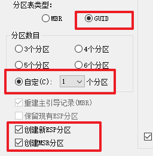

date: 2018-02-16
tags:

- boot
---

```
变更记录：
2018-02-16 初版
2019-06-14 改用UEFI
```

装机要用到各种工具u盘，手上只有一个u盘的时候总得费事格式化，如果直接把ISO镜象拖到U盘里按需选用就能方便很多。

于是试着弄了个能灵活加载各种ISO镜象的U盘，这里记录一下过程。

<!--more-->

---

## grub2-filemanager

https://github.com/a1ive/grub2-filemanager

国人做的一个基于GRUB2的启动器，能启动各类Linux发行版的Live CD，也能用memdisk方式启动其他类型的ISO。


## 启动U盘制作方法

这里制作UEFI引导方式的U盘。

先将分区表格式为设为GUID，建EFI分区，可以用DiskGenius：


快速分区功能建EFI分区：



[获取grubfm-zh_CN.7z](https://github.com/a1ive/grub2-filemanager/releases)，把`grubfmx64.efi`复制到`(EFI分区)/efi/boot/bootx64.efi`。完毕

## 使用方法

只需要把iso文件copy到U盘里，在grub2-filemanager的图形界面下以适当的方式启动即可，比如winpe（比如pe工具盘，win安装盘）用grub2dos方式；linux的cd则直接能被识别、引导。
