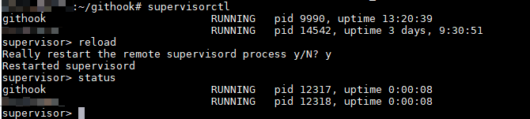

date: 2019-6-11
tags: 

- golang
- git

------

Git的Hook功能可以让仓库在某些条件触发下执行特定脚本，而各托管平台都实现了自家的Webhook功能，将这些事件通过Web API的形式向外发送事件通知，我们常用Webhook在服务器上做自动部署、持续集成等。

这里用快速搭建一个最小功能的Github Webhook Server，当有人向仓库推送东西时，服务器会自动执行设定的脚本。

<!--more-->

## 材料

* 带公网IP的linux服务器一台（以使用apt的ubuntu为例）
* Github仓库，以我的Wiki站作演示：<https://github.com/noodlefighter/wiki>
* Golang和社区实现好的[go-playground/webhooks](https://github.com/go-playground/webhooks)

安装Go和我们需要的依赖：

```bash
$ sudo apt install golang
$ go get -u gopkg.in/go-playground/webhooks.v5
```

## 烹调

用golang实现的服务器程序已经搭好：<https://github.com/noodlefighter/githook>。

```bash
$ git clone git@github.com:noodlefighter/githook.git
```

目录树是这样的，执行`./run_githook.sh [你设定的webhook secret]`就能跑起来了：

```bash
$ tree
.
|-- githook.go
|-- noodlefighter
|   `-- wiki
|       `-- push.sh
|-- README.md
`-- run_githook.sh

```

> 注意：请**不要**直接用`go run`命令启动程序，它会把程序构建到临时目录，程序无法找到我们想要执行的shell脚本

以我的wiki仓库作演示：

- 设置URL为`http://服务器的IP:3000/webhooks`
- Content type选`application/json`
- 设定你的Secret


当程序收到来自`noodlefighter/wiki`仓库的`push`事件时，执行的是`./noodlefighter/wiki/push.sh`脚本——所以添加新仓库的支持只需添加对应的脚本文件。

这演示的脚本是我调用hexo生成静态页，测试效果：


## 后菜

服务器的话，大概还需要做自启动、异常退出重新拉起，这里推荐supervisor。

安装supervisor:

```bash
$ sudo apt install supervisor
```

写配置文件到`/etc/supervisor/conf.d/githook.conf`：

```
[program:githook]
command=bash -c "你clone的路径/run_githook.sh 你的Secret"
stdout_logfile_maxbytes=20MB
stdout_logfile=/var/log/supervisor/%(program_name)s.log
stderr_logfile_maxbytes=20MB
stderr_logfile=/var/log/supervisor/%(program_name)s.log
autostart=true
autorestart=true
startsecs=5
priority=1
stopasgroup=true
killasgroup=true
environment=PATH=%(ENV_PATH)s
```

根据需要修改`environment`配置，添加需要的环境变量，比如我的nodejs环境需要这样写才能正常运行`environment=PATH=/home/r/.nvm/versions/node/v7.7.0/bin:%(ENV_PATH)s`。

进入`supervisorctl`，输入`reload`，再输入`status`查看运行状态：



使用`tail -f /var/log/supervisor/githook.log`可以即时查看追加命令，方便调试：


配置完成之后，服务器不管怎么重启，Webhook服务器都会继续工作啦。